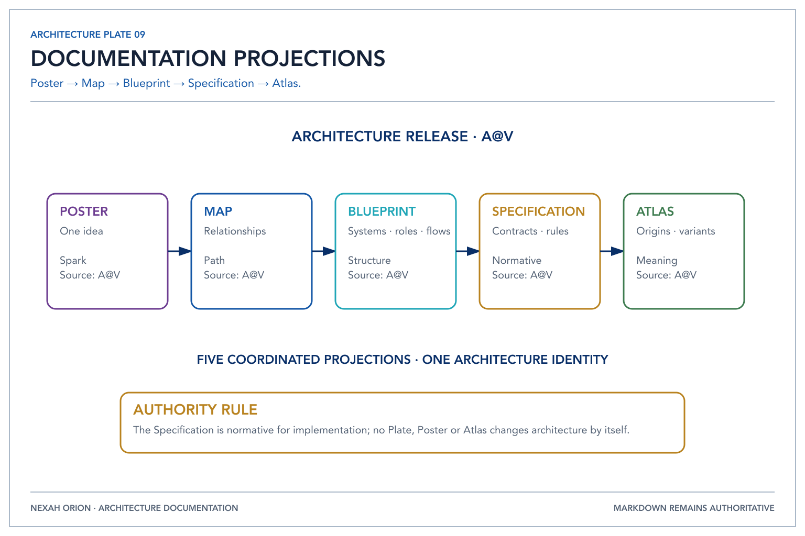

# ADR-0007: Five documentation projections

- Status: Accepted
- Date: 2026-07-19
- Decision owner: ORION Documentation
- Affected repositories: nexah-orion; informative guidance for the wider ecosystem
- Supersedes: none
- Superseded by: none

## Context

The visual evolution repeatedly produced five useful levels of understanding. They answer different questions and should not be mistaken for competing specifications.

## Decision

*Poster, Map, Blueprint, Specification and Atlas are coordinated views of one
architecture release.*

Architecture releases may provide five linked projections: Poster, Map, Blueprint, Specification, and Atlas. All reference the same architecture release. Specification is normative for implementation; no poster changes architecture by itself.

## Ownership and authority

The architecture owner governs the release identity. Each projection names its status, sources, omissions, and related ADRs.

## Consequences

- Contributors can enter at an appropriate level without losing traceability.
- Visual and narrative artifacts no longer compete with formal specifications.
- Architecture changes flow from evidence and ADRs to all affected projections.

## Alternatives considered

Treating the five levels as a visual style or linear truth hierarchy was rejected because an Atlas cannot replace a contract and a Specification cannot replace human orientation.

## Compatibility and migration

Existing posters remain historical evidence unless explicitly linked to a future architecture release.

## Verification

Every normative projection names its architecture release and ADR sources. Visual-only changes have no technical effect.

## References

- [`../architecture/ORION_ARCHITECTURE.md`](../architecture/ORION_ARCHITECTURE.md)
