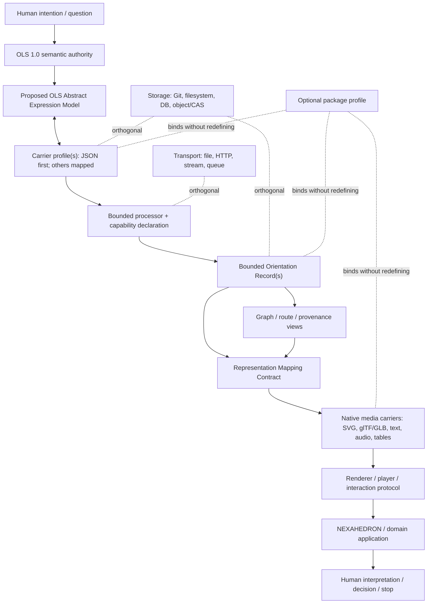
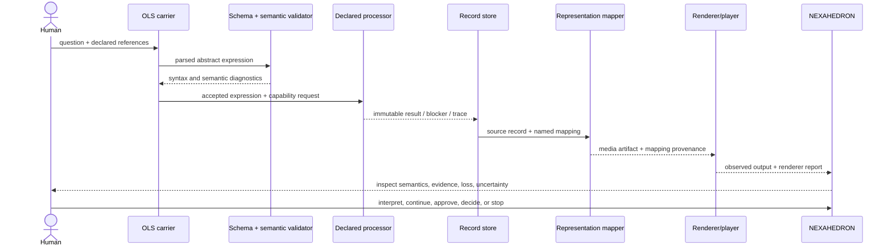

# NEXAH Machine-Readable Orientation Architecture

## From OLS semantics to carriers, processors, records, representations, and experience

- Status: **Informative architecture proposal**
- Maturity: **Stage 0 — architecture only**
- Date: 2026-07-25
- Scope: cross-repository architecture and ownership
- Semantic authority: the published, checksum-backed **OLS 1.0 release**
- ORION authority: the existing certified **ORION Version 1** baseline
- Normative effect: **none**

> This document does not amend OLS 1.0, reopen ORION Version 1, define a
> production serialization, register a file extension, or promote research
> terminology into normative vocabulary.

The companion
[OLS 1.0 Repository Architecture Extraction](OLS_1_0_REPOSITORY_ARCHITECTURE_EXTRACTION.md)
establishes the language, vocabulary, grammar, records, reference spaces, and
ecosystem relationships from which this proposal begins. This document addresses
the next architectural question: how those semantics could cross machine,
processor, representation, storage, transport, and Human-experience boundaries
without transferring authority between them.

---

## 1. Executive summary

The repository does not lack orientation semantics. It lacks a governed bridge
from released semantics to interchangeable machine artifacts.

That bridge should not be one monolithic “OLS file format.” It should be a set of
separable contracts:

1. **OLS Semantic Specification** remains the authority for meaning.
2. A proposed **OLS Abstract Expression Model** gives expressions a
   language-independent structure.
3. One or more **OLS carriers** serialize that model. A constrained JSON carrier
   is the smallest useful first experiment; YAML, RDF/JSON-LD, or a textual DSL
   remain possible later mappings.
4. A **Processor Capability Contract** states exactly which OLS version,
   profiles, declarations, operators, inputs, and outputs a processor supports.
5. **Bounded Orientation Record classes** preserve particular kinds of state,
   evidence, provenance, validation, and continuation. There should not be one
   universal record.
6. An **Orientation Graph** is a governed view, execution plan, provenance view,
   or representation over records—not the universal canonical model.
7. A **Representation Mapping Contract** separates semantic source, mapping
   rule, media parameters, renderer, and observed output.
8. Existing formats such as SVG, glTF/GLB, Lottie, audio, MIDI, tabular data, and
   Markdown remain native representation carriers.
9. An optional **orientation package profile** can bind expressions, records,
   mappings, assets, provenance, hashes, signatures, and validation reports
   without converting every asset.
10. **NEXAHEDRON and domain applications** inspect and render these artifacts
    while preserving Human interpretation and decision authority.

Storage and transport are orthogonal to this sequence. A JSON expression may
live in Git, a database, a content-addressed store, an archive, or a stream. None
of those locations changes its semantics or evidence status.

The working hypothesis is therefore refined as follows:

> OLS specifies orientation semantics. ORION Version 1 is a certified,
> deterministic subset processor over its frozen structural scope. A future
> carrier and processor declaration could describe that correspondence, but
> similarity of vocabulary is not full OLS conformance.

No released or repository-integrated UDF specification exists. Concrete
historical technical design material does exist outside the repository,
however: a textual rule/graph/scene proposal, JSON examples, browser-player
prototypes, deterministic and streaming extensions, and an integration draft.
This changes UDF from an unexplained historical label to a concrete but
unreleased exploratory design. It does not make UDF an adopted standard.

Historical material also gives `.nxa`, `.scarab`, and `.xva` preliminary
narratives and two generated JSON examples, but the material itself lists
“Mini-Spec v0.1” and reference objects as future work. The extensions therefore
remain design hypotheses, not completed formats. This document evaluates the
hypotheses without reserving their names or extensions.

---

## 2. Method, evidence labels, and authority

This repository was treated as an archaeological site. Evidence was read across
the OLS release, framework implementation, ORION contracts and certified
architecture, JANUS and scientific research, IEEE validation, Living Concepts,
Atlas and Library material, NEXAH Experience, and the visual construction
archive.

### 2.1 Status labels

| Label | Meaning in this document |
| --- | --- |
| **Normative** | Already authoritative in its named, released scope |
| **Certified** | Deterministically implemented and certified in a bounded scope |
| **Informative** | Explains or connects authoritative material without changing it |
| **Proposed** | Architectural recommendation requiring governance |
| **Experimental** | Implemented or explored without general semantic authority |
| **Historical** | Earlier evidence retained for lineage, not presumed current |
| **Missing** | Requested or implied concept for which repository evidence was not found |

### 2.2 Authority order

1. The released OLS 1.0 suite owns OLS semantics.
2. Accepted governance and ADRs own their declared decisions.
3. The certified ORION baseline owns only its frozen contracts and guarantees.
4. Domain specifications own their domain meanings and validation criteria.
5. Implementations own behavior only inside their declared contracts.
6. Representations own no authority over their semantic sources.
7. This document proposes boundaries; it creates no new semantic authority.

### 2.3 Evidence rule

Repository evidence takes precedence over the task's working hypotheses. Where
evidence supports more than one interpretation, this document retains the
alternatives. Absence from text search is reported as absence, not proof that a
concept never existed.

### 2.4 Evidence classes used in this revision

| Evidence class | Included material | Permitted architectural use |
| --- | --- | --- |
| **Released and normative/certified** | OLS 1.0; certified ORION Version 1 boundaries | Establish meaning, authority, and frozen processor guarantees |
| **Concrete historical technical design** | Supplied UDF PDFs, Markdown, JSON examples, demo packages, and browser-player prototypes | Recover prior intent, tested concepts, inconsistencies, and possible reusable responsibilities |
| **New or incomplete design hypothesis** | `.nxa`, `.xva`, `.scarab`; UBF/USF adoption; package architecture | Compare options and risks only; do not assign current conformance or reserve names |

Historical implementation is evidence that an idea and prototype existed. It
is not evidence of interoperability, security, semantic validity, deterministic
conformance, or current repository ownership.

### 2.5 Supplied-source status

The supplied primary-source directory is outside the current repository. Paths
below are relative to
`NXA_SCARAB_UDF_XVA-files_neues Container_Player Format/`.

| Source | Date/version stated | What it evidences | Source status | Authority limit |
| --- | --- | --- | --- | --- |
| `UDF PLAYER/UDF_DataFormat_Extensions.pdf` | 2025-09-03 | Time, semantic layers, controls, seeded stochasticity, physics, data mappings; UDF/UBF/USF split; provenance, capabilities, gateways, validation, LOD, chunking, caching | Concrete historical technical design | Seven-page extension proposal, not a released specification |
| `UDF PLAYER/UDF_Player_FactSheet.md` | 2025-09-02 | Browser player intended to generate visual, audio, and text from `.udf.json`; sharing, remix, and export goals | Historical product/fact-sheet description | Promotional comparisons are not conformance evidence |
| `UDF PLAYER/UDF_Player_Besonderheit.pdf` | 2025-09-02 | Rule-only audiovisual concept, interactivity, PNG/WAV export, and claimed distinction from p5.js, Tone.js, ShaderToy, SVG, and Lottie | Historical concept note | “Universal” and uniqueness claims are unvalidated |
| `UDF PLAYER/UDF_NewDataFormat_Concept.pdf` | 2025-09-02 | Rules-instead-of-raw-data model, procedural generation, possible uses, and storage-reduction vision | Historical concept/pitch | Compression figures and future-standard claims are hypotheses |
| `UDF PLAYER/my_work.udf.json` | No format version; work title only | Concrete JSON shape for metadata, seeded mode, 2D shapes, 3D scene/lights/camera, and synthesized audio | Historical prototype instance | No schema, canonicalization, or compatibility claim |
| `UDF PLAYER/UDF_Extended_Paket/rules_ext.json` | Embedded work version `0.2` | Concrete rule vocabulary for variables, gradient/polygon/pattern/spiral/circle, tones/chords/noise/envelopes, and text selection | Historical prototype instance | Work version is not an explicit `udf_version`; random choice is not bound to a declared RNG here |
| `Udf Nexah Integration Bridge.pdf` | Draft v1.0, October 2025 | Proposed UDF/NEXAH stack, semantic parser, CORTEX/player combination, and early roles for `.nxa/.scarab/.xva` | Historical integration proposal | Uses broad “container,” “semantic,” and hybrid-extension claims that conflict with current authority boundaries |
| `NXA SCARAB XVA Format Table.pdf` | No formal version | Comparative roles: `.nxa` harmony/math structure, `.scarab` resonance body, `.xva` bridge/alignment | Historical comparative concept | Metaphors and comparisons are not schemas |
| `Nexah Engine 3 Formats LOG.pdf` | README draft | Proposed static-grid, dynamic-wave, and topology-bridge responsibilities; use cases and hacker challenges | Historical design log | Explicitly says mini-specs and reference objects are still next steps |
| `UDF PLAYER/UDF, UBF USF.pdf` | No formal version | Exact proposed separation of textual UDF Core, binary UBF, and split/stream USF | Historical extension note | Names are proposals; no encodings or conformance fixtures found |
| `UDF PLAYER/UDF_Demo_Paket/` and `UDF_Extended_Paket/` | Work versions `0.1` and `0.2` | Rule files plus generated PNG/WAV/text outputs and command documentation | Historical demo packages | Demonstrations do not establish portable replay |
| `UDF PLAYER/udf_player*.html` | Prototype files; no common release version | Actual local JSON loading, Canvas/Web Audio rendering, seeded 2D/3D prototype, PNG and `.udf.json` export; one player loads Three.js from a CDN | Historical executable prototypes | Multiple dialects; no common schema/sandbox/conformance suite; one animated path uses `Math.random()` |
| `Ideensammlung/demo_output.nxa.json` and `demo_output.scarab.json` | No schema version | Generated examples named `nxa-axis` and `scarab-resonance` | Adjacent historical experimental artifacts | Examples do not establish the extension semantics or general formats |
| Correction brief supplied with this task | 2026-07-25 task context | Evidence-class correction and required hypotheses/matrix | Task direction | Not technical format authority |

---

## 3. Existing assets and evidence

Paths use these prefixes:

- `ORION/` — this repository;
- `NEXAH/` — `.workspace/repositories/NEXAH-framework-ci/`;
- `EXPERIENCE/` — `.workspace/repositories/nexah-experience/`;
- `SOURCE/` — `source_material/NEXAH Builder Hub_CONSTRUCTION DOCUMENTS/`.

### 3.1 Evidence table

| Term or asset | Repository location | Original purpose | Current status / authority | Architectural overlap | Conflict risk / possible role |
| --- | --- | --- | --- | --- | --- |
| OLS 1.0 release | `NEXAH/ORIENTATION_LANGUAGE/SPECIFICATION/RELEASES/OLS-RELEASE-1.0.0/` | Universal concepts, declarations, primitive operators, profiles, derivations, semantic transitions, conformance | Normative, checksum-backed | Semantic layer and conformance vocabulary | Must not be recast as a file format; governs any future abstract model |
| OLS architecture extraction | `ORION/docs/architecture/OLS_1_0_REPOSITORY_ARCHITECTURE_EXTRACTION.md` | Cross-repository synthesis and navigation | Informative | Vocabulary, grammar, record anatomy, ecosystem map | Must not supersede the release |
| ORION Version 1 | `ORION/docs/architecture/`, `ORION/docs/releases/`, `ORION/src/orion/` | Deterministic structural representation, relations, navigation, Orientation Map, and expression | Certified and bounded | First processor case study | Similar names could be mistaken for full OLS conformance |
| Structured interfaces | `ORION/docs/adr/0003-structured-orientation-contracts.md` and public contract documents | Replace prompt-string boundaries with versioned request/result structures | Accepted architecture | Processor input/output contract | Serialization remains deliberately unfrozen |
| Context Manifest | `ORION/docs/adr/0004-immutable-context-manifest.md`, `ORION/src/orion/context.py` | Immutable record of selected sources, versions, transformations, omissions, and digests | Accepted architecture / implemented scope | Provenance-bearing input record | Not a universal Orientation Record |
| Representation Architecture | `ORION/docs/architecture/REPRESENTATION_ARCHITECTURE.md` | Identity-preserving projections and deterministic renderers | Accepted ORION architecture; renderer execution partly open | Direct foundation for mapping contracts | Earlier text assigning all renderers to ORION cannot assign OLS semantic ownership |
| Structural Representation | `ORION/docs/architecture/STRUCTURAL_REPRESENTATION_ARCHITECTURE.md` | Specialize the general representation model for ORION structures | Accepted / bounded | One processor-specific representation | Must not become the OLS abstract model |
| Transition Contracts | `ORION/docs/architecture/transformations/contracts/` | Versioned source-to-target transformations with invariants, loss, parameters, evidence, and prohibited implications | Accepted architecture; many candidate mappings remain unimplemented | Strong template for Representation Mapping Contracts | Candidate mathematics must not be promoted to semantic fact |
| ORION canonical JSON and identity | `ORION/docs/architecture/runtime/ORION_IDENTITY_CONTRACT.md` | Deterministic request/result identities and replay | Runtime 1.1 work; outside certified v1 Core | Useful implementation evidence | Its integer-only canonical JSON is ORION-specific, not automatically OLS-wide |
| Artifact Manifest | `ORION/docs/architecture/runtime/ORION_ARTIFACT_MANIFEST_CONTRACT.md` | Ordered artifact inventory with hashes and reference graph | Runtime contract | Package integrity and replay evidence | Does not grant publication or truth authority |
| Operational Boundary | `ORION/docs/architecture/runtime/ORION_OPERATIONAL_BOUNDARY.md` | Isolated, bounded, no-network worker execution | Runtime contract | Security model for processors | Should not be generalized without separate conformance |
| Orientation State | `NEXAH/nexah/orientation/state.py` | Immutable typed orientation state | Implemented framework model | Candidate bounded state record | Field set is not a released universal record |
| Orientation Report | `NEXAH/nexah/orientation/report.py`; ORION public report contract | Explain change, options, missing information, evidence, uncertainty, and provenance | Implemented, with repository-specific variants | Result record family | Same name does not imply identical schema |
| Orientation Brief | `NEXAH/nexah/orientation/brief.py` | Stable Human-readable orientation summary | Implemented | Human projection of bounded records | Markdown output is not the semantic source |
| Episode and memory | `NEXAH/nexah/orientation/memory.py`; observed-evidence test kit | Append-only state → report → observed outcome lineage | Implemented | Learning/Memory profile record | No observed outcome means no episodic update |
| IEEE manifests and validation | `NEXAH/nexah/power_systems/ieee_manifest.py`, IEEE geometry and validation material | Freeze datasets, solvers, projections, cases, evidence, and reproducibility | Domain implementation and validation evidence | Domain profile and provenance example | Physical validity cannot be inferred from carrier validity |
| JANUS research | `NEXAH/RESEARCH/CORE_CONCEPTS/JANUS_OPERATOR/` | Perspective, aperture, directional coherence, transition and validation research | Research / experimental | Domain mapping and synchronized-view demonstrations | Research vocabulary must not become OLS primitives |
| Living Concepts | `NEXAH/EDITORIAL_OPERATING_SYSTEM/living_concepts/` | Separate occurrence, definition, review, evidence, and publication | Editorial governance | Provenance and promotion model | Recurrence is not specification authority |
| Atlas and Library | `NEXAH/docs/library/atlas-of-atlases/`, Library registry material | Curated assets, source manifests, works, editions, paths | Curatorial / referential | Package metadata and Human navigation | Atlas views do not supersede source specifications |
| NEXAHEDRON | construction documents and Experience architecture | Human-facing Orientation Laboratory / Workspace | Architectural and implemented experience evidence | Viewer, inspector, interaction boundary | Must not become semantic or decision authority |
| NEXAH Experience generated interactions | `EXPERIENCE/src/data/generated/orion-interaction.json` | Surface executable routes, missing operators/renderers, evidence, and provenance | Generated application artifact | Capability negotiation and viewer diagnostics | A displayed route is not a certified execution |
| Animated GIF research outputs | multiple `NEXAH/RESEARCH/`, `ARCHITECTURE/CORE/`, and `EXPERIMENTAL/` paths | Visualize transition, drift, reconstruction, dynamics | Research / experimental | Dynamic representation evidence | No shared scene or playback contract is established |
| SVG architecture plates | `ORION/docs/architecture/plates/src/` | Deterministic visual companions | Informative generated documentation | 2D mapping target | SVG scripts/external references require sandbox policy |
| JSON/JSON-LD, RDF, graph, binary/media | `SOURCE/9108b372-c738-4d86-a3e2-8292cb1854ac.png` | Candidate data formats in an earlier architecture | Historical visual evidence | Carrier/representation options | Plate does not define contracts |
| “UDF Containers” | `SOURCE/21eb722e-50cb-41a8-82cb-9e56b43521ab.png` plus supplied UDF sources in Section 2.5 | Historical infrastructure label; later sources propose a rule/scene core, binary and split forms, player, assets, controls, provenance, and gateways | Concrete historical design outside repository; unreleased and unintegrated | Representation scene, player, mapping, package, and transport concerns | High conflation risk; recover useful responsibilities but split them across modern layers |
| `.nxa` | Supplied Integration Bridge, format table, engine log, and adjacent generated `demo_output.nxa.json` | Proposed “harmony/static-grid” structure; task hypothesis reframes it as a semantic orientation asset/exchange module | Incomplete historical concept plus new architectural hypothesis | OLS carrier, record, mapping, coordinate, and data-asset concerns | Do not finalize format; narrow to a conventional schema/profile only if a unique contract remains |
| `.scarab` | Supplied Integration Bridge, format table, engine log, and adjacent generated `demo_output.scarab.json` | Proposed resonance/dynamic-wave structure; task hypothesis reframes it as bounded dynamics/recurrence/behavior | Incomplete historical concept plus new architectural hypothesis | Scientific dynamics, animation behavior, event generation, and symbolic terminology | Separate domain model from runtime behavior and visual metaphor before any profile |
| `.xva` | Supplied Integration Bridge, format table, and engine log | Proposed axis/topology/alignment bridge; task hypothesis defines reference spaces and transformations | Incomplete historical concept plus new architectural hypothesis | OLS declarations, coordinate/reference-space standards, transformation contracts, and scene composition | Do not create a format unless existing standards plus a mapping profile cannot carry the requirement |
| glTF/GLB | Mentioned conceptually; no repository asset/specification found | Standard 3D runtime asset carrier | External standard candidate | 3D representation output | Metadata alone does not make an asset orientation-aware |
| Audio/MIDI/OSC | Musical renderer concept and task brief; no shared repository contract found | Sound rendering and control | Candidate external technologies | Audiovisual output/player control | Timing, nondeterminism, device behavior, and interpretation remain separate |

### 3.2 Strong recurring architectural patterns

The strongest repeated patterns are:

- one source identity may have many representations;
- representations and transformations must declare provenance and loss;
- observation, computation, inference, validation, approval, and observed
  outcome are different statuses;
- records are immutable, append-only, or superseding;
- processors stop at explicit boundaries;
- provider/runtime behavior must not silently alter public contracts;
- deterministic identity requires canonical bytes and complete inputs;
- visual clarity does not grant semantic authority;
- Human interpretation, approval, and decision remain outside autonomous
  processing;
- missing operators, renderers, evidence, or mappings should produce explicit
  blockers rather than guessed behavior.

---

## 4. Architectural problem

OLS 1.0 defines semantics but intentionally does not define:

- one concrete textual syntax;
- one language-independent abstract expression structure;
- one serialized Orientation Record;
- one graph data model;
- a processor discovery and capability protocol;
- a universal representation mapping schema;
- an audiovisual scene or playback format;
- a package/container;
- streaming, signing, or media-type rules.

ORION demonstrates deterministic structured processing, canonical identity,
manifests, and STOP boundaries, but only within its certified contracts. The
framework demonstrates typed state, reports, episodes, briefs, domain manifests,
and JSON round trips. Research demonstrates mappings into diagrams, geometry,
animation, and analysis. These parts do not yet share a governed interchange
boundary.

The missing architecture must therefore connect existing responsibilities
without collapsing them:

```text
meaning ≠ syntax ≠ processing ≠ record ≠ representation
        ≠ rendering ≠ interaction ≠ storage ≠ transport ≠ authority
```

A valid serialization proves that bytes match a schema. It does not prove that
the claims are true, evidence is sufficient, a transformation is beneficial,
an animation is causal, or a Human should act.

---

## 5. Proposed layer model



### 5.1 Layer responsibilities

| Layer | Owns | Must not own |
| --- | --- | --- |
| OLS semantics | Concepts, declarations, primitive operator contracts, profiles, derivations, semantic transitions, conformance meaning | Syntax, runtime, transport, scientific validity |
| Abstract Expression Model | Language-independent expression structure, references, ordering, extension points | Media layout, processor behavior, domain truth |
| Carrier | Parsing, serialization, version marker, schema validation, canonicalization profile | Meaning beyond its mapping to the abstract model |
| Processor contract | Supported subset, accepted input, produced output, determinism and prohibited implications | Universal OLS conformance by association |
| Orientation Records | Durable bounded facts about a state, process, evidence, outcome, or decision lineage | One total model of all orientation |
| Graph views | Explicit nodes/edges for a named purpose | Automatic truth or canonicality |
| Representation mapping | Source/target, rule, parameters, invariants, loss, evidence, renderer requirements | New semantic claims |
| Media carrier | Native visual, spatial, acoustic, textual, or tabular data | OLS authority |
| Renderer/player | Controlled realization and interaction | Hidden inference, undeclared network access, source mutation |
| Package | Integrity-bound aggregation and dependency declaration | New semantics or forced conversion |
| NEXAHEDRON/apps | Inspection, interaction, presentation, domain workflows | Autonomous Human decision or semantic redefinition |
| Storage/transport | Persistence and movement of bytes | Meaning, authority, evidence status |

### 5.2 Refined data flow



No arrow implies that the destination inherits the source's authority.

---

## 6. Responsibility matrix

| Concern | OLS governance | Carrier governance | Processor owner | Record owner | Mapping owner | Renderer/player | Workspace/Human |
| --- | --- | --- | --- | --- | --- | --- | --- |
| Semantic meaning | **A/R** | C | C | C | C | I | I |
| Abstract expression shape | A | **R** | C | C | C | I | I |
| Concrete syntax | C | **A/R** | C | I | I | I | I |
| Supported OLS subset | C | I | **A/R** | I | I | I | I |
| Execution behavior | I | I | **A/R** | I | C | C | I |
| Persistent record semantics | C | C | C | **A/R** | C | I | C |
| Representation mapping | C | I | C | C | **A/R** | C | I |
| Media-format conformance | I | I | I | I | C | **A/R** | I |
| Rendering/playback | I | I | I | I | C | **A/R** | C |
| Evidence/domain validity | C | I | C | C | C | I | **domain authority / Human** |
| Storage/transport | I | I | C | C | C | C | **deployment owner** |
| Approval/decision | I | I | I | records only | I | I | **Human authority** |

`R` = responsible, `A` = accountable, `C` = consulted, `I` = informed. The table
describes proposed governance, not current team assignments.

---

## 7. OLS Abstract Expression Model

### 7.1 Recommendation

OLS needs one governed **abstract expression model**, not one mandatory concrete
syntax.

The model should be the smallest language-independent structure capable of
expressing what OLS 1.0 already specifies:

- OLS release/version reference;
- expression identity and version;
- profile selection;
- declarations;
- ordered primitive operator applications;
- references to input semantic products;
- typed output semantic products;
- preserved evidence, provenance, uncertainty, and authority statuses;
- explicit conditions, blockers, and extension namespaces;
- source locations for diagnostics.

“Abstract syntax” is used here in the programming-language sense. It is not a
new OLS primitive and should not be inserted into the released vocabulary.

### 7.2 Distinctions

| Construct | Purpose | Canonical? |
| --- | --- | --- |
| Concrete text/JSON/YAML | Human- or tool-facing serialization | No single carrier proposed as universal |
| Abstract Expression Model | Carrier-independent structure of an OLS expression | Proposed common semantic bridge |
| Orientation Record | Durable bounded account of state/process/evidence/outcome | Multiple classes |
| Orientation Graph | Named graph view or execution/provenance representation | No |
| ORION Structural Representation | Certified ORION-specific representation | Only in its frozen scope |

### 7.3 Minimal abstract nodes

The first proposal should use only released OLS terms as semantic node kinds:

- declaration;
- semantic product reference;
- primitive operator application;
- profile reference;
- condition;
- status/evidence/provenance attachment;
- result or blocker reference.

Transport helpers such as `id`, `version`, and `source_location` are carrier
metadata, not new semantic primitives.

### 7.4 Ordering and references

The universal sequence

```text
OBSERVE → REPRESENT → COMPARE → ORIENT → EXPLAIN
```

provides the first ordered example. The abstract model must also support
profile-bound SELECT, TRANSFORM, VALIDATE, RECORD, and APPROVE without implying
that every expression executes every operator or that approval can be automated.

References should be stable identifiers, not object duplication. Cycles should
be rejected in an execution plan unless a profile explicitly defines iteration
or recurrence. Graph-shaped relations can be referenced without making the
entire expression a graph.

---

## 8. Concrete syntax and DSL options

### 8.1 Options assessment

| Option | Readability | Validation / deterministic parsing | Diff / evolution | Streaming | Interoperability | Recommendation |
| --- | --- | --- | --- | --- | --- | --- |
| Constrained JSON | Moderate | Strong ecosystem; JSON Schema; canonicalization possible | Good with formatted source; explicit versioning | Incremental parsers exist, but documents are naturally bounded | Excellent across languages | **First informative carrier** |
| YAML 1.2.2 | High for authors | Parser behavior, aliases, tags, and scalar typing require a strict profile | Good when disciplined | Possible but less uniform | Broad | Optional authoring syntax only after exact JSON-equivalent mapping |
| Line-oriented text | High for simple pipelines | Easy incremental parsing; poor fit for nested evidence/provenance | Excellent | Excellent | Good | Consider for event/log envelopes, not the full model |
| RDF / JSON-LD | Moderate to low without tooling | Strong graph semantics; validation needs SHACL or equivalent and mapping rules | Triple-level diffs can be noisy | Streaming variants exist | Strong linked-data ecosystem | Later graph/provenance mapping, not initial syntax |
| Property graph encoding | Tool-dependent | Vendor/model differences; no single universal serialization | Variable | Variable | Useful in graph systems | A view/profile, not the abstract model |
| Custom textual DSL | Potentially high | Requires grammar, parser, formatter, security model, language tooling | Potentially excellent | Good | New ecosystem cost | Defer until JSON prototype exposes a real authoring need |
| Binary CBOR-like encoding | Low | Deterministic profiles possible | Poor Git review | Strong | Good in constrained systems | Future transport optimization, never the only form |

### 8.2 Standards relationship

- [JSON RFC 8259](https://www.rfc-editor.org/info/rfc8259/) supplies a widely
  implemented interchange syntax, not orientation semantics.
- [JSON Schema 2020-12](https://json-schema.org/draft/2020-12) can validate
  carrier shape, not evidence sufficiency or domain truth.
- [JSON Canonicalization Scheme RFC 8785](https://www.rfc-editor.org/rfc/rfc8785.html)
  demonstrates canonical JSON for hashing/signing. ORION's existing canonical
  JSON differs, notably by forbidding floats; a future OLS carrier must choose
  deliberately rather than claim compatibility.
- [YAML 1.2.2](https://yaml.org/spec/1.2.2/) can be an authoring projection, but
  aliases, tags, merge behavior, and implicit typing should be forbidden or
  normalized by profile.
- [RDF 1.2](https://www.w3.org/TR/rdf12-concepts/) separates an abstract graph
  data model from multiple syntaxes; this is a useful architectural analogy,
  not an equivalence.
- [JSON-LD 1.1](https://www.w3.org/TR/json-ld11/) is both JSON and an RDF syntax.
  It is appropriate only after OLS identifiers and graph mapping semantics are
  governed.

### 8.3 Minimal non-normative OLS carrier example

This example is deliberately incomplete. It tests structure, references,
operator order, and status preservation. It is not a schema or an approved
syntax.

```json
{
  "carrier": "ols-expression-json/proposed-0.1",
  "expression_id": "urn:example:ols:orientation-001",
  "ols_release": "OLS-RELEASE-1.0.0",
  "profile": "Representation",
  "declarations": {
    "context": "urn:example:context:room-a",
    "evidence_class": "declared",
    "perspective": "urn:example:perspective:human-observer",
    "representation_type": "urn:example:representation:two-dimensional",
    "uncertainty_status": "explicit"
  },
  "steps": [
    {
      "id": "s1",
      "operator": "OBSERVE",
      "input": ["urn:example:source:sensor-7"],
      "output": ["urn:example:product:observation-1"]
    },
    {
      "id": "s2",
      "operator": "REPRESENT",
      "input": ["urn:example:product:observation-1"],
      "output": ["urn:example:product:representation-1"]
    },
    {
      "id": "s3",
      "operator": "COMPARE",
      "input": [
        "urn:example:product:representation-1",
        "urn:example:reference:baseline-1"
      ],
      "output": ["urn:example:product:difference-1"]
    },
    {
      "id": "s4",
      "operator": "ORIENT",
      "input": ["urn:example:product:difference-1"],
      "output": ["urn:example:product:orientation-1"]
    },
    {
      "id": "s5",
      "operator": "EXPLAIN",
      "input": ["urn:example:product:orientation-1"],
      "output": ["urn:example:product:explanation-1"]
    }
  ],
  "provenance": ["urn:example:provenance:record-1"],
  "authority_scope": "informative-only"
}
```

Required negative tests should include duplicate IDs, unknown primitive
operators, unsupported profiles, unresolved references, illegal status
promotion, cycles, duplicate JSON keys, non-finite numbers, and undeclared
extensions.

---

## 9. Orientation Record architecture

### 9.1 Recommendation

Do not create one universal Orientation Record. Create a small shared envelope
and multiple bounded record classes.

The repository already distinguishes requests, states, manifests, reports,
briefs, evidence references, episodes, validations, artifacts, and editorial
decisions. Combining them would make every record mostly optional, obscure
authority, and encourage downstream consumers to treat partial state as total
knowledge.

### 9.2 Shared envelope

An informative envelope may eventually standardize:

- record class and schema version;
- stable identity and supersession;
- subject/source references;
- created/observed/effective times, kept distinct;
- producer and responsible authority;
- OLS release/profile references where applicable;
- provenance and evidence references;
- uncertainty and validation status;
- content digest and optional detached-signature references.

Each record class owns its body and required fields.

### 9.3 Candidate bounded classes grounded in existing code

| Record class | Existing analogue | Required distinction |
| --- | --- | --- |
| Orientation Request | ORION public contract | Human intention and constraints, not an answer |
| Context Manifest | ORION context pipeline | Exact selected material, not interpretation |
| Orientation State | NEXAH `OrientationState` | State at a declared reference frame |
| Orientation Report | ORION/NEXAH reports | Process result, uncertainty, blockers, continuation |
| Evidence Reference | ORION contract / validation | Reference and class, not transferred source authority |
| Validation Record | IEEE and test-kit manifests | What was tested and under which frozen method |
| Episode | NEXAH memory | State → report → observed outcome; outcome required |
| Representation Record | ORION representation architecture | Projection, renderer, configuration, loss, artifact identity |
| Approval/Publication Record | OLS governance / Editorial Operating System | Human authority, scope, and effect |

### 9.4 Signatures and authority

A cryptographic signature can authenticate bytes and a signing key. It does not
by itself establish that:

- the signer had authority for the semantic claim;
- evidence is sufficient;
- the observation is accurate;
- the interpretation is correct;
- the decision is approved.

Those implications require an explicit authority policy and record class.

---

## 10. Orientation Graph options

### 10.1 Finding

“Graph” recurs in the repository as:

- relation graph;
- representation graph;
- transition graph;
- navigation graph;
- provenance graph;
- execution route;
- knowledge/Library relationship view;
- visual diagram.

These are not one graph.

### 10.2 Options

| Role | Source nodes/edges | Use | Canonical status |
| --- | --- | --- | --- |
| Semantic relationship view | OLS products and typed relations | Query and comparison | Derived view |
| Expression/execution graph | Operator applications and dependencies | Planning and validation | Carrier-dependent plan |
| Provenance graph | Entities, activities, agents, derivations | Audit and lineage | Record-derived view |
| Navigation graph | positions, routes, alternatives, blockers | Orientation and continuation | Processor/domain output |
| Representation graph | representation spaces and mappings | Renderability and transition inspection | Architecture-specific |
| Property/knowledge graph | application entities and properties | Integration and search | Application representation |

The canonical object should remain the governed abstract expression or bounded
record from which a graph view is derived. A graph may become authoritative
inside a named processor contract, but not universally.

---

## 11. Processor contract

### 11.1 Required declaration

A processor should declare:

- processor identity, version, and responsible owner;
- supported OLS release(s);
- supported profiles;
- supported declarations and value constraints;
- supported primitive operators;
- accepted carrier versions and record classes;
- output record classes and representation types;
- deterministic, conditionally deterministic, or nondeterministic behavior;
- canonicalization and digest rules;
- external dependencies, network access, and provider dependencies;
- resource limits and failure/partial-result behavior;
- validation and certification level;
- prohibited implications;
- unsupported features and STOP behavior.

Capability discovery is descriptive, not permission to execute.

### 11.2 Non-normative ORION capability declaration

This illustrates the form; it is not an official ORION manifest and does not
claim full OLS conformance.

```json
{
  "declaration": "ols-processor-capability/proposed-0.1",
  "processor": {
    "id": "orion",
    "version": "1.0-certified",
    "role": "certified-subset-processor"
  },
  "ols": {
    "release": "OLS-RELEASE-1.0.0",
    "conformance_claim": "none",
    "correspondence_status": "informative-mapping-required",
    "profiles": {
      "Representation": "partial-correspondence",
      "Navigation": "partial-correspondence"
    },
    "operators": {
      "OBSERVE": "not-implemented-as-OLS-primitive",
      "REPRESENT": "bounded-correspondence",
      "COMPARE": "bounded-correspondence",
      "ORIENT": "bounded-correspondence",
      "EXPLAIN": "bounded-correspondence"
    }
  },
  "certified_scope": [
    "structural-representation",
    "understand-inventory",
    "relations",
    "navigation",
    "orientation-map",
    "expression"
  ],
  "determinism": {
    "status": "certified-within-frozen-scope",
    "identity": "canonical-json-and-sha256"
  },
  "unsupported_implications": [
    "full-OLS-conformance",
    "human-meaning",
    "human-decision",
    "domain-validity",
    "recommendation",
    "universal-runtime"
  ]
}
```

### 11.3 ORION conformance boundary

ORION should be described as a **certified subset processor**. “Reference
implementation” would imply that it establishes how OLS generally should be
implemented; the repository does not support that. “Interpreter” suggests a
concrete OLS syntax and execution semantics that do not yet exist. “Processor”
alone is accurate but insufficiently bounded.

An eventual ORION mapping profile should:

1. map each certified ORION input, stage, artifact, and output to the closest
   OLS concept or explicitly state “no mapping”;
2. distinguish exact implementation, bounded correspondence, and analogy;
3. list unsupported OLS declarations, operators, profiles, and products;
4. preserve ORION's frozen names, contracts, STOP conditions, and hashes;
5. make no changes to the Version 1 certification.

---

## 12. Representation Mapping Layer

### 12.1 Contract anatomy

The existing ORION Transition Contract model is the strongest repository
foundation. A representation mapping should declare:

- mapping identity and version;
- source semantic type and source identity;
- target representation space and native format/version;
- mapping rule and parameter schema;
- renderer/player family and capability requirements;
- preserved invariants;
- derived fields;
- omitted/lost fields and degree of lossiness;
- evidence status for the mapping;
- determinism inputs, seed, clock, units, coordinate system, and precision;
- prohibited implications;
- output artifact identity and digest;
- observed-render report, kept separate from the intended artifact.

### 12.2 Example mapping

```yaml
mapping_id: urn:example:mapping:transition-to-svg-path
version: proposed-0.1
source:
  semantic_type: transition
  record: urn:example:record:transition-17
target:
  representation_type: two-dimensional-path
  media_type: image/svg+xml
rule:
  id: urn:example:rule:state-coordinate-linear-path
  parameters:
    source_coordinate: [20, 80]
    target_coordinate: [180, 20]
    duration_ms: 1200
preserves:
  - transition_identity
  - source_state_identity
  - target_state_identity
  - direction
derives:
  - screen_coordinates
  - path_length_pixels
omits:
  - unrepresented_state_dimensions
  - causal_interpretation
determinism:
  clock: fixed-timeline
  seed: null
  renderer_profile: urn:example:renderer:svg-static-1
evidence_status: illustrative
prohibited_implications:
  - physical_trajectory
  - causal_path
  - optimal_transition
```

YAML is used only for readability. It is not a syntax recommendation.

### 12.3 Semantic-to-dynamic examples

| OLS/repository meaning | Mapping rule | Animation/audio parameter | Renderer output | Interpretive limitation |
| --- | --- | --- | --- | --- |
| State | Map declared state variables to a named visual profile | Position, color, scale | Frame/configuration | Appearance is not the state itself |
| Transition | Map source/target and order through a declared path rule | Keyframes, curve, duration | Motion path | Motion is not evidence of physical travel or causality |
| Uncertainty | Map bounded uncertainty class/value using an accessibility-aware profile | Opacity range, blur, error band, noise depth | Visual/acoustic variation | Salience is profile-dependent; never “truth intensity” |
| Relation strength | Map a declared quantitative relation only | Stroke width, gain, modulation depth | Edge behavior | Must not visualize qualitative labels as invented numbers |
| Scale | Select predeclared level-of-detail representation | LOD threshold | Simplified/detailed scene | Omission must remain inspectable |
| Provenance | Link source and transformation records to artifacts | Inspector event, trace overlay | Inspectable trace | A visible trace does not verify source accuracy |
| Disagreement | Preserve parallel, source-identified representations | Split view, parallel voices | Synchronized alternatives | Must not average away incompatible claims |
| JANUS perspectives | Apply two declared perspectives to the same source | Synchronized cameras/views | Dual view | Perspective difference is not contradiction unless asserted |
| Boundary crossing | Detect a declared boundary predicate | Event marker/trigger | Flash, sound, annotation | Trigger is valid only under the named boundary |
| Recurrence | Map a detected recurrence record | Loop region | Repeated segment | Looping does not prove periodic law |
| Drift | Map an observed phase difference | Phase offset | Desynchronization | Offset does not imply deterioration |
| Coherence | Map an explicit coherence measure | Alignment or consonance | Coupled motion/sound | Aesthetic harmony is not empirical validation |
| Orientation route | Map an ordered route | Camera path/navigation focus | Guided traversal | Route is not a recommendation or decision |

---

## 13. UDF assessment

### 13.1 Evidence

The current repository contains only the visual label “UDF Containers.” The
newly supplied external project material proves that a concrete historical
technical design existed:

- a textual “UDF Core” intended for rules, graphs, and scene descriptions;
- JSON/YAML rule examples generating images, audio, text, and simple 3D scenes;
- metadata, variables, seeded/random modes, shapes, lights, cameras, waveforms,
  envelopes, and text selection;
- proposed keyframes, LFOs, events, semantic tags/layers, controls, MIDI, OSC,
  WebSocket, physics/force layouts, and data-to-shader/material/geometry
  mappings;
- proposed provenance fields for source, authorship, license, hash, and
  signature;
- proposed network/filesystem capability declarations and sandboxing;
- proposed gateways to SVG, MIDI, glTF, CSV, and Parquet;
- proposed embedded lightweight LUT, gradient, and wavetable assets;
- proposed JSON Schema validation, `udf_version`, LOD, tiling, chunking, and
  content-hash caching;
- browser-player prototypes for local JSON loading, Canvas and Web Audio
  rendering, seeded generation, simple Three.js scenes, PNG export, and rule
  export.

The evidence also reveals incomplete and conflicting maturity:

- one document calls UDF a universal binary container, while another calls UDF
  textual and assigns binary encoding to UBF;
- fact sheets describe a one-file, no-external-data system, while demo packages
  contain separate rule, PNG, WAV, and text files and the pro player loads
  Three.js from a CDN;
- examples use work-level versions such as `0.1` and `0.2`, but do not implement
  the proposed top-level `udf_version`;
- `my_work.udf.json` declares a deterministic seed, while an animated player
  uses `Math.random()` for text choice;
- JSON examples use different shapes (`structure`, `visual`, `visual3D`) with no
  common schema;
- capabilities and sandboxing are proposed in prose but not enforced by the
  recovered prototypes;
- deterministic artifact or audiovisual replay is not tested across
  implementations.

The correct status is therefore:

> UDF is a concrete historical rule/scene/player design with executable
> prototypes, but no released, repository-integrated, interoperable, or
> conformance-tested specification.

### 13.2 Reconstructed historical architecture

The historical sources imply the following, even though they do not consistently
maintain the boundaries:

```text
UDF rule document
  ├─ metadata and variables
  ├─ visual / graph / 3D scene rules
  ├─ audio synthesis rules
  ├─ text generation rules
  ├─ timeline, events, controls, and seed policy
  ├─ provenance and requested capabilities
  └─ asset or data mappings
          ↓
UDF Player / renderer
  ├─ parse and interpret rules
  ├─ generate Canvas / WebGL / Web Audio output
  ├─ accept Human controls
  └─ export PNG, WAV, glTF, or rule documents
```

The extension note then proposes three storage/delivery forms:

| Historical name | Stated role | Evidence maturity | Modern interpretation |
| --- | --- | --- | --- |
| UDF Core | Textual rules, graph, scene description | JSON/YAML examples and several browser prototypes exist, but no shared schema | Candidate declarative audiovisual scene/mapping model |
| UBF | CBOR/MessagePack binary form for fast loading/signing | Name and candidate encodings only | Premature encoding-profile name; evaluate deterministic CBOR only after an abstract scene model is stable |
| USF | Split/stream modules for Core, Styles, Seeds, Assets | Name and module list only | Premature package/stream-profile name; compare with the package architecture rather than create a second container |

### 13.3 Historical UDF versus the modern layer model

| Historical UDF responsibility | Modern layer | Disposition |
| --- | --- | --- |
| Meaning, “semantic resonance,” NEXAH fields | OLS/domain semantics and records | Remove from UDF authority; reference semantic sources |
| Rule/graph/scene description | Representation Mapping Profile plus declarative scene model | Retain as the strongest possible UDF contribution, but narrow and version it |
| 2D/3D geometry and animation assets | SVG, glTF/GLB, Lottie or other native media | Delegate native assets; UDF may reference or generate them |
| Audio synthesis and envelopes | Audio mapping profile and Web Audio/offline audio renderer | Retain declarative mapping intent; delegate signal rendering |
| Text generation and random choice | Text representation profile/player rule | Retain only with declared source, selection rule, RNG, and interpretive boundary |
| Keyframes, LFOs, events, synchronization | Player timeline/protocol; Web Animations and native media timelines | Reuse standards; specify only cross-media synchronization gaps |
| MIDI/OSC/WebSocket controls | Player-control adapters | Delegate protocols; keep allowlisted parameter mappings and event records |
| Physics and force layouts | Bounded runtime behavior graph or processor profile | Separate scientific models from artistic animation; require engine/version/units |
| Data-to-shader/material/geometry mapping | Representation Mapping Contract | Retain; this directly matches the modern mapping layer |
| Provenance, hashes, signatures | Orientation/Representation Records and package manifest | Delegate ownership; UDF references them |
| Network/filesystem capabilities | Player capability declaration and sandbox policy | Retain as a required player boundary, not scene semantics |
| Binary encoding | Future carrier/transport profile | Defer; no UBF name or encoding is justified yet |
| Split/stream modules | Optional package and streaming profile | Delegate; no USF name is justified yet |
| LOD, tiling, chunking, caching | Native asset, package, transport, and player profiles | Reuse standard behavior and content-addressed manifests |
| PNG/WAV/glTF export | Renderer/export adapter plus Representation Record | Retain as player functionality; record renderer, parameters, and result digest |

### 13.4 Standards comparison

| Technology | Already solves | Does not solve for OLS | Architectural use |
| --- | --- | --- | --- |
| glTF 2.0 / GLB | Efficient runtime-neutral 3D scenes, hierarchy, materials, cameras, animation, embedded or external assets | Orientation semantics, evidence, authority, general streaming, authoring history | Native 3D representation carrier |
| SVG 2 | Inspectable vector structure, metadata, text, geometry, links, events, animation hooks | 3D scene delivery, OLS semantics, safe execution by default | Native 2D/static or controlled animated representation |
| Lottie | JSON vector animation, layers, animated properties, keyframes | 3D, semantic provenance, safe “expressions” across renderers | Optional 2D animation output profile |
| Web Animations | Common timing and synchronization model/API | Portable asset/package semantics | Player/runtime timing model |
| Web Audio | Audio routing graph, synthesis, scheduling, envelopes, offline rendering | Semantic mapping, portable deterministic output across all devices | Browser player/render target |
| MIDI 1/2 | Musical events, control, capabilities/profiles | General scene graph, evidence/provenance, identical audio rendering | Control/output gateway |
| OSC | Flexible real-time control messages | Standard semantic scene, durable package, built-in evidence model | Optional live-control protocol |
| JSON scene graph | Easy custom declaration and validation | Interoperability unless standardized; likely reinvents existing formats | Only for a narrowly missing mapping/player concern |
| Declarative shader graph | Material/shader composition | Scene semantics, portability across engines, safety | Renderer-specific asset referenced by a mapping |
| OpenUSD | Rich scene composition, layers, variants, large production workflows | Lightweight web playback and OLS semantics | Future high-end pipeline option, not first prototype |

The [glTF 2.0 specification](https://registry.khronos.org/glTF/specs/2.0/glTF-2.0.html)
explicitly describes glTF as a runtime asset delivery format, not an authoring
or general streaming format. [SVG 2](https://www.w3.org/TR/SVG/struct.html)
already supplies structured vector graphics and metadata, while
[Web Animations](https://www.w3.org/TR/web-animations-1/) defines a
timing/synchronization model for Web animation.
[Web Audio](https://www.w3.org/TR/webaudio-1.0/) already defines an audio routing
and scheduled rendering API. [MIDI 2.0](https://midi.org/midi-2-0) supplies a
backward-compatible family of musical protocols and capability negotiation,
not an orientation scene model. The
[Lottie specification](https://lottie.github.io/lottie-spec/1.0/single-page/)
defines JSON vector animation but remains a work in progress and warns that
nonstandard expressions can execute code.

### 13.5 Separate format, scene model, and player protocol

The historical word “UDF” covers at least three responsibilities that should be
specified independently:

1. **Declarative scene/mapping model.** A safe rule vocabulary for visual,
   acoustic, textual, temporal, and interaction parameters. It may consume OLS
   references but never own OLS semantics.
2. **Carrier/format profile.** A serialization of that model. JSON is already
   demonstrated historically; no binary form should be named until needed.
3. **Player protocol and capability contract.** How a renderer declares
   supported rules, clocks, RNG, exports, controls, resource limits, network and
   filesystem access, and unsupported behavior.

An orientation package may aggregate any of these with native assets and
records, but the package is a fourth responsibility.

### 13.6 Recommendation

Do **not** revive UDF as the historical broad “universal container.” Do preserve
the recovered work as the design ancestor of an experimental declarative
audiovisual scene/mapping profile and bounded player contract.

The modern path is:

1. OLS semantics and records remain outside media.
2. Extract a small safe rule vocabulary from the historical examples.
3. Express its relationship to the Representation Mapping Contract.
4. Delegate geometry, animation, audio, control, and storage to existing
   standards wherever they are sufficient.
5. Define a player capability/sandbox contract before live control or external
   access.
6. Test deterministic scene evaluation separately from rendered-output
   determinism.
7. Keep “UDF,” “UBF,” and “USF” as historical working names until governance and
   interoperability evidence justify any current name.

No arbitrary embedded code, shader source, URL fetch, filesystem access, or
unbounded physics behavior should be enabled by the default profile.

---

## 14. Historical format recommendation

| Candidate | Semantic / technical responsibility found | Overlap | Implementation, interoperability, security | Versioning implication | Migration path | Recommendation |
| --- | --- | --- | --- | --- | --- | --- |
| UDF | Concrete historical textual rule/scene model plus browser players; wider container/stream claims remain proposals | Representation mapping, scene formats, player protocol, package, native media | A narrow declarative profile is testable; a universal container duplicates standards and expands attack surface | Work versions exist, but no common format version, compatibility rule, or conformance corpus | Preserve sources; extract one safe model; map native outputs; add capability declaration and negative tests | **Retain only as a historical working name for an experimental scene/mapping profile and player contract; do not revive the universal format claim** |
| UBF | Proposed CBOR/MessagePack encoding only | Binary carriers, canonical CBOR, signing | Premature optimization creates a second compatibility surface before the model is stable | No version or byte-level definition | Benchmark JSON first; evaluate a deterministic binary encoding only for demonstrated need | **Premature name; defer and do not reserve** |
| USF | Proposed split/stream Core/Styles/Seeds/Assets form only | Package manifest, multipart transfer, content-addressing, streaming | Duplicates the proposed package unless it solves a measured streaming gap | No module, ordering, completeness, or negotiation specification | Model the same case with the package/stream architecture | **Premature name; fold requirements into package research** |
| `.nxa` hypothesis | Historical “harmony/static grid” narrative and generated `nxa-axis` example; new hypothesis proposes semantic orientation exchange | OLS carrier, records, graphs, coordinate assets | Highest risk is becoming a universal semantic container and duplicating OLS/records | No schema/version negotiation; example has no format version | Prototype as ordinary JSON data plus an OLS/record mapping; keep extension unused | **Do not create a file format. Candidate bounded orientation-asset or representation-mapping profile only if unique semantics are proved** |
| `.xva` hypothesis | Historical axis/topology/alignment bridge; new hypothesis specifies frames, units, origin, handedness, perspective, and transforms | OLS declarations, coordinate/geospatial/scene standards, Transition Contracts | A custom bridge can hide units, loss, and invalid comparisons and reduce interoperability | No schema/version negotiation | Write a reference-space/transformation contract and map it to existing standards first | **Candidate Representation Mapping Profile or conventional schema; not an independent format** |
| `.scarab` hypothesis | Historical dynamic waves/resonance narrative and generated field example; new hypothesis specifies recurrence, phase, oscillation, modulation, attractors, responses, and events | Scientific models, processor profiles, UDF runtime behavior, animation | Can confuse measured dynamics, simulation, symbolic interpretation, and display behavior | No model registry, units, solver/RNG version, or compatibility rules | Split domain-state model, executable behavior graph, and media mapping; validate each independently | **Candidate bounded processor/runtime-behavior profile plus representation mapping; reject as universal format** |

No extension should be reserved or used until semantics, ownership, media type,
version negotiation, compatibility policy, security model, and at least two
independent implementations justify it.

### 14.1 `.nxa` hypothesis

The useful question is not whether a JSON file can store identity, declarations,
states, relations, transitions, operator references, evidence, uncertainty, and
links. It can. The question is whether those fields form a responsibility not
already owned by the OLS abstract model and bounded records.

Current answer: no independent responsibility has been established. The
historical `nxa-axis` example is closer to a derived data/representation artifact
than a universal semantic asset. If a bounded use survives, define it as a
normal versioned schema or Representation Mapping Profile before considering a
name.

### 14.2 `.xva` hypothesis

Axes, coordinate frames, units, scale, origin, handedness, basis transforms,
observer position, perspective, mapping direction, preserved invariants, loss,
and invalid comparisons form a coherent **Reference-Space and Transformation
Contract**. That contract is valuable. There is no evidence that it needs an
independent file format.

Its best first home is a Representation Mapping Profile using existing
coordinate, geospatial, scene, and unit conventions where applicable. Any
domain-specific transform must state its equations, tolerances, singularities,
invertibility, and evidence.

### 14.3 `.scarab` hypothesis

Recurrence, phase, oscillation, modulation, attractors, response curves,
transition behavior, and event generation can describe at least three different
things:

1. observed or scientifically modeled domain dynamics;
2. executable simulation/runtime behavior;
3. artistic animation or sonification behavior.

These must not share one undifferentiated format. A domain model belongs to its
scientific/application owner; executable behavior belongs to a bounded processor
profile with solver, units, timestep, RNG, and resource limits; visual/audio
behavior belongs to a Representation Mapping Profile or UDF-style scene model.

### 14.4 Ownership comparison matrix

Cells assign responsibility, not storage capability:

- **Owns** — the layer should define the concern;
- **Preserves/references** — the layer carries a governed reference or immutable
  account but does not define the concern;
- **Candidate bounded role** — the hypothesis may own only the stated narrow
  profile after governance;
- `—` — the layer should not own the concern.

| Concern | OLS | Orientation Record | `.nxa` hypothesis | `.xva` hypothesis | `.scarab` hypothesis | UDF | glTF/GLB | Package |
| --- | --- | --- | --- | --- | --- | --- | --- | --- |
| Semantic meaning | **Owns** | Preserves/references | — | — | Domain reference only | — | — | — |
| State and relation | Defines semantics | **Owns bounded instances/history** | Candidate derived orientation-asset view | — | Candidate domain-state reference | Scene state only | Represented node state only | Aggregates |
| Reference frames | Defines declarations | Preserves | References | **Candidate bounded mapping role** | References | Consumes mapping | Owns local scene coordinates only | Preserves manifest references |
| Dynamics | Defines transition semantics, not equations | Preserves observed/model/run state | — | Transform behavior only | **Candidate bounded domain/processor role** | Owns declared presentation behavior | Owns native animation representation | Aggregates |
| Geometry | Representation semantics only | References | Candidate derived grid asset | Coordinate transform only | References field geometry | Owns procedural mapping rules only | **Owns represented 3D geometry** | Aggregates native asset |
| Rendering rules | — | Preserves mapping reference | — | — | — | **Candidate scene-model role** | Owns native materials/animation semantics | — |
| Assets | — | References | Candidate data asset | — | Candidate field asset | References or embeds only lightweight declared assets | **Owns 3D asset** | **Owns aggregation/integrity** |
| Provenance | Defines preservation requirements | **Owns record lineage** | References | References | References | References | Asset metadata/back-reference only | **Binds entry provenance** |
| Evidence and uncertainty | **Defines semantic status** | **Preserves instances** | References | Mapping evidence/loss only | Domain evidence reference | Must map visibly; does not own | — | Preserves references |
| Deterministic replay | Defines no runtime | Preserves trace/inputs/results | — | Mapping determinism only | Processor-profile responsibility | Scene/player responsibility | Asset/timeline level only | Binds frozen dependencies |
| Streaming | — | Event-record profile only | — | — | Event source only | Player consumption only | Incremental buffers, not full protocol | Declares chunks/dependencies; transport owns delivery |
| Security capabilities | Authority constraints | Preserves grants/results | — | — | Processor limits | **Owns player capability request** | Parser/extension safety | **Owns package intake policy** |
| Versioning | **Owns semantic release** | **Owns record schema/class** | Candidate profile version | Candidate mapping version | Candidate model/processor version | Candidate scene/player versions | **Owns asset-format version** | **Owns package-profile version** |

---

## 15. glTF / GLB integration model

glTF/GLB should remain a native representation artifact, linked to OLS records
through a mapping record and package manifest.

```text
OLS expression / Orientation Record
  └─ representation mapping record
       ├─ source record digest
       ├─ mapping profile + parameters
       ├─ coordinate/unit/reference-space declaration
       ├─ loss and prohibited implications
       └─ output: scene.glb + digest
```

Recommended order of preference:

1. Keep the authoritative mapping and provenance in a sidecar record/package
   manifest.
2. Use glTF `extras` only for noncritical back-references that may be safely
   ignored.
3. Propose a glTF extension only after multiple implementations need
   interoperable in-asset behavior and Khronos extension rules are understood.
4. Never require a generic glTF viewer to understand OLS in order to render the
   underlying asset.

GLB improves distribution by embedding buffers and images, but does not by
itself embed the semantic source, prove deterministic rendering, or make a
package complete. Renderer, GPU, shader, font, color-management, and timing
differences may affect observed pixels. Deterministic replay claims must state
whether they concern semantic artifact bytes, scene evaluation, rendered frames,
or perceived output.

---

## 16. Animation and audiovisual architecture

### 16.1 Separate clocks and outputs

A synchronized representation needs explicit:

- semantic time or sequence;
- mapping timeline;
- player clock and epoch;
- frame/sample rate;
- interpolation rule;
- event ordering;
- random seed and pseudorandom algorithm if used;
- renderer version and capability set;
- device-dependent versus offline-rendered status;
- observed-output digest where reproducible.

Deterministic scene evaluation is not necessarily byte-identical audiovisual
output. Web Audio, fonts, codecs, GPUs, device sample rates, and color pipelines
can vary. The strongest portable claim may be deterministic event/timeline
generation plus bounded renderer conformance, with a separately captured
reference render.

### 16.2 Three reference demonstrations

#### Demonstration A — 2D transition graph

- Source: one bounded State/Transition/Relation record set.
- Mapping: identities to SVG nodes; typed relations to edges; one selected
  transition to an ordered path.
- Output: static SVG plus optional Web Animations timeline.
- Tests: stable IDs, source/target direction, deterministic layout seed,
  accessible text alternative, no scripts or external fetches.
- Non-claim: spatial distance and motion do not represent physical distance,
  causal force, or route optimality unless the domain record says so.

#### Demonstration B — animated 3D GLB scene

- Source: the same record set and a declared geometric reference space.
- Mapping: states to named glTF nodes; transition to an animation channel;
  uncertainty to a declared material profile.
- Output: GLB, sidecar mapping record, reference stills, renderer capability
  declaration.
- Tests: asset validation, coordinate/unit preservation, stable node
  back-references, animation sampling, deterministic source-to-GLB bytes.
- Non-claim: the 3D path is a representation, not a physical trajectory.

#### Demonstration C — synchronized visual/audio representation

- Source: two perspective-identified series or a JANUS-style paired observation.
- Mapping: values to an SVG trace and a bounded Web Audio/MIDI event schedule;
  disagreement remains parallel rather than averaged.
- Output: event timeline, SVG, offline reference WAV where available, mapping
  record.
- Tests: shared epoch, event ordering, frequency/amplitude limits, silence and
  reduced-motion modes, offline-render repeatability.
- Non-claim: consonance means only what the mapping declares; it is not coherence
  evidence by itself.

### 16.3 Live control

MIDI, OSC, WebSocket, or other live inputs should enter through an explicit
player-control boundary:

```text
untrusted control event
  → allowlisted control mapping
  → bounded parameter update
  → event record
  → renderer
```

Controls must not mutate semantic source records. Any Human edit produces a new
record or mapping version. Network access should be off by default and declared
as a capability.

---

## 17. Package and container architecture

### 17.1 Is a package justified?

Yes, as an **optional aggregation profile**, because compound demonstrations and
audits need to bind heterogeneous native assets to expressions, records,
mappings, provenance, and validation. It is not justified as a mandatory OLS
container or as a new media format.

### 17.2 Recommended progression

1. Begin with a Git-diffable directory convention.
2. Make every included file content-addressed in a canonical manifest.
3. Permit external references only when URI, expected media type, byte length,
   digest, retrieval policy, and required/optional status are declared.
4. Add a reproducible ZIP serialization only after path, timestamp,
   compression, permission, ordering, Unicode, and symlink rules are frozen.
5. Consider multipart or content-addressed network transfer as transport
   profiles, not different package semantics.

[BagIt RFC 8493](https://www.rfc-editor.org/info/rfc8493/) is relevant prior art
for directory payloads, manifests, checksums, remote payloads, completeness, and
path-traversal security. [RO-Crate 1.2](https://www.researchobject.org/ro-crate/specification/1.2/index.html)
is relevant prior art for JSON-LD research-object metadata. Neither should be
adopted automatically: an experiment should determine whether an OLS package
profile can reuse one of them or needs only a thinner manifest convention.

### 17.3 Example package tree

```text
orientation-package/
├── manifest.json
├── README.md
├── expressions/
│   └── orientation.json
├── records/
│   ├── context-manifest.json
│   ├── orientation-report.json
│   └── representation-record.json
├── processor/
│   └── requirements.json
├── mappings/
│   ├── transition-to-svg.json
│   ├── transition-to-gltf.json
│   └── declarative-scene-rules.json
├── representations/
│   ├── graph.svg
│   ├── scene.glb
│   └── explanation.md
├── audio/
│   └── reference.wav
├── data/
│   └── observations.csv
├── provenance/
│   └── provenance.json
├── signatures/
│   └── manifest.signature
└── validation/
    ├── carrier-report.json
    ├── mapping-report.json
    └── asset-report.json
```

This tree is illustrative. Filenames and directories are not reserved.

### 17.4 Manifest concerns

The root manifest should eventually declare:

- package-profile version;
- package identity and supersession;
- ordered entries with relative path, media type, role, length, and digest;
- required/optional status;
- references between entries;
- external dependencies and retrieval policy;
- processor/player capabilities;
- entry schema/profile versions;
- completeness status;
- signature references;
- creation tool as provenance, not authority.

Existing formats remain usable without conversion. A GLB remains GLB, an SVG
remains SVG, and a CSV remains CSV.

### 17.5 Partial packages

Distinguish:

- **complete** — all required entries present and verified;
- **partial-declared** — intentionally incomplete, with missing entries listed;
- **streaming-incomplete** — transfer not yet complete;
- **invalid** — required entry absent, digest mismatch, unsafe path, forbidden
  capability, or unresolved mandatory reference.

Processors must not treat incomplete as valid. They may expose verified
available content for inspection if no semantic or execution claim depends on
missing entries.

---

## 18. Security model

### 18.1 Threat boundaries

All carriers, packages, assets, schemas, mappings, and player controls are
untrusted until validated. Principal threats include:

- parser differentials, duplicate keys, numeric ambiguity, alias expansion, and
  resource exhaustion;
- path traversal, symlinks, absolute paths, case/Unicode collisions, archive
  bombs, and oversized assets;
- remote-reference SSRF, mutable URLs, credential leakage, and dependency
  substitution;
- SVG scripts, external resources, event handlers, and embedded HTML;
- glTF extension abuse, huge buffers/textures, decoder vulnerabilities, and
  shader/resource exhaustion;
- Lottie or renderer-specific expression/code execution;
- malicious MIDI/OSC/WebSocket event rates and unsafe control ranges;
- signature confusion, algorithm downgrade, key ambiguity, replay, and validly
  signed but unauthorized claims;
- deceptive representation that hides uncertainty, provenance, disagreement, or
  missing evidence.

### 18.2 Required controls

- deny executable content by default;
- parse with strict size, depth, count, time, and memory limits;
- reject duplicate keys and nonconforming numeric values;
- validate schema/profile before semantic processing;
- normalize and confine all paths beneath the package root;
- reject symlinks and special devices in the first profile;
- disable external fetches by default; resolve only allowlisted schemes/hosts
  under explicit policy;
- verify byte length and digest before consumption;
- isolate processors and renderers with no network, read-only inputs, bounded
  ephemeral output, and least privilege where practical;
- declare every optional capability and fail closed when required capabilities
  are unsupported;
- separate artifact validity, semantic conformance, evidence validation, and
  Human approval in the UI and records.

The ORION Operational Boundary supplies strong local precedent for isolated,
non-root, read-only, resource-bounded execution.

---

## 19. Provenance, hashes, and signatures

### 19.1 Provenance chain

```text
semantic source identity
  → carrier bytes + canonical digest
  → processor identity/capabilities + input digest
  → result record + operator trace
  → mapping identity/parameters + source digest
  → native representation artifact + digest
  → renderer/player identity + observed-output report
  → Human review/approval record, if any
```

Each arrow is a recorded derivation, not an authority transfer.

### 19.2 Hash model

- Hash exact native asset bytes.
- Hash canonical structured records using a declared canonicalization profile.
- Include algorithm identifiers with digests.
- Bind manifests to entry path, role, media type, length, and digest.
- Do not hash a ZIP archive as the only identity; archive metadata can change
  while logical contents do not.
- Preserve both logical package identity and distribution-archive digest.

SHA-256 is supported by current ORION precedent. Algorithm agility should remain
possible at the package level without permitting silent downgrade.

### 19.3 Signature model

Use detached signatures over canonical manifest bytes, not signatures embedded
recursively in the signed manifest. A future RFC/ADR should choose the concrete
signature envelope and trust policy. [COSE RFC 9052](https://www.rfc-editor.org/rfc/rfc9052.html)
is relevant when a CBOR/binary profile exists; JSON-oriented JOSE or a supply
chain envelope may be more appropriate for the JSON-first prototype.

The signature record must state signer/key identifier, algorithm, signed digest,
signature time if asserted, verification result, and authority scope. Trust
anchors, revocation, thresholds, and countersignatures remain governance issues.

---

## 20. Streaming and performance

### 20.1 Principles

- Stream transport, not semantics.
- Receive and validate a manifest/header before large assets when possible.
- Address chunks and assets by digest.
- Keep semantic records small and independently inspectable.
- Support range requests or native incremental loading for large assets.
- Declare dependency order and required/optional chunks.
- Bound buffering, decompression ratio, event rate, and total resolved size.
- Never execute an unverified partial asset.

glTF permits buffers to be fetched incrementally but explicitly does not define
a complete streaming format. A package streaming profile should therefore
describe manifest-first transfer and native-format behavior rather than claim
that GLB alone solves streaming.

### 20.2 Event streaming

For live observations, use an append-only event envelope with:

- stream identity and schema version;
- monotonically ordered sequence number within a named source;
- event and ingestion times kept distinct;
- source/observer/provenance;
- idempotency key;
- previous-event or segment digest where tamper evidence is required;
- bounded payload reference;
- checkpoint/snapshot relationship;
- late, duplicate, correction, and retraction rules.

An event stream can update a derived current view. It must not rewrite immutable
source records.

### 20.3 Deterministic replay levels

| Level | Claim |
| --- | --- |
| L0 | Same verified input bytes |
| L1 | Same parsed abstract expression |
| L2 | Same processor result record bytes |
| L3 | Same representation artifact bytes |
| L4 | Same evaluated scene/event timeline |
| L5 | Same rendered frame/audio bytes under a frozen renderer environment |
| L6 | Same Human perception/interpretation — **not a valid deterministic claim** |

Every replay statement must name its level and frozen dependencies.

---

## 21. Domain translation contract

### 21.1 Purpose

OLS can support comparison across biological, AI, power-grid, cognitive,
cultural, astronomical, and educational domains only if shared structure is
kept separate from domain meaning.

### 21.2 Contract

A translation should declare:

- source and target domains, authorities, and versions;
- source and target semantic types;
- shared structural primitives actually present;
- mapping rule and direction;
- units, scale, coordinate/reference spaces, and boundary conditions;
- preserved invariants;
- derived, renamed, approximated, and omitted fields;
- evidence supporting the mapping;
- mapping class;
- validation tests and counterexamples;
- prohibited implications;
- Human/domain review authority.

### 21.3 Mapping classes

| Class | Meaning | Permitted wording |
| --- | --- | --- |
| Identity | Same governed entity/reference | “same identified object/version” |
| Formal equivalence | Bidirectional structure-preserving mapping proved in declared scope | “formally equivalent under contract X” |
| Empirical correspondence | Measured relationship supported by declared evidence | “corresponds within dataset/method Y” |
| Admissible transformation | Valid one-way transformation with known preservation/loss | “maps to under profile Z” |
| Lossy mapping | Some declared information cannot be recovered | “projects/approximates; loses …” |
| Analogy | Similar pattern used for explanation or exploration | “analogous with respect to …” |
| Incompatible | Required semantics or invariants cannot be preserved | “no admissible mapping established” |
| Unknown | Evidence or mapping is absent | “unresolved” |

No visual resemblance, shared word, correlation, synchronized animation, or
successful serialization upgrades analogy to equivalence.

---

## 22. Repository ownership map

Normative OLS work should not live in ORION merely because this analysis was
performed here.

| Component | Proposed authoritative home | Current evidence / mirrors | Notes |
| --- | --- | --- | --- |
| OLS 1.0 semantics | `NEXAH/ORIENTATION_LANGUAGE/SPECIFICATION/` | Released OLS suite | Unchanged |
| OLS Abstract Expression Model | Future OLS RFC/spec under `NEXAH/ORIENTATION_LANGUAGE/` | This analysis in ORION | Requires OLS governance |
| OLS carrier profiles and schemas | Future `NEXAH/ORIENTATION_LANGUAGE/CARRIERS/` or governed equivalent | `ORION/schemas/` is explicitly reserved only for approved ORION public encodings | Do not place universal schema under ORION |
| Shared record envelope | Future cross-ecosystem RFC owned by NEXAH architecture/governance | NEXAH/ORION bounded records | Record bodies remain owner-specific |
| Processor capability contract | Future cross-ecosystem processor spec | ORION as first case | Each processor publishes its own declaration |
| ORION mapping profile | `ORION/docs/architecture/` plus future approved schema | Certified ORION docs/code | Informative until adopted; no v1 reopening |
| Representation Mapping Contract | Cross-ecosystem architecture/RFC, with profiles near their domain owners | ORION Transition Contracts provide template | Mapping owner must be named |
| SVG/glTF/audio profiles | `NEXAH/representation-profiles/` or governed equivalent | Current plates/research outputs | Native standards remain external authority |
| Package profile | Cross-ecosystem packaging RFC | ORION artifact manifests, Atlas manifests | Begin as example directory, not extension |
| Players/renderers | Implementation repositories such as NEXAH Experience/NEXAHEDRON | ORION renderer architecture and Experience diagnostics | Capability manifests required |
| Domain translation profiles | Domain application/research directories | IEEE, JANUS, other applied cases | Domain authority reviews semantics |
| Examples/conformance fixtures | Adjacent to the owning spec with checksum manifests | Current contract tests and verified corpora | Separate positive and negative fixtures |
| Historical formats | Archive/research history area | Visual source material and task brief | No current format directories |

This document should remain in ORION as an informative cross-repository
analysis until the architecture is adopted and relocated by governance.

---

## 23. ADR and RFC recommendations

Create no implementation before the first five decisions are resolved.

| Order | Proposed decision record | Question |
| --- | --- | --- |
| 1 | ADR: semantic/implementation authority boundaries | Which repository and governance body owns each layer? |
| 2 | RFC: OLS Abstract Expression Model | What is the minimal carrier-independent structure, and how does it preserve released OLS semantics? |
| 3 | RFC: JSON informative carrier profile | What exact JSON subset, identifiers, numbers, extensions, canonicalization, and diagnostics apply? |
| 4 | RFC: Processor Capability Contract | How are supported subsets, determinism, STOP behavior, and prohibited implications declared? |
| 5 | ADR/RFC: bounded record classes and shared envelope | Which metadata is truly common, and which record owners remain independent? |
| 6 | RFC: Representation Mapping Contract | Which transition-contract fields become shared mapping requirements? |
| 7 | RFC: ORION–OLS mapping profile | What is exact correspondence, partial correspondence, unsupported, or unmapped? |
| 8 | RFC: package profile experiment | Can BagIt, RO-Crate, or a thin manifest satisfy the need? |
| 9 | ADR: signatures and trust | What is signed, by whom, under which authority and revocation model? |
| 10 | RFC: safe player/capability protocol | Is any protocol still needed after SVG/glTF/Lottie/Web Animations/Web Audio/MIDI integration? |
| 11 | ADR: historical-format evidence and disposition | Which recovered UDF dialect and responsibilities, if any, may inform a bounded experiment, and what evidence would validate the `.nxa`, `.scarab`, and `.xva` hypotheses? |
| 12 | RFC: domain translation contract | How are analogy, mapping, empirical correspondence, and formal equivalence tested and labeled? |

---

## 24. Staged roadmap

### Stage 0 — Architecture only

- Entry: published OLS 1.0 and frozen ORION v1 remain intact.
- Deliverables: terminology, authority map, ADR/RFC queue, evidence ledger,
  historical-source preservation record, and explicit hypothesis-status record.
- Tests: cross-reference/link audit; every proposed term labeled; no released
  file modified.
- Authority limit: informative only.
- Exit: governance accepts ownership and authorizes an informative prototype.
- Non-claims: no syntax, package, processor, or renderer conformance.

### Stage 1 — Informative carrier prototype

- Entry: abstract-model and JSON-profile RFCs accepted for experimentation.
- Deliverables: one small JSON example, parser, validator, canonical round-trip
  formatter, positive and negative fixtures.
- Tests: parse → abstract model → serialize → parse equivalence; duplicate-key,
  unknown-operator, unresolved-reference, numeric, depth, and size failures.
- Authority limit: non-normative; no extension or media type.
- Exit: two independent implementations agree on fixtures and diagnostics.
- Non-claims: not full OLS coverage, domain validation, or production security.

### Stage 2 — ORION mapping profile

- Entry: stable abstract model and capability-declaration prototype.
- Deliverables: explicit supported/unsupported matrix, capability declaration,
  adapter outside the frozen v1 Core, conformance fixtures.
- Tests: every mapped ORION artifact preserves identity/status; all unsupported
  OLS inputs stop visibly; certified baseline hashes unchanged.
- Authority limit: informative correspondence profile unless separately
  adopted.
- Exit: ORION certification owners approve that v1 was not reopened.
- Non-claims: ORION is not full OLS interpreter/reference implementation.

### Stage 3 — Representation mapping prototype

- Entry: mapping-contract RFC accepted experimentally.
- Deliverables: OLS/record → SVG, glTF metadata/sidecar, and UDF-style
  declarative scene-rule experiments using a documented safe subset of the
  recovered design; three reference demonstrations.
- Tests: source/mapping/output digests; invariant/loss checks; standard asset
  validators; deterministic timeline; accessibility modes.
- Authority limit: experimental representations.
- Exit: independent renderer reproduces the declared artifact/timeline level.
- Non-claims: visual/audio similarity is not domain equivalence or causality.

### Stage 4 — Package prototype

- Entry: at least two heterogeneous representations need coordinated exchange.
- Deliverables: manifest, directory fixture, external-asset policy, provenance,
  hashes, optional detached signature, partial-package states, replay report.
- Tests: path traversal, symlink, archive bomb, digest mismatch, missing
  required entry, unsafe capability, offline replay, Git diff.
- Authority limit: experimental package profile; no new extension.
- Exit: documented comparison shows reuse or non-reuse of BagIt/RO-Crate and
  demonstrates a real interoperability gain.
- Non-claims: package validity is not semantic/scientific validity.

### Stage 5 — NEXAHEDRON viewer

- Entry: stable example corpus and safe renderer capability contracts.
- Deliverables: inspect source semantics, records, mappings, loss, evidence,
  provenance, uncertainty, capabilities, and native representations.
- Tests: inaccessible/missing renderer behavior; no-network sandbox; reduced
  motion/silence; source-to-view trace; Human confirmation/stop paths.
- Authority limit: Workspace and presentation only.
- Exit: Humans can distinguish source, mapping, artifact, renderer, and observed
  output for every demonstration.
- Non-claims: viewer does not decide, approve, validate domain truth, or redefine
  OLS.

---

## 25. Risks and rejected alternatives

| Alternative or risk | Decision |
| --- | --- |
| Make JSON itself the OLS semantic model | Rejected: JSON is a carrier |
| Require one concrete DSL | Rejected for now: freezes authoring before abstract semantics and interoperability are tested |
| Make RDF/the knowledge graph canonical | Rejected: graph roles differ and OLS operator/status rules need explicit mapping |
| Create one universal Orientation Record | Rejected: obscures bounded authority and produces an unstable optional-field superset |
| Call ORION the OLS reference implementation | Rejected: unsupported by certification scope |
| Put normative OLS schemas in ORION | Rejected: wrong authority owner |
| Embed all OLS semantics inside GLB | Rejected: traps authority in a representation and generic viewers may discard metadata |
| Revive the broad historical UDF scene/package/runtime/container claim | Rejected: the recovered design combines distinct responsibilities, overlaps established standards, contains incompatible dialects, and lacks a released conformance contract |
| Preserve `.nxa`, `.scarab`, `.xva` as formats because early design narratives and examples exist | Rejected: the sources establish concepts and hypotheses, not complete or uniquely owned format semantics |
| Make the package mandatory | Rejected: single artifacts and APIs should remain independently usable |
| Zip first and define logical contents later | Rejected: harms Git review and hides reproducibility issues |
| Permit scripts/expressions in representations by default | Rejected: unsafe and undermines deterministic bounded rendering |
| Treat hashes or signatures as truth | Rejected: they establish integrity/authenticity under a policy, not semantic validity |
| Map uncertainty to opacity/noise universally | Rejected: mappings are profile- and accessibility-dependent |
| Treat animation as causal explanation | Rejected: motion is a representation unless causality is separately evidenced |
| Treat domain analogy as equivalence | Rejected explicitly |

Principal implementation risks are semantic drift between carriers, hidden
status promotion, namespace collision, schema/version proliferation, canonical
number mismatch, renderer nondeterminism, remote dependency mutation, unsafe
media parsing, inaccessible uncertainty encodings, and governance fragmentation.

---

## 26. Conclusions changed by the added primary sources

The supplied material changes the evidence assessment, not the current
architecture's authority boundaries.

| Earlier conclusion | Corrected conclusion after source review | Architectural consequence |
| --- | --- | --- |
| UDF had no primary technical evidence | UDF has concrete historical design notes, JSON examples, demo packages, and executable browser-player prototypes outside the current repository | Preserve the source lineage and evaluate a bounded declarative scene/mapping model; do not call the design released or repository-integrated |
| UDF could be treated only as an unexplained historical label | UDF was explored as textual rules/graphs/scenes, audiovisual generation, player behavior, deterministic controls, provenance, gateways, and broader container/stream concerns | Separate scene model, carrier, player/runtime, package, transport, and native-media responsibilities before reuse |
| UBF and USF had not been technically assessed | UBF was proposed as a CBOR/MessagePack binary form; USF as split/stream Core/Styles/Seeds/Assets | Keep the requirements, but defer the names: binary encoding and streaming/package behavior need demonstrated gaps and independent specifications |
| `.nxa`, `.scarab`, and `.xva` lacked any source definition | Comparative notes and examples provide incomplete roles: static/harmonic structure, dynamic/resonant behavior, and axis/topology alignment | Treat them as testable bounded hypotheses, not released formats or settled architecture |
| A lack of current repository files implied a lack of prior design | Current-repository absence, released-specification absence, and prior-technical-design absence are distinct findings | Every future archaeology report should state source location, source class, release status, and authority limit separately |

The following conclusions remain unchanged:

- OLS owns orientation semantics; historical format material cannot redefine it.
- ORION is a certified subset processor, not evidence of a universal OLS
  interpreter.
- bounded records preserve provenance and evidence under their own authorities;
- established native media, package, and transport standards should carry the
  responsibilities they already define;
- Human authority and visible STOP/unsupported boundaries remain mandatory.

---

## 27. Missing evidence

The following was not found or is not yet authoritative:

- a released, unified UDF specification, common schema, canonicalization rules,
  compatibility policy, owner, conformance suite, and independent
  implementation;
- complete schemas, readers/writers, conformance fixtures, owners, or unique
  responsibility proofs for `.nxa`, `.scarab`, or `.xva`;
- an OLS abstract expression model;
- any normative OLS concrete syntax;
- a cross-repository identifier/namespace policy;
- a universal evidence-class registry mapping all repositories;
- an approved shared Orientation Record envelope;
- a processor capability/discovery schema;
- an adopted ORION–OLS conformance mapping;
- a representation mapping schema shared beyond ORION Transition Contracts;
- glTF/GLB assets or an OLS metadata profile in the repository;
- a shared animation/audio scene or deterministic playback contract;
- a package profile and signature trust policy;
- streaming checkpoints, correction/retraction semantics, and back-pressure
  rules;
- independent carrier or renderer implementations;
- cross-domain formal-equivalence proofs;
- accessibility requirements for visual/acoustic mappings;
- governance acceptance of the repository ownership proposed here.

---

## 28. Open questions

1. Which OLS governance body can approve an abstract model without changing the
   released semantic inventory?
2. Are OLS semantic products values, immutable records, references, or different
   classes of each in the abstract model?
3. Which declarations are required globally versus per operator/profile?
4. How should decimals, scientific quantities, units, timestamps, and large
   integers be represented without conflicting with ORION's integer-only
   canonical JSON?
5. Which extension mechanism permits experimentation without silently changing
   semantics?
6. Can existing record classes share an envelope without coupling their release
   cycles?
7. Should provenance reuse W3C PROV/RO-Crate mappings or remain a smaller native
   model with optional exports?
8. Does a package need signatures at Stage 4, or are content hashes and an
   external release-signing workflow sufficient for the prototype?
9. What observed-output determinism level is required for audio and GPU
   rendering?
10. Which renderer/player capabilities are safe enough for default enablement?
11. Which recovered UDF dialect, if any, is the legitimate baseline, and are
    there additional primary sources that resolve its schema, ownership,
    capability, or compatibility contradictions?
12. Which domain authorities can approve translation profiles and their
    evidence thresholds?
13. How should retractions and corrected observations affect derived records
    without deleting history?
14. When does a representation mapping become an OLS profile, a domain profile,
    or neither?

---

## 29. Explicit answers to the final decision questions

### Does OLS need one concrete DSL?

**No.** It needs governed semantics and equivalent carrier mappings. Begin with
one constrained, informative JSON carrier to test interoperability. Add another
syntax only for a demonstrated need.

### Does it need one abstract syntax model?

**Yes, provisionally.** One minimal, language-independent Abstract Expression
Model is the cleanest bridge between OLS semantics and multiple carriers. It
must be governed by OLS and must use—not expand—the released semantic inventory.

### Does it need one universal Orientation Record?

**No.** Use bounded record classes with a small shared envelope where evidence
supports common fields.

### Is an Orientation Graph canonical or merely one representation?

**It is a named representation or view by default.** A graph can be canonical
inside a specific processor or domain contract, but no universal Orientation
Graph is established by the repository.

### Is ORION an interpreter, processor, reference implementation, or certified subset processor?

**A certified subset processor.** “Interpreter” and “reference implementation”
are not supported by current evidence. A future mapping profile may document
bounded OLS correspondence without reopening ORION v1.

### Should UDF be revived?

**Not as the broad universal format/container that the historical proposals
describe.** The evidence has now been recovered and should be preserved as a
real design ancestor. A governed experiment may extract its bounded,
declarative scene/mapping behavior and player capability contract, while
delegating native media, packaging, transport, provenance authority, and
security to their proper layers and standards.

### Should `.nxa`, `.scarab`, and `.xva` survive as formats, profiles, modules, or historical artifacts?

**Do not preserve them as established formats.** They are incomplete historical
concepts with enough evidence to form hypotheses, but not enough to establish
extensions or independent semantic ownership. `.nxa` may be tested as a bounded
orientation-asset or mapping profile, `.xva` as a reference-space/transformation
contract or mapping profile, and `.scarab` only after domain dynamics,
processor/runtime behavior, and artistic representation are separated.

### Is a package/container justified?

**Yes, optionally and later.** A manifest-bound, Git-diffable directory profile
is justified for compound exchange and audit. A reproducible archive
serialization may follow. A mandatory container or new extension is not
justified.

### Which smallest prototype tests the architecture without prematurely freezing it?

**One non-normative JSON carrier slice** for
`OBSERVE → REPRESENT → COMPARE → ORIENT → EXPLAIN`, with:

- a minimal abstract-model implementation;
- parser and strict validator;
- canonical round-trip test;
- positive and negative fixtures;
- one processor capability declaration;
- one mapping to static SVG with explicit loss/provenance.

This tests semantics/carrier separation, references, operator order, capability
boundaries, records, mapping, and determinism without defining a package,
runtime, custom DSL, or audiovisual format.

### What must remain unresolved until further research or governance?

- abstract-model ownership and exact semantics;
- identifier, namespace, numeric, canonicalization, and extension policies;
- shared-record envelope and evidence-class alignment;
- ORION–OLS correspondence and conformance language;
- representation-mapping governance;
- preservation and governance of the recovered UDF sources, selection or
  rejection of a baseline dialect, and a safe subset boundary;
- validation or rejection of the `.nxa`, `.xva`, and `.scarab` hypotheses;
- package reuse of BagIt/RO-Crate and signature trust policy;
- streaming correction/retraction semantics;
- renderer/player determinism and safe capabilities;
- domain-specific translation evidence and equivalence thresholds;
- the boundary between OLS profiles, representation profiles, and application
  profiles.

---

## 30. Architectural conclusion

The repository already contains the principles needed for machine-readable
orientation: explicit declarations, bounded operators, immutable identity,
provenance, evidence classes, uncertainty, deterministic processing,
identity-preserving representations, transition contracts, STOP boundaries, and
Human authority.

The next step is not to invent a universal format. It is to govern the interfaces
between those existing responsibilities.

```text
OLS owns meaning.
Carriers encode expressions.
Processors declare and execute bounded capabilities.
Records preserve accountable state and lineage.
Mappings translate without hiding loss.
Native standards carry representations.
Players render under declared capabilities.
Packages bind artifacts without redefining them.
NEXAHEDRON makes the chain inspectable.
Humans retain interpretation and decision.
```
