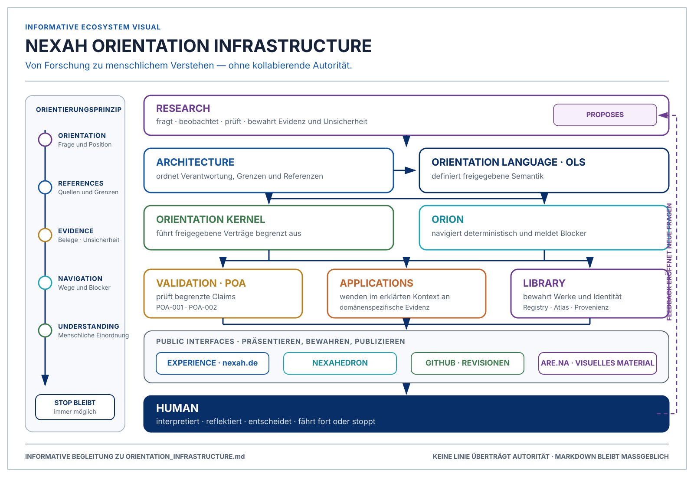

# NEXAH Orientation Infrastructure

**Status:** Informative conceptual synthesis

**Scope:** The present NEXAH ecosystem and its established responsibilities

**Date:** 2026-07-25

This document explains what the NEXAH ecosystem has become. It introduces no
new layer, operator, language, repository, application, or architectural
authority. The adopted Constitution, released OLS suite, repository-local
architecture, system-state records, and frozen POA documents retain their
existing authority.

It is a conceptual bridge between the work already preserved as Research,
Architecture, Language, Validation, Applications, and Public Interfaces. It is
not an implementation specification, repository map, status ledger, or
replacement for those documents.



> **Informative visual companion.** The diagram summarizes the responsibility
> relationships described here. It transfers no authority between them and
> does not replace this document or any referenced canonical source.

## 1. Why this infrastructure exists

Complex systems are encountered through partial representations: measurements,
models, documents, diagrams, graphs, simulations, publications, and human
questions. Each representation reveals something and omits something. Moving
between them responsibly requires more than retrieving information or
displaying it clearly. It requires visible references, bounded claims,
preserved evidence, explicit uncertainty, and a way to stop when a transition
is unsupported.

NEXAH exists to provide that orientation.

It is not primarily another AI. It does not replace human interpretation or
decision-making with an autonomous answer.

It is not primarily another database. It may preserve records and
relationships, but storage does not establish their meaning or authority.

It is not primarily another visualization tool. Representations make results
perceptible; they do not become the results they depict.

It is not primarily another website. Websites provide entrances and
experiences; they do not silently acquire semantic, scientific, or validation
authority.

NEXAH is an evidence-bound infrastructure for understanding where one is
within a complex field, what references are available, which relationships and
transitions are declared, what remains unknown, and which next steps are
supported. Its purpose is not to remove complexity through unjustified
certainty. Its purpose is to make complexity navigable without hiding its
limits.

## 2. The ecosystem

The infrastructure is a coordination of established responsibilities. It is
not one program and does not have one universal runtime.

```text
                              HUMAN
                                ^
                                |
                    understanding and judgment
                                |
        +---------------- PUBLIC INTERFACES ----------------+
        |                  |                 |              |
     Experience       NEXAHEDRON          GitHub         Are.na
        ^                  ^                 ^              ^
        |                  |                 |              |
     Library -------- Applications ------ Validation -------+
        ^                  ^                 ^
        |                  |                 |
        +----------- Kernel / ORION ----------+
                           ^
                           |
                          OLS
                           ^
                           |
                      Architecture
                           ^
                           |
                Research questions and evidence

Authority moves only through explicit adoption, execution, review, or
publication. No arrow transfers the authority of one responsibility to another.
```

### Research

Research asks questions, develops hypotheses, conducts bounded experiments,
preserves observations, and states uncertainty. It contains active scientific
work, including structural, geometric, dynamical, and application-specific
investigation. Research can inform Architecture, OLS, implementations, and
applications, but does not become released semantics merely because a result
is promising or reproducible.

### Architecture

Architecture gives the ecosystem stable responsibilities, boundaries,
reference relationships, and authority rules. It explains where meaning,
execution, evidence, representation, publication, interpretation, and
decision belong. Architecture structures accepted responsibility; it does not
manufacture evidence and does not replace the Constitution.

### Orientation Language

The Orientation Language Specification, OLS, is the released semantic
authority for describing bounded orientation. It defines the stable language,
declarations, operator contracts, composition, derivations, conformance rules,
versioning, and governance within its published scope. OLS does not execute
itself, establish domain validity, or turn every related implementation format
into a normative carrier.

### Kernel

The NEXAH Orientation Kernel is the maintained implementation track for
approved deterministic contracts and evidence-bound reports. It makes parts of
the language and architecture executable while preserving the distinction
between implementation behavior and semantic authority. Its current
computational work includes demonstrator-level and actively validated
capabilities; implementation does not imply complete conformance or universal
validity.

### ORION

ORION provides deterministic orientation and navigation through known,
declared, and registered structures within its certified scope. It preserves
identity, provenance, evidence boundaries, blockers, and missing capability.
ORION owns its architecture, implementation, reports, and validation records.
It does not define OLS meaning, invent unavailable transitions, interpret
personal significance, or decide for the Human.

### Validation

Validation connects an architectural claim to inspectable evidence. The
Proof-of-Architecture experiments freeze a narrow claim, its inputs,
conditions, implementation boundaries, expected failures, results,
representations, checksums, and Human Review. Validation therefore records
what has been demonstrated without promoting a bounded result into a general
claim.

Validation is now an explicit ecosystem capability because POA-001 and
POA-002 show that architectural boundaries can be tested as executable,
replayable evidence. It remains a responsibility and lifecycle activity, not a
new constitutional House or an authority above Research, Architecture, or OLS.

### Applications

Applications place orientation methods in declared domains and use cases.
They include maintained reference applications, applied research programs,
demonstrations, adapters, and experimental prototypes. Each application must
carry its own evidence and maturity boundary. An application may demonstrate
usefulness in its scope; it does not generalize its result to every domain or
redefine the language it uses.

### Library

The Living Library preserves Works, Editions, publication metadata,
provenance, curated relationships, reader paths, and editorial context. Its
Registry provides stable NEXAH identity and classification. The Library makes
orientation communicable across works and collections without becoming OLS
semantic authority or computational validation.

### Experience

NEXAH Experience makes the ecosystem publicly perceivable and navigable,
principally through `nexah.de`. It provides explanation, public onboarding,
the Library, Living Atlas, Laboratory, Reading Spaces, and routes to deeper
sources. Experience owns presentation and encounter. It does not define
semantics, validate evidence, or alter the records it presents.

### NEXAHEDRON

NEXAHEDRON is the Human-facing reference Workspace and Laboratory application.
It provides a place for an Orientation Session in which system results remain
distinguishable from human reflection and decision. The Workspace consumes
declared upstream responsibilities; it does not become the architecture,
language, or processor because it makes them usable.

### GitHub

GitHub preserves versioned specifications, source, evidence, reviews, releases,
and revision identity. It makes provenance and change inspectable across
repositories. Repository presence does not determine conceptual authority;
authority comes from the ecosystem's declared responsibility and governance.

### Are.na

Are.na is the live visual publication and browsing surface for Library
material and editorial sequence. It provides access to visual source content
and public arrangement. The NEXAH Library Registry retains stable identity and
classification; public arrangement does not replace that registry.

## 3. Knowledge lifecycle

The ecosystem's knowledge lifecycle is:

```text
Question
   |
   v
Research
   |
   v
Evidence
   |
   v
Architecture
   |
   v
Language
   |
   v
Implementation
   |
   v
Validation
   |
   v
Publication
   |
   v
Application
   |
   v
Feedback
   +-----------------------------> Question / Research
```

This sequence describes responsibilities, not an automatic promotion path.

- A **Question** establishes what requires orientation.
- **Research** investigates it without presuming the answer.
- **Evidence** preserves what was observed, how, and with which limits.
- **Architecture** adopts stable responsibilities and relationships when
  justified.
- **Language** gives released meaning to the concepts within its scope.
- **Implementation** executes declared behavior without becoming semantic
  authority.
- **Validation** tests a bounded claim against explicit success and failure
  conditions.
- **Publication** makes an artifact available to a declared audience.
- **Application** uses the available language, implementation, and evidence in
  a stated context.
- **Feedback** returns observed use, misunderstanding, failure, or new questions
  to the appropriate owner.

Publication and validation are independent properties. A published work,
website, diagram, or program may still be exploratory or unvalidated. A
validated experiment may remain local, frozen, or unpublished. Neither status
silently supplies the other.

Likewise, implementation is not proof, and validation is never broader than
the claim, inputs, conditions, and evidence that were actually tested.

## 4. Validation

POA-001 and POA-002 provide the first frozen executable evidence for the
distilled architectural chain. They validate different claims.

### POA-001 — one complete, inspectable chain

POA-001 demonstrates one deterministic passage through:

```text
Human Request
  -> Observation
  -> OLS Expression
  -> one bounded Processor
  -> immutable Result
  -> static SVG Representation
  -> Human Review
```

For its committed `COMPARE` slice, the experiment shows byte-stable replay,
checksum integrity, visible lineage, preservation of evidence, uncertainty,
limitations, prohibited implications, and fail-closed behavior for its
required negative cases. A reviewer can trace the Representation back to the
immutable Result without reading processor source code.

POA-001 validates only this single frozen experimental slice. It does not
establish general OLS validity, general Processor conformance, Representation
independence, multi-Processor equivalence, arbitrary domains, distributed
execution, or interoperability.

### POA-002 — two independent implementations, one semantic outcome

POA-002 reuses the frozen Observation and OLS Expression and compares two
isolated Processor implementations of the same declared `COMPARE` capability.
Each implementation deterministically reproduces its own immutable Result.
The experiment preserves implementation-specific differences rather than
normalizing them away.

For this slice, structural equivalence and semantic equivalence pass. Byte
equivalence between the independent Results is false, expected, and not
required. Both implementations preserve the same evidence, uncertainty,
prohibited implications, and STOP behavior.

POA-002 validates semantic equivalence between these two implementations of
this one frozen capability. It does not establish general Processor
conformance, arbitrary OLS operator support, Representation independence
beyond the experiment, distributed execution, interoperability in general, or
domain validity.

Together the experiments establish that the architecture can be made
executable and inspectable for one bounded slice, and that this slice is not
inseparable from a single Processor implementation. They do not establish a
general certification system for the ecosystem.

## 5. Authority model

The infrastructure remains coherent because responsibility does not travel
silently with an artifact.

| Responsibility | What it may establish | What it does not replace |
|---|---|---|
| Research | Questions, hypotheses, observations, evidence, uncertainty | Released semantics or governance |
| Architecture | Adopted structure, boundaries, references, responsibility | Evidence or implementation behavior |
| OLS | Released orientation semantics and conformance requirements | Research findings, execution, or domain validity |
| Implementations | Executable behavior in a declared scope | OLS authority or Human judgment |
| POAs | Validation evidence for a frozen claim and experiment | General conformance or broader architectural truth |
| Applications | Domain use and domain-bounded evidence | Language or ecosystem-wide validity |
| Library | Work identity, editions, editorial provenance, curated context | OLS semantics or computational proof |
| Websites | Presentation, navigation, onboarding, encounter | Architecture, evidence, or canonical records |
| Are.na | Live visual publication and sequence | Library Registry identity |
| GitHub | Revisions, source, review history, releases, and preservation | Conceptual authority by repository location alone |
| Human | Interpretation, reflection, consent, continuation, decision, STOP | Recorded evidence or system provenance |

The resulting rule is simple:

```text
Research proposes.
Architecture structures.
OLS defines released semantics.
Implementations execute.
POAs validate bounded claims.
Applications apply within declared domains.
Websites explain.
Are.na publishes visual material.
GitHub preserves revisions.
The Human interprets and decides.
```

No responsibility silently replaces another.

## 6. The orientation principle

The project follows the same orientation principle that it studies:

```text
orientation
   |
   v
references
   |
   v
evidence
   |
   v
navigation
   |
   v
understanding
```

**Orientation** identifies the question, position, scope, and limits of the
current representation.

**References** make authorities, sources, identities, and relationships
inspectable rather than implicit.

**Evidence** distinguishes what is supported from what is inferred, proposed,
unknown, or prohibited.

**Navigation** shows declared possible transitions and visible blockers without
inventing a route.

**Understanding** remains a Human achievement: an informed interpretation of
the available references and evidence, including the freedom to continue,
return, wait, or stop.

Every ecosystem responsibility exists to preserve part of this passage.
Research prevents premature certainty. Architecture prevents responsibility
collapse. OLS preserves meaning. Implementations make declared behavior
inspectable. Validation tests claims. Applications expose contextual limits.
Library and public interfaces make knowledge encounterable. Provenance allows
the Human to trace the path.

## 7. The Desk

The future Desk is the Orientation Surface for the project.

It is not a software product, live dashboard, service, registry, or new source
of truth. Its simplest and most maintainable form is one small Markdown
document at the root of the canonical NEXAH repository.

The Desk should answer:

- What repositories and public surfaces exist?
- Which exact sources and revisions are current?
- What is active, frozen, published, historical, or pending?
- Where does each responsibility's authority live?
- Which research and applications are active?
- What has been validated, and within what scope?
- Which owner decisions remain unresolved?
- What are the next three bounded actions?

It remains intentionally small because orientation depends on revealing the
correct source, not reproducing it. A large Desk would become another
competing repository map, backlog, architecture document, or status archive.
The Desk should link to the Constitution, Architecture, System State, OLS
release, repository-local indexes, POA evidence, application status, Library,
and public deployment records while copying none of their normative content.

Its authority is navigational: it tells maintainers where to look and when a
status was last verified. It does not change the meaning of what it links.

## 8. Current maturity

NEXAH does not have one ecosystem-wide maturity level. Its responsibilities
have intentionally different states.

### Already mature

- The ecosystem's constitutional responsibility and Human-authority model.
- The separation of Research, Language, Implementation, Applications, Library,
  Editorial responsibility, ORION, Experience, and Human interpretation.
- The canonical OLS 1.0 publication and its authority rules.
- Repository-level provenance, scope statements, evidence boundaries, and
  navigation practices.
- Deterministic, inspectable behavior for the declared POA slices.
- The Library's separation of Registry identity from public visual
  publication.

“Mature” here means coherent and governed within a declared scope, not
universally complete.

### Still active research

- Structural and field reconstruction across dynamical systems.
- Transition geometry, JANUS, stability, gates, navigation, and recovery.
- Broader statistical and cross-system validation.
- Domain applications, including power systems and Orientation Translation.
- Human effects, reader outcomes, calibrated uncertainty, and the limits of
  generalization.

Active research is a protected state: it permits investigation while retaining
open questions and counterevidence.

### Frozen

- The adopted constitutional baseline.
- Published OLS release units.
- Frozen ORION architecture and release baselines within their named scopes.
- POA-001 and POA-002 designs, artifacts, evidence, and conclusions.

Frozen means stable and addressable. It does not mean every possible claim has
been tested.

### Historical

- Earlier NEXAH layouts, exploratory systems, superseded architecture
  diagrams, prototype lineages, and dated visual snapshots.
- Preserved books, visual series, and research artifacts whose present
  authority is not established.

Historical material remains valuable evidence of development. Its role is to
preserve lineage, not to compete with current authority.

### Pending

- One approved, maintained project Desk.
- Resolution of connected repository revisions and selected repository
  identities.
- Broader empirical and Human validation.
- Verification and maintenance of public deployment state.
- Clear provenance/status indexing for local book and visual archives.
- Public onboarding and contribution routes that reflect the now-stable
  responsibility model.

Pending work is not an architectural deficiency. It is the work required to
make an already coherent ecosystem easier to navigate, evaluate, and use.

## 9. Future evolution

Evolution should occur inside the existing responsibilities.

### What should evolve

**Applications** can test the established language and implementation
boundaries in additional declared contexts, with domain-specific evidence and
limits.

**Human studies** can examine comprehension, trust, traceability, reader
effects, and the difference between system output and personal understanding.

**Builders** can receive clearer contribution routes, bounded examples,
ownership guidance, and evidence requirements without creating a new Builder
authority or repository by default.

**Educational material** can make references, evidence, uncertainty,
representation, validation, and STOP behavior easier to learn without
simplifying them into unsupported certainty.

**Websites** can improve presentation, accessibility, cross-linking, and the
visibility of source authority.

**Public onboarding** can provide distinct routes for readers, researchers,
implementers, reviewers, and Workspace users.

**Community** can grow around transparent contribution, review, publication,
and stewardship while Human judgment and responsibility remain explicit.

These are areas of continued work, not commitments to new applications,
services, protocols, or layers.

### What should remain stable

- The Constitution and its Human-authority principle.
- Published OLS releases and their release-specific governance.
- Frozen POA claims, artifacts, evidence, and limits.
- Scientific evidence, including negative and uncertain findings.
- Repository and public-surface responsibility boundaries.
- The distinction between canonical and derived artifacts.
- The separation of validation from publication.
- The rule that no representation, implementation, or public interface becomes
  authority merely by being useful or visible.

Stability does not prohibit future versions. It requires that change be
explicit, scoped, attributable, and unable to rewrite the evidence of earlier
states.

## Final review

### 1. What changed compared to six months ago?

The preserved development record shows a transition from a predominantly
research- and prototype-centered body of work into a governed ecosystem with a
published Orientation Language, separated implementation responsibilities,
maintained applications and Library structures, public interfaces, frozen
ORION boundaries, and executable Proof-of-Architecture evidence. The main
change is not that research ended; it is that research now has explicit paths
to architecture, semantics, implementation, bounded validation, and
publication without those responsibilities collapsing into one another.

### 2. What is now stable?

The constitutional authority model, the ecosystem responsibility boundaries,
OLS 1.0, the distinction between semantics and execution, the role of ORION,
the separation of Result and Representation, the public-surface
responsibilities, and the bounded conclusions of POA-001 and POA-002 are
stable within their declared versions and scopes.

### 3. What is intentionally still evolving?

Scientific research, empirical breadth, applications, Human studies,
educational explanation, builder onboarding, public presentation, community
practice, and operational navigation remain active. They should evolve through
their existing owners while preserving evidence, uncertainty, and scope.

### 4. What is the next architectural milestone after this document?

The next milestone is navigational rather than architectural invention:
approve the small NEXAH Desk as the maintained Orientation Surface, bind it to
verified repository revisions and existing sources of truth, and make the
frozen validation milestones discoverable from it. That milestone is not
implemented by this document.
