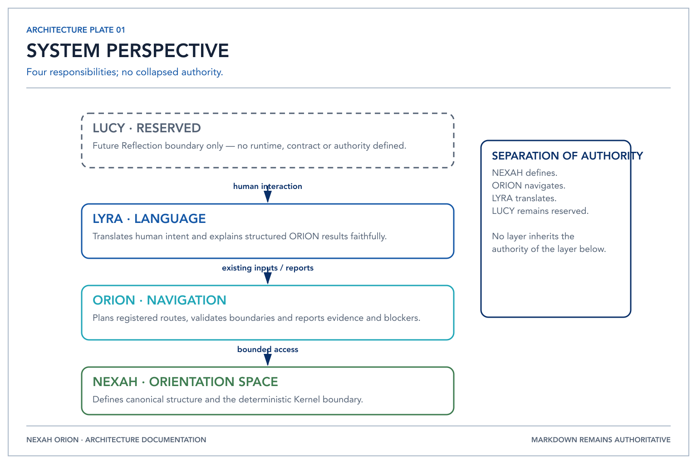
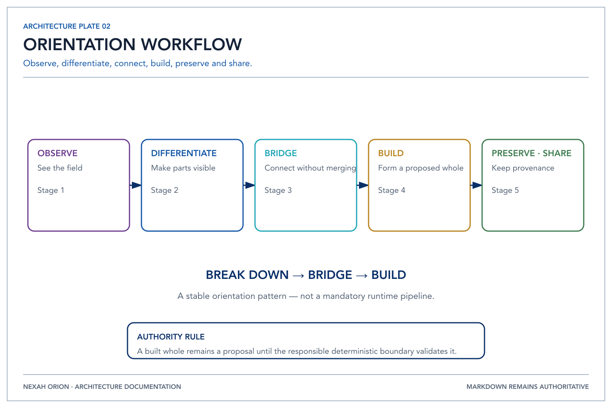
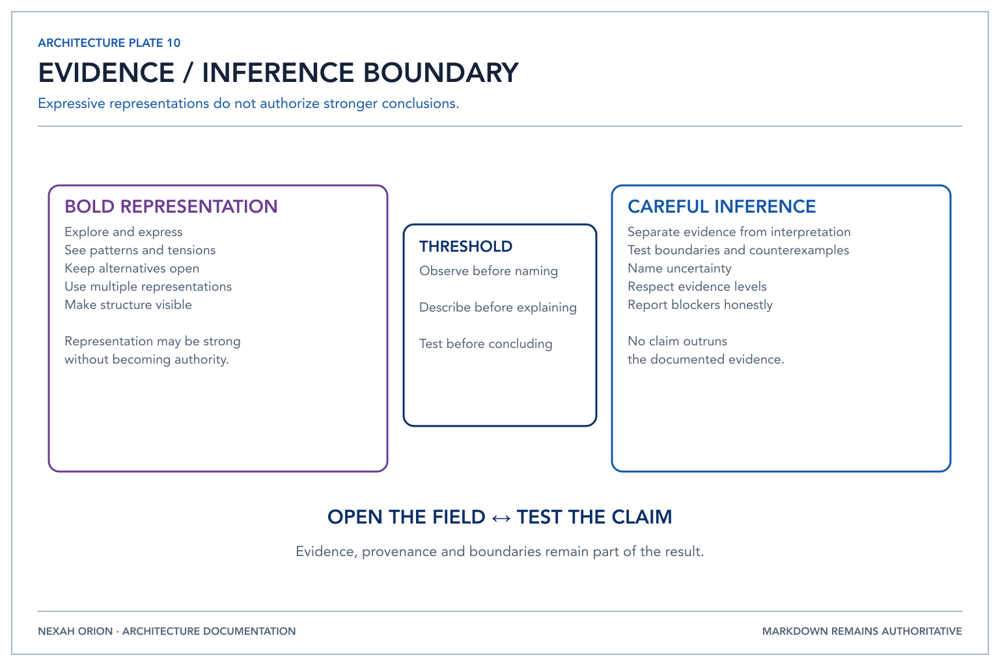

# ORION Architecture

Status: Frozen ORION v1 Architecture Baseline
Datum: 19. Juli 2026
Freeze bestätigt: 19. Juli 2026, Phase F1
Scope: Architektur, Verantwortlichkeiten, Autorität und Erweiterungsgrenzen
Entscheidungsgrundlage: `NEXAH_REASONING_ARCHITECTURE_REVIEW.md`, sechs Visual-Iterationen zur Architecture of Orientation sowie die vorangegangenen Construction Documents

---



*NEXAH defines the Orientation Space, ORION navigates it, and LYRA makes it
accessible to human language.*

## 1. Zweck dieses Dokuments

Dieses Dokument stabilisiert die Architektur, die im Engineering Review und in mehreren visuellen Iterationen unabhängig voneinander sichtbar geworden ist.

Die Visuals sind keine UI-Spezifikation und ihre Namen sind keine automatische Repository-Struktur. Sie liefern konzeptionelle Evidenz. Das Engineering Review liefert technische Randbedingungen. Dieses Dokument übersetzt beides in eine implementierbare Architektur, ohne Metapher, Repräsentation, Software und Dateisystem miteinander zu vermischen.

Die Exploration und die erste Human-facing Integration gelten als abgeschlossen.
Diese Baseline ist durch
[`ORION_V1_ARCHITECTURE_FREEZE.md`](ORION_V1_ARCHITECTURE_FREEZE.md) und
[`ADR-0008`](../adr/0008-orion-v1-architecture-freeze.md) eingefroren. Änderungen
an ihr erfolgen künftig über explizite Architecture Review und ein akzeptiertes
Architecture Decision Record (ADR), nicht über neue Posterinterpretationen.

### Aktueller Interaktionsnachweis

Phase 6B implementiert LYRA als deterministische, nicht-autoritative Translation-
und Explanation-Grenze. Phase 6C validiert diese Grenze mit versionierten
[`Orientation Sessions`](../orientation_sessions/README.md). Die Sessions
verwenden ausschließlich vorhandene Planning Inputs und Reports, ändern keine
Engine-Entscheidung und halten LUCY ausdrücklich außerhalb des Ausführungspfads.

## 2. Verbindliche Architekturentscheidung

ORION ist die modellunabhängige Reasoning-Architektur oberhalb des deterministischen NEXAH Kernel.

> Das Modell schlägt vor.
> Der Orchestrator validiert.
> Der Kernel entscheidet.

Diese Aussage definiert drei verschiedene Autoritäten:

1. Ein Reasoning-Modell erzeugt nicht-kanonische Kandidaten.
2. ORION steuert den Run, stellt Kontext bereit und prüft die Kandidaten.
3. Nur der Kernel darf kanonischen NEXAH-Zustand akzeptieren oder verändern.

ORION ist damit weder ein weiteres Sprachmodell noch eine weitere Anwendung. ORION ist die kontrollierte Vermittlung zwischen Anwendungen, Wissen, Repräsentationen, Modellen und Kernel.

## 3. Vier Ebenen, die nicht vermischt werden dürfen

### 3.1 Metapher

Metaphern erklären Bedeutung, Bewegungsrichtung oder Haltung. Sie dürfen Sprache und Dokumentation prägen, aber keine versteckten technischen Abhängigkeiten erzeugen.

Beispiele:

- Sternbilder, Spiralen, kosmisches Zentrum und Observer Path
- Hunter, Lyre, Bright One, Bridge und Fusion of Worlds
- Fission → Bridging → Fusion
- Anchoring, Harmonics, Ascension und Dragonfly Mode
- Bewegung zwischen Welten

Metaphern werden nicht als Services, Klassen, Prozesse, Datenbanken oder Deployments implementiert.

### 3.2 Repräsentation

Repräsentationen machen dieselbe Architektur für unterschiedliche Zwecke verständlich. Sie können visuell, sprachlich, mathematisch oder maschinenlesbar sein.

Beispiele:

- Poster, Map, Blueprint, Specification und Atlas
- Graph-, Poset-, Lattice-, Neighborhood- und Reader-Path-Sichten
- LYRA als Sprache und Übersetzungsschicht
- Sirius als Darstellung eines lokalen Zugangspunkts oder Begleiters
- Operator als Darstellung der navigierenden menschlichen Rolle

Repräsentationen dürfen variieren. Sie müssen auf dieselben kanonischen Objekte, Beziehungen und Provenance-Referenzen zurückführbar bleiben.

### 3.3 Architektur

Architektur definiert Verantwortlichkeiten, Verträge, Autorität, Datenbewegung und Grenzen.

Stabile Architekturelemente sind:

- Human als Ursprung von Intention und delegierter Autorität
- Anwendungen und Operator-Flows als Eingangs- und Freigabegrenze
- ORION als Orchestration-, Context- und Validation-Schicht
- Kernel als kanonische, deterministische Foundation
- LYRA als menschliche Language-/Translation-Boundary
- Library als kuratierte Wissens-, Evidenz- und Kontextquelle
- Reasoning Backends als austauschbare, nicht-autoritative Inferenzdienste
- Adapter als Anti-Corruption Layer zu lokalen und Cloud-Runtimes
- Audit, Provenance, Policy und Evaluation als durchgängige Kontrollen

### 3.4 Implementierung

Implementierung sind konkrete Schemas, Packages, Prozesse und Werkzeuge.

Beispiele:

- `OrientationRequest` und spezialisierte Request-Schemas
- Context Planner, Retriever, Reranker und Context Manifest
- Backend Router und `ReasoningBackend`-Port
- Ollama-, llama.cpp-, GPT- oder Claude-Adapter
- Validatoren und vorgeschlagene Kernel Commands
- Review/Diff/Approve-Workflow
- Contract-, Conformance- und Acceptance-Tests

Implementierungsentscheidungen dürfen ausgetauscht werden, solange Architekturverträge und Invarianten erhalten bleiben.

## 4. Klassifikation der wiederkehrenden Namen

| Begriff | Primäre Kategorie | Stabile Bedeutung | Softwareübersetzung | Nicht daraus ableiten |
|---|---|---|---|---|
| Kernel | Architektur | kanonische Foundation; Objekte, Relationen, Invarianten, Grenzen | versionierter NEXAH Core und seine Ports | ein LLM, Prompt oder Workflow-Manager |
| ORION | Architektur | modellunabhängige Reasoning- und Orchestration-Schicht | Orchestrator, Context Pipeline, Routing, Validation, Evaluation | „das Llama-Modul“ oder bloßer Modellwrapper |
| LYRA | Spracharchitektur | kanonische Sprache zwischen Human und ORION | deterministische Translation vorhandener Inputs und faithful Explanation vorhandener Reports | Renderer, Reasoning Engine oder zweite Wahrheitsschicht |
| Library | Architektur/Daten | kuratierte gemeinsame Evidenz, Werke, Maps, Records und Corpora | getrennt versionierte Wissensbestände mit Provenance und Retrieval-Ports | beliebiger Dokumentenordner oder ORION-Quellcode |
| Sirius | Repräsentation/Systemgrenze | lokaler Knoten, Begleiter, Interface oder Gate | optionale Client-/Edge-Runtime oder Builder-Anwendung | Core-Service oder kanonische Autorität |
| Operator | Rolle/Trust Boundary | navigiert, prüft, baut und genehmigt | Rollen, Berechtigungen, Review- und Approval-Flows | autonomer Super-Agent mit impliziten Rechten |
| Human | konzeptionelle Autorität | Intention, Verantwortung und finale Delegation | Actor/Principal in Policy und Audit | Package, Service oder automatisierbare Komponente |
| Bridge | Prozessmetapher | Beziehungen herstellen, ohne Unterschiede aufzulösen | Mapping-, Alignment- und Translation-Operationen | pauschales Zusammenführen von Daten oder Modellen |
| Fission | Prozessmetapher | zerlegen, differenzieren, Grenzen sichtbar machen | Analyse-/Decomposition-Schritte | eigener Microservice |
| Fusion | Prozessmetapher | geprüfte Synthese zu einer neuen Repräsentation | Synthesevorschlag plus Kernel-validierte Übernahme | ungeprüftes Mergen oder Verlust der Quellen |
| Cosmos | Metapher/Domänenlinse | Feld, Maßstab und Orientierung | möglicherweise spätere Domänenprofile | Infrastruktur-Layer |
| Geometry | Repräsentationslinse | Form, Ordnung, Lattices und Proportion | formale Modelle im Core oder ORION-Representation-Projektionen | eigenständiger Produktbereich ohne Use Case |
| Atlas | Repräsentation/Dokumentation | navigierbare Bedeutungs- und Beziehungssicht | Atlas Objects und publizierte Dokumentationssicht | Ersatz für Spezifikation oder kanonischen Zustand |

Die Namen bleiben wertvoll, aber die technische Architektur verwendet zusätzlich klare Funktionsnamen. Ein Entwickler muss die Systemgrenze verstehen können, ohne die Metaphern zu kennen.

## 5. Stable Concept Set

Die folgenden Konzepte erscheinen in mehreren visuellen Iterationen und stimmen zugleich mit dem Engineering Review oder den Construction Documents überein. Nur sie werden als stabil übernommen.

### 5.1 Ein stabiler Kernel

Der Kernel hält kanonische Objekte, Relationen, Invarianten, Provenance, Versionen und Grenzen. Er bleibt unabhängig von Anwendung, Repräsentation und Modell.

### 5.2 Reasoning oberhalb des Kernel

ORION arbeitet mit Kernel-Sichten und schlägt Veränderungen vor, besitzt aber keine kanonische Schreibautorität. Diese Trennung erscheint sowohl in den Architekturdiagrammen als auch im Review.

### 5.3 Der Mensch bleibt außerhalb der Maschine

Human und Operator erscheinen wiederholt als Quelle, Rolle oder Navigator außerhalb von Kernel und ORION. Daraus folgt eine echte Trust Boundary: Intention und Genehmigung dürfen nicht stillschweigend durch Modellinferenz ersetzt werden.

### 5.4 Mehrere Repräsentationen, eine Bedeutung

Poster, Map, Blueprint, Specification und Atlas sowie die wiederkehrenden Domänenreihen zeigen: NEXAH reduziert ein Objekt nicht auf eine einzige Darstellung. Übersetzungen müssen Identität und Provenance bewahren.

### 5.5 Zerlegen, verbinden, neu bilden



*Orientation moves from observation through differentiation and connection
toward a preserved, shareable result.*

Die Iterationen variieren sprachlich, erhalten aber denselben Arbeitsrhythmus:

```text
Observe → Differentiate/Break Down → Relate/Bridge → Synthesize/Build → Preserve/Share
```

Dies ist ein fachliches Prozessmuster, keine zwingende feste Pipeline für jeden Request.

### 5.6 Wissen ist eine eigene Quelle

Library erscheint wiederholt neben Kernel, ORION und LYRA. Wissen hat eine andere Lebensdauer und Autorität als Code. Es wird referenziert und versioniert, nicht in Prompts oder Quellcode eingebettet.

### 5.7 Lokaler Zugang ohne lokale Wahrheitshoheit

Sirius bleibt ein lokaler Node, Gate, Companion oder Interface. Lokalität ist eine Deployment- und Interaktionsqualität, keine kanonische Autorität.

### 5.8 Bewahren und Teilen gehören zum System

Preserve, Evidence, Provenance, Library und Share treten über die Serien hinweg wieder auf. Ein Run endet daher nicht bei einer Antwort, sondern bei einem prüfbaren Artefakt mit Herkunft und bewusstem Publikationsstatus.

### 5.9 Evidenzmatrix der sechs Iterationen

Zur Stabilitätsprüfung wurden die Visuals als sechs Iterationen betrachtet:

- **V1** – The Bridge Operator: Fission · Bridging · Fusion
- **V2** – The Fusion of Worlds
- **V3** – Architecture of Orientation: Stage VI
- **V4** – Architecture of Orientation: Five Stages
- **V5** – Architecture of Orientation: Blackboard
- **V6** – Break It Down · Bridge It · Build

| Konzept | V1 | V2 | V3 | V4 | V5 | V6 | Extraktion |
|---|:---:|:---:|:---:|:---:|:---:|:---:|---|
| Kernel als Foundation | ✓ | ✓ | ✓ | ✓ | ✓ | – | Architektur |
| ORION als Reasoning | ✓ | ✓ | ✓ | ✓ | ✓ | – | Architektur |
| LYRA als Language/Meaning | ✓ | ✓ | ✓ | ✓ | ✓ | – | Repräsentationsarchitektur |
| Sirius als lokaler Companion/Node | ✓ | ✓ | ✓ | ✓ | ✓ | – | Systemgrenzen-Repräsentation |
| Human als Quelle/Zweck | ✓ | ✓ | ✓ | ✓ | ✓ | ✓ | Trust Boundary |
| Operator/Navigator | ✓ | – | ✓ | ✓ | ✓ | implizit | Rolle |
| Library/Shared Memory | – | – | ✓ | ✓ | ✓ | Share/Preserve | Wissensgrenze |
| Break Down → Bridge → Build | ✓ | ✓ | Prozessvariante | Prozessvariante | Prozessvariante | ✓ | fachliches Prozessmuster |
| mehrere Repräsentationen | ✓ | ✓ | ✓ | ✓ | ✓ | ✓ | Architekturprinzip |
| Poster → Map → Blueprint → Specification → Atlas | ✓ | ✓ | ✓ | ✓ | – | – | Dokumentationsstrategie |
| Preserve/Share | ✓ | ✓ | ✓ | ✓ | ✓ | ✓ | Governance-Prinzip |

Ein Häkchen bedeutet nicht, dass Wortlaut oder grafische Position identisch blieben. Stabilität wurde angenommen, wenn Rolle und Beziehung über die Iterationen erhalten blieben. Ein einzelnes Auftreten reichte nicht für die Übernahme. Deshalb werden beispielsweise Vega, Galactic Center, Lagrange Points, konkrete Phase Modes und Dragonfly Mode nicht zu Architekturelementen.

## 6. Konzeptionelle Architektur

Die konzeptionelle Architektur beschreibt, was NEXAH tut, unabhängig von Softwarekomponenten.

```text
Human Intention
      │
      ▼
Observation ──► Differentiation ──► Bridging ──► Synthesis
      ▲                                                   │
      │                                                   ▼
      └──────────── Reflection / Feedback ◄──── Preserve / Share
```

Dabei gelten vier Bedingungen:

1. Beobachtung wird nicht mit Interpretation verwechselt.
2. Teile werden beim Verbinden nicht gleichgesetzt oder quellenlos verschmolzen.
3. Synthesen bleiben Vorschläge, bis sie gegen Struktur und Evidenz geprüft wurden.
4. Geteilte Ergebnisse behalten Herkunft, Status und Grenzen.

Die Metapher „Bridge“ bedeutet deshalb nicht Fusion um jeden Preis, sondern nachvollziehbare Beziehung unter Erhalt von Differenz.

## 7. Softwarearchitektur

Dieser Abschnitt beschreibt das eingefrorene Responsibility Envelope von ORION,
nicht die Behauptung, dass jede mögliche Capability bereits implementiert ist.
Der konkrete F1-Funktionsumfang und seine Grenzen stehen im Freeze-Bericht.
Nicht implementierte Routing-, Evaluation-, Effect- oder Publication-Funktionen
bleiben Erweiterungspunkte innerhalb derselben Autoritätsgrenzen.

### 7.1 Systemkontext

```text
Human / Operator
       │ canonical language, intent, scope, approval
       ▼
LYRA / Applications / Builder Hub / Editorial OS / Review Toolbox / Sirius clients
       │ OrientationRequest
       ▼
┌──────────────────────── ORION ─────────────────────────┐
│ Request validation                                     │
│ Run orchestration                                      │
│ Context planning and assembly                          │
│ Policy, budgets and backend routing                    │
│ Result, evidence and invariant validation              │
│ Evaluation, audit and replay                           │
└──────────────┬──────────────────────────┬───────────────┘
               │ query/read               │ inference
               ▼                          ▼
      NEXAH Kernel Ports          Reasoning Backend Port
               │                          │
               │                   backend adapters
               │                          │
               ▼                          ▼
     canonical NEXAH state       local/cloud model runtimes
               ▲
               │ curated evidence and typed projections
      ┌────────┴─────────┐
      │ Library          │
      │ typed references │
      └──────────────────┘
```

### 7.2 ORION-interne Verantwortlichkeiten

ORION besteht logisch aus sechs Bereichen. Sie beginnen als Module in einem Prozess und werden nicht vorschnell zu Microservices.

1. **Contracts** – versionierte Requests, Results, Commands, Fehler und Capabilities.
2. **Orchestration** – Run Lifecycle, State Machine, Budgets, Cancellation, Retry und Approval Stops.
3. **Context** – Discovery, Retrieval, Graph Expansion, Ranking, Compression und Context Manifest.
4. **Reasoning** – Backend Port, Router, Prompt/Message Renderer und Adapteraufrufe.
5. **Validation** – Schema-, Citation-, Evidence-, Policy- und Kernel-Invariantenprüfung.
6. **Evaluation/Audit** – Run Record, Replay, Acceptance Corpus, Qualitäts- und Betriebsmetriken.

### 7.3 Request-to-Decision Flow

```text
OrientationRequest
  → contract validation
  → deterministic scope resolution
  → task and context plan
  → immutable ContextPackage + ContextManifest
  → capability-based backend selection
  → backend-specific rendering
  → model inference
  → typed ReasoningResult
  → schema/evidence/policy validation
  → ProposedKernelCommands
  → human approval when policy requires it
  → kernel validation and decision
  → RunRecord + resulting canonical references
```

Fehler, Abbruch und Ablehnung sind reguläre Endzustände und werden ebenfalls protokolliert.

### 7.4 Autoritätsmatrix

| Entscheidung | Human/Operator | Anwendung | ORION | Modell | Kernel | Library |
|---|---:|---:|---:|---:|---:|---:|
| Intention und Zweck setzen | A | C | C | – | – | – |
| Request erfassen | C | A/R | V | – | – | – |
| Kontext auswählen | C | – | A/R | Vorschlag | C | Quelle |
| Hypothesen/Synthesen erzeugen | C | – | A | R | – | Quelle |
| Evidenzbezug prüfen | C | – | A/R | – | C | Quelle |
| kanonischen Zustand ändern | Approval nach Policy | – | Vorschlag | – | A/R | – |
| Wissen publizieren | A | R | V | – | C | Ziel/Quelle |

Legende: A = accountable, R = responsible, C = consulted, V = validates, – = keine Autorität.

### 7.5 LYRA Boundary

LYRA ist die menschliche Language Boundary und keine zweite Wahrheitsschicht.
Sie übersetzt kanonische Vokabeln auf vorhandene ORION-Inputs und erklärt
vorhandene strukturierte Ergebnisse. Sie ist kein Renderer und transformiert
keine Representation. Jede Erklärung behält Status, Evidenz, Provenance,
Validation, Blocker und Alternativen des autoritativen Reports. Freie Modellprosa
ist keine kanonische LYRA-Ausgabe.

### 7.6 Library Boundary

Library bezeichnet kuratierte Wissensbestände, nicht eine allgemeine Softwarebibliothek. Sie umfasst beispielsweise Review Corpora, Werke, Maps, Records, Evidenzsegmente und Atlas-Quellen.

Library-Inhalte benötigen:

- stabile Content-IDs
- Version und Status
- Quelle, Rechte und Provenance
- Autoritäts- und Aktualitätsmetadaten
- maschinenlesbare Segmente plus Originalreferenz
- getrennte Draft-, Reviewed- und Published-Zustände

ORION liest Library-Inhalte über Ports und erzeugt höchstens Publikationsvorschläge. Ein Modell schreibt nie direkt in kuratierte Bestände.

### 7.7 Sirius und Operator

Sirius und Operator sind keine ORION-Subsysteme.

- **Sirius** ist eine mögliche lokale Client-/Edge-Runtime: persönliche Umgebung, lokaler Kontext, sichere Verbindung, Offline-Fähigkeit und Run Inspection.
- **Operator** ist eine Rolle: Request formulieren, Scope setzen, Evidenz prüfen, Diff verstehen, genehmigen oder ablehnen.

Eine Anwendung kann beide Konzepte verkörpern. Weder benötigt zum Start ein eigenes Repository.

## 8. Repository-Architektur

### 8.1 Entscheidung: kein naives `/core /orion /lyra /library`

Vier gleichrangige Ordner würden semantische Ebenen vermischen:

- Core und ORION enthalten Laufzeitcode.
- LYRA ist eine interne fachliche Language Boundary ohne eigene Planungs- oder Renderer-Autorität.
- Library enthält primär versioniertes Wissen und andere Governance-Regeln.

Die empfohlene Zielstruktur ist ein Multi-Repository-Workspace mit klaren Release-Grenzen.

### 8.2 Eingefrorene Repository-Grenzen

```text
nexah-core/              bestehender stabiler Kernel
nexah-orion/             Reasoning-, Context-, Navigation- und LYRA-Architektur
nexah-library/           kuratierte, veröffentlichbare Wissensbestände
nexah-builder-hub/       unabhängige operator-facing Anwendung
```

Architektur- und Entwicklungsdokumentation für ORION liegt im ORION-Repository.
Die Zahl der Repositories wird nicht künstlich erhöht. LYRA ist eine interne
ORION-Boundary und kein eigenes Repository. Eine spätere Extraktion benötigt eine
neue Architekturentscheidung.

### 8.3 Abhängigkeitsrichtung

```text
nexah-builder-hub ──► nexah-orion contracts
nexah-orion       ──► published nexah-core ports/contracts
nexah-orion       ──► nexah-library ports/content references
nexah-orion       ──► external backend APIs through adapters

nexah-core        ──X─► nexah-orion
nexah-core        ──X─► provider SDKs
nexah-library     ──X─► model runtimes
```

Der Core kennt ORION nicht. Eine Abhängigkeit von ORION auf interne Core-Dateien ist ebenfalls verboten; verwendet werden nur publizierte Ports, Schemas oder versionierte SDK-Artefakte.

### 8.4 Eingefrorene Struktur von `nexah-orion`

```text
nexah-orion/
├── README.md
├── CHANGELOG.md
├── VERSION
├── docs/
│   ├── architecture/          # frozen baseline and specializations
│   ├── adr/                   # accepted decision history
│   ├── development/           # phase and contributor records
│   ├── governance/            # ownership and compatibility
│   ├── orientation_sessions/  # executable documentation
│   └── releases/              # release policy and compatibility
├── src/
│   └── orion/                 # internal runtime and LYRA package
├── tests/                     # unit, conformance and opt-in integration
├── scripts/                   # repository governance and verification
├── schemas/                   # reserved; no public contracts approved
├── tools/                     # reserved maintained tools
└── .workspace/                # ignored local-only material
```

Die konkrete Programmiersprache darf diese logischen Grenzen abbilden, aber nicht
umkehren. `src/orion/lyra` ist die aktuelle LYRA Language Boundary.

### 8.5 Was wohin gehört

| Inhalt | Ziel |
|---|---|
| kanonische Objekte, Relationen, Posets/Lattices und Invarianten | `nexah-core` |
| Provenance-, Boundary- und Statusregeln des kanonischen Zustands | `nexah-core` |
| Request Lifecycle, Context Planning, Routing und Validation | `nexah-orion` |
| Backend-, Kernel- und Library-Adapter | `nexah-orion` |
| LYRA Language Boundary | `nexah-orion/src/orion/lyra` |
| Review Corpora, Werke, Maps und veröffentlichte Records | `nexah-library` |
| ORION Architecture Plates und normative ORION-Dokumentation | `nexah-orion/docs` |
| Builder UI, Review/Diff/Approve und Run Inspector | `nexah-builder-hub` |
| persönliche Notizen, vertrauliche Rohdaten, Modellgewichte und temporäre Runs | ausschließlich lokaler Workspace |

### 8.6 Repository-Regeln

- Keine Modellgewichte, Secrets, persönliche Daten oder unredigierte Run-Dumps in Git.
- Prompts sind versionierte Renderer-Artefakte, aber nicht der öffentliche Domänenvertrag.
- Acceptance Corpora dürfen nur redigierte, lizenzierte und reproduzierbare Fixtures enthalten.
- Architekturänderungen benötigen ADR und aktualisierte Specification; Posteränderungen allein ändern keine Architektur.
- Provider-SDKs dürfen nur in Backend-Adaptern importiert werden.
- Kernel-Schreiboperationen dürfen nur über explizite Commands und Ports erfolgen.

## 9. Lokale Workspace-Architektur

Der lokale Workspace ist ein Arbeitskontext über mehrere unabhängige
Repositories. Er ist nicht selbst das Produkt und nicht vollständig
veröffentlichbar. `workspace.yaml` ist das Manifest; `.workspace/` ist der
ignorierte lokale Bereich.

```text
nexah-orion/
├── workspace.yaml
└── .workspace/
    ├── architecture/
    ├── repositories/
    │   ├── NEXAH/               pinned read-only Core
    │   ├── nexah-library/       only after remote confirmation
    │   └── nexah-builder-hub/   only after identity confirmation
    ├── research/
    ├── experiments/
    ├── runs/
    ├── reviews/
    ├── releases/
    └── archive/
```

### Workspace-Regeln

- `.workspace/` ist vollständig untracked und verleiht keinem Artefakt Autorität.
- Core, Library und Builder Hub werden weder kopiert noch vendort.
- Der Core-Checkout muss dem in `workspace.yaml` gepinnten Commit entsprechen
  und bleibt read-only.
- Library und Builder Hub werden erst verbunden, wenn ihre Repository-Identität
  und Remote-Quelle bestätigt sind.
- Forschung, Experimente, Runs, Reviews, lokale Release Candidates und Archive
  werden nicht durch bloße Platzierung zu Repository-Inhalten.
- Promotion benötigt Ownership, Provenance, Lizenzprüfung, Redaction und Review.
- Die ausführliche Arbeitsanleitung steht in
  [`WORKSPACE.md`](../development/WORKSPACE.md).

## 10. Offizielle Dokumentationsstrategie

### 10.1 Entscheidung

`Poster → Map → Blueprint → Specification → Atlas` wird als offizielle Dokumentationsstrategie übernommen, nicht als visueller Stil.

Die fünf Stufen sind unterschiedliche Informationsprodukte für unterschiedliche Fragen:

| Stufe | beantwortet | Inhalt | normativer Status |
|---|---|---|---|
| Poster | Warum existiert das? | eine Idee, Zweck, Richtung | nicht normativ |
| Map | Was gehört zusammen? | Elemente, Beziehungen, Grenzen | orientierend |
| Blueprint | Wie ist es strukturiert? | Rollen, Module, Flows, Deployments | architektonisch normativ nach Freigabe |
| Specification | Was muss exakt gelten? | Verträge, Schemas, Invarianten, Fehler, Policies | implementierungsnormativ |
| Atlas | Wie lebt und entwickelt es sich? | Herkunft, Beispiele, Entscheidungen, Varianten, Journeys | kuratiertes Referenzwerk |

### 10.2 Wichtige Korrektur

Diese Stufen sind keine lineare Wahrheitsleiter, bei der der Atlas die Specification ersetzt. Sie bilden fünf Projektionen derselben veröffentlichten Architekturversion.

```text
Architecture Release
   ├── Poster projection
   ├── Map projection
   ├── Blueprint projection
   ├── Specification projection
   └── Atlas projection
```

Jede Projektion trägt:

- Architecture Release ID
- Gültigkeitsstatus
- Quell-ADRs und Specification-Version
- Erstellungs- und Reviewdatum
- bekannte Auslassungen
- Links zu den anderen vier Projektionen

### 10.3 Change-Regel

Die Änderungsrichtung ist:

```text
Evidence/Need → ADR → Architecture Baseline → Specification
                                  ├→ Blueprint
                                  ├→ Map
                                  ├→ Poster
                                  └→ Atlas
```

Ein Poster ist niemals die alleinige Quelle einer technischen Änderung. Ein Atlas darf Geschichten und Bedeutung ergänzen, aber keine widersprechenden Laufzeitverträge einführen.

## 11. Konsolidierte Architekturprinzipien

Nur wiederholt auftretende und technisch belastbare Prinzipien werden übernommen.

### P1 — Structure First

Struktur, Rollen, Grenzen und Invarianten werden vor Oberflächen und Features definiert.

### P2 — Observe Before Naming

Quellen, Zustand und Kontext werden zuerst erfasst. Interpretation und Benennung bleiben davon unterscheidbar.

### P3 — Evidence Before Interpretation



*NEXAH supports expressive representations while keeping inference bounded by
evidence.*

Claims und Synthesen müssen auf identifizierbare Evidenz verweisen oder ausdrücklich als Hypothese markiert sein.

### P4 — One Kernel, Many Representations

Ein kanonischer Kernel kann viele Anwendungen, Sprachen, Maps und Atlas-Sichten tragen. Keine Darstellung wird allein zur Wahrheit.

### P5 — Separation of Authority

Human, Anwendung, ORION, Modell, Kernel und Library besitzen unterschiedliche Rechte. Validierung ist nicht Entscheidung; Vorschlag ist nicht Wahrheit.

### P6 — Break Down → Bridge → Build

Komplexität wird differenziert, Beziehungen werden explizit hergestellt und Synthesen werden als neue, prüfbare Artefakte gebaut.

### P7 — Preserve Difference and Provenance

Bridging bedeutet nicht Gleichsetzung. Quellen, Unterschiede, Unsicherheit und Transformationsgeschichte bleiben sichtbar.

### P8 — Stable Core, Replaceable Components

Kernel-Verträge bleiben stabil. Modelle, Runtimes, Retriever, Renderer und Anwendungen sind austauschbar und werden über Ports angebunden.

### P9 — Multiple Representations, Explicit Translation

Jede Projektion benennt Zweck, Verlust, Quelle und Äquivalenzbedingungen. Übersetzung wird nicht als neutrale Kopie behandelt.

### P10 — Human-Governed Impact

Je größer die Wirkung einer Operation, desto expliziter müssen Scope, Review und Freigabe sein.

### P11 — Preserve and Share Deliberately

Eine Ausgabe wird erst durch Provenance, Status und bewusste Publikation zu geteiltem Wissen.

### P12 — Learn Through Feedback Without Rewriting History

Verbesserung erzeugt neue Versionen, Evaluationen und Entscheidungen. Frühere Evidenz und Runs bleiben nachvollziehbar.

Nicht als Architekturprinzip übernommen werden kosmologische Zuordnungen, konkrete Sternnamen, Phasenorte oder numerologische Strukturen. Sie können im Atlas als kulturelle Repräsentation erhalten bleiben.

## 12. Historische Implementierungsroadmap

Dieser Abschnitt dokumentiert den ursprünglichen Plan vor der Implementierung.
Die Phasen 0–6C sind abgeschlossen; seine Nummerierung ist keine aktuelle
Roadmap und begründet keine offenen Aufgaben. Der verifizierte Ist-Stand steht im
ORION-v1-Freeze-Bericht. Neue Arbeit erweitert die eingefrorene Baseline und darf
die nachfolgenden historischen Schritte nicht als aktuelle Autorisierung lesen.

### Phase 0 — Baseline Recovery

Ziel: den realen Freeze-Stand und die Integrationsgrenzen verifizieren.

- NEXAH Core und Repository Map im Workspace verfügbar machen.
- sechs Subsysteme, öffentliche Ports und kanonische Commands inventarisieren.
- bestehende Review Corpora, Editorial OS und Review Toolbox kartieren.
- Architekturbegriffe mit tatsächlich veröffentlichten Typen abgleichen.

**Gate 0:** Ein signiertes Architecture Inventory benennt alle Core-Ports, Invarianten und verbotenen Abhängigkeiten. Keine Interface-Implementierung beginnt vorher.

### Phase 1 — Architecture Freeze

Ziel: Entscheidungen aus diesem Dokument formal beschließen.

- ADRs 001–007 erstellen und reviewen.
- Threat Model, Data Classification und Human-Approval-Policy definieren.
- ORION-Systemkontext und Autoritätsmatrix freigeben.
- Dokumentationsprojektionen mit Release IDs versehen.

**Gate 1:** Autorität, Abhängigkeiten und Scope sind beschlossen; offene Produktnamen blockieren nicht die funktionalen Grenzen.

### Phase 2 — Contracts

Ziel: Anbieter- und sprachneutrale Verträge spezifizieren.

- `OrientationRequest`, `ContextPackage`, `ContextManifest`, `BackendRequest`, `ReasoningResult`, `ProposedKernelCommand` und `RunRecord` definieren.
- Request-Typen zunächst auf `ReviewRequest` begrenzen.
- Capability-, Error-, Cancellation- und Approval-Modelle festlegen.
- Beispiele und negative Contract Fixtures erstellen.

**Gate 2:** Verträge sind versioniert und mit einem Fake Backend vollständig testbar. Kein Provider-SDK erscheint außerhalb eines Adapter-Namespace.

### Phase 3 — Deterministic Vertical Slice

Ziel: den gesamten Run ohne echtes Modell beweisen.

- ReviewRequest durch Orchestrator-State-Machine führen.
- kleinen Review Corpus deterministisch selektieren.
- Context Manifest erzeugen und versiegeln.
- Fake Backend liefert valide, invalide und widersprüchliche Results.
- Validatoren erzeugen akzeptierte oder abgelehnte Command-Vorschläge.
- ausschließlich Dry-run; keine kanonische Mutation.

**Gate 3:** Jeder Run ist replayable; jeder Claim verweist auf Evidenz oder ist als unbelegt markiert; alle Ablehnungen sind erklärbar.

### Phase 4 — First Local Backends

Ziel: echte Modellunabhängigkeit nachweisen.

- Ollama als erstes lokales Referenz-Backend integrieren.
- llama.cpp als zweites Conformance-Backend integrieren.
- identische Acceptance Requests und Corpora verwenden.
- Capability Gaps explizit behandeln, nicht emulieren oder verstecken.
- semantische Äquivalenzmetriken definieren.

**Gate 4:** Derselbe fachliche Acceptance Corpus besteht auf mindestens zwei Runtimes innerhalb definierter Qualitätsgrenzen.

### Phase 5 — Structured NEXAH Objects und LYRA

Ziel: Freitextzentrierung überwinden.

- kanonische Projektionen für Orientation Graphs, Posets/Lattices, Neighborhoods, Reader Paths, Review Corpora und Atlas Objects definieren.
- Informationsverlust und Round-trip-Regeln dokumentieren.
- Graph- und Invariantenvalidatoren anbinden.
- gezielte Context-Nachladung über Objekt-IDs ermöglichen.

**Gate 5:** Kein ReasoningResult kann ungültige Core-Zustände erzeugen; Projektionen sind auf Quellobjekte zurückführbar.

### Phase 6 — Operator und Builder Integration

Ziel: kontrollierte menschliche Wirkung.

- Request Builder, Context Preview und Scope Review integrieren.
- Result-, Citation- und Command-Diff darstellen.
- Approve/Reject/Revise mit Rollen und Audit implementieren.
- Run Inspector für Manifest, Backend, Modell, Parameter und Validatoren bereitstellen.

**Gate 6:** Jede wirkende Operation ist vor Ausführung verständlich; Policy kann automatische Read-only-Runs von genehmigungspflichtigen Writes unterscheiden.

### Phase 7 — Library Publication Loop

Ziel: geprüfte Ergebnisse bewusst in Wissen überführen.

- Draft → Reviewed → Published Workflow definieren.
- Rechte, Provenance und Aktualität prüfen.
- neue Library-Versionen und Atlas-Projektionen erzeugen.
- Feedback als neue Version statt History-Rewrite speichern.

**Gate 7:** Keine Modellantwort gelangt ohne Review- und Provenance-Kette in kuratierte Library-Bestände.

### Phase 8 — Production and Scale

Ziel: Betrieb, Routing und Skalierung.

- Cloud-Adapter und gegebenenfalls vLLM ergänzen.
- Queueing, Isolation, SLOs, Kosten- und Datenschutzrouting einführen.
- Shadow Runs, Canary Releases und Drift Detection betreiben.
- adversariale, Boundary- und Failure-Recovery-Corpora ausbauen.

**Gate 8:** Ein Backendwechsel ist eine kontrollierte Konfigurations- und Releaseentscheidung mit messbarer Qualitätsfreigabe.

## 13. ADR-Historie und Erweiterungskandidaten

ADR-0001 bis ADR-0007 sind akzeptiert; ADR-0008 bestätigt den Architecture
Freeze. Die nachfolgende ursprüngliche Kandidatenliste ist historisch. Nicht
angelegte Einträge sind weder akzeptierte Architektur noch Voraussetzung der
Freeze-Baseline.

### Historische Kandidaten

1. **ADR-001: ORION above Kernel**
   Beschließt die Autoritätsgrenze und verbietet direkte Modellmutationen.

2. **ADR-002: Multi-Repository Boundaries**
   Legt Core, ORION, Library, Docs und Anwendungen sowie Abhängigkeitsrichtungen fest.

3. **ADR-003: Structured Orientation Contracts**
   Definiert Requests und Results als stabile Produktverträge; Prompts bleiben Renderer.

4. **ADR-004: Immutable Context Manifest**
   Definiert Reproduzierbarkeit, Retrieval-Provenance und Context-Versionierung.

5. **ADR-005: Capability-Based Backend Port**
   Verbietet Anbieterbranches außerhalb der Adapter und legt Capability Negotiation fest.

6. **ADR-006: Human Approval and Effect Classes**
   Klassifiziert read-only, draft-producing, publishable und state-changing Operations.

7. **ADR-007: Five Documentation Projections**
   Formalisiert Poster, Map, Blueprint, Specification und Atlas samt Release-Verknüpfung.

### Vor einem zweiten produktiven Backend

- **Reproducibility Levels** – replayable, repeatable und semantically equivalent.
- **Error, Retry and Cancellation Semantics** – reguläre Run-Endzustände.
- **Secrets, Local Data and Run Retention** – lokale und veröffentlichbare Artefakte.
- **Acceptance and Conformance Evaluation** – fachliche statt textidentische Backend-Gleichheit.

### Vor Library Write-back

- **Library Governance and Publication** – Status, Rechte, Provenance und Freigabe.
- **LYRA Projection Contract** – Identität, Lossiness und Versionierung.
- **Kernel Command Boundary** – Validierung, Idempotenz und Konfliktverhalten.

## 14. Historisches Frageninventar

Diese Fragen stammen aus der Architektur-Extraktion. Antworten, die in späteren
Phasen implementiert oder dokumentiert wurden, gelten gemäß den jeweiligen
Phase Guides und dem Freeze-Bericht als geklärt. Verbleibende Fragen sind
Erweiterungspunkte; sie öffnen die eingefrorenen Verantwortlichkeiten und
Autoritätsgrenzen nicht erneut.

Diese Fragen müssen beantwortet werden, ohne die bereits beschlossene Autoritätsarchitektur wieder zu öffnen.

### Core und Verträge

- Welche der sechs Core-Subsysteme besitzen bereits stabile Query- und Command-Ports?
- Welche Kernel-Invarianten sind maschinenprüfbar und welche benötigen menschliche Review?
- Ist die Repository Map ausreichend präzise für deterministische Context Discovery?
- Welche Objekt- und Versions-IDs sind über Releases hinweg stabil?

### ORION

- Welche minimale Semantik besitzt der erste `ReviewRequest`?
- Welche Run States und Approval Stops sind für Version 0.1 erforderlich?
- Welche Latenz-, Kosten- und Datenschutzbudgets müssen Requests ausdrücken können?
- Wie wird partielle Backend-Ausgabe behandelt, wenn Cancellation oder Timeout eintritt?

### LYRA

- Welche Repräsentationen sind normativ, verlustfrei oder bewusst verlustbehaftet?
- Benötigt LYRA später mehrere kontrollierte Sprachprofile, ohne ihre Authority Boundary zu erweitern?
- Welche Round-trip-Eigenschaften sind für Graphen, Atlas Objects und Reader Paths realistisch?

### Library

- Welche Inhalte sind Core-nahe Referenzdaten und welche gehören in kuratierte Library-Repositories?
- Wer darf Reviewed und Published Status vergeben?
- Welche Lizenz-, Datenschutz- und Löschregeln gelten für Review Corpora?
- Wie werden widersprüchliche Quellen dargestellt, ohne sie vorschnell zu harmonisieren?

### Human, Operator und Sirius

- Welche Effect Classes dürfen ohne explizite Approval laufen?
- Ist Sirius ein Produktname für den Builder Client, eine Deployment-Option oder nur Repräsentation?
- Wie werden delegierte Rechte zeitlich, räumlich und inhaltlich begrenzt?

### Dokumentation

- Wer besitzt die Architecture Release ID und synchronisiert die fünf Projektionen?
- Welche Artefakte sind öffentlich, intern oder lokal-vertraulich?
- Wie werden ältere Poster als historische Evidenz markiert, ohne als aktuelle Specification missverstanden zu werden?

## 15. Architektur-Risiken

| Risiko | Wirkung | Gegenmaßnahme |
|---|---|---|
| Metaphern werden zu technischen Modulen | unklare Verantwortlichkeiten und Namensarchitektur | funktionale Namen neben kulturellen Namen; ADRs definieren Grenzen |
| ORION wird zum God Service | untestbarer Mix aus Retrieval, Policy, Modelle und Domäne | modulare Ports, ein Prozess zu Beginn, klare interne Abhängigkeitsregeln |
| Core-Freeze wird faktisch umgangen | Modelllogik leakt in Kernel oder interne Core-Typen werden gekoppelt | nur publizierte Core-Ports; Dependency Tests; Core kennt ORION nicht |
| `generate(prompt)` als Scheinabstraktion | Anbietersemantik verteilt sich im Produkt | strukturierte Requests/Results und Capability Negotiation |
| OpenAI-kompatibel wird mit gleichwertig verwechselt | unterschiedliche Tools, Schemas und Fehler bleiben unsichtbar | Conformance Suite mit mindestens zwei heterogenen Backends |
| Library und Context Cache werden vermischt | temporäre Modellinputs erhalten falschen Wahrheitsstatus | getrennte Stores, IDs, Status und Retention Policies |
| LYRA erzeugt neue Wahrheit | freie Übersetzung verliert Identität und Provenance | kanonische Referenzen, Lossiness-Metadaten, Equivalence Tests |
| Sirius erhält implizite Autorität | lokaler Client kann ungeprüft kanonisch schreiben | Kernel Commands, Effect Classes und Approval |
| Poster treiben Architekturänderungen | visuelle Kohärenz ersetzt Engineering Review | ADR-first Change Flow und Release-Verknüpfung |
| Multi-Repository Drift | Schemas und Dokumentation laufen auseinander | versionierte Artefakte, Compatibility Matrix und Release Automation |
| massive Prompts ersetzen Context Engineering | Kosten, Leakage und fehlende Reproduzierbarkeit | Context Manifest, hybride Retrieval-Pipeline und iterative Nachladung |
| Modellbewertung misst Stil statt Richtigkeit | schöne, aber strukturell falsche Ergebnisse | Invarianten-, Evidence- und Task-spezifische Acceptance-Metriken |
| zu frühe Agenten-/Service-Verteilung | vervielfachte Zustände und schweres Debugging | zunächst ein orchestrierter Run und modularer Monolith |
| ungeprüfter Write-back | Kontamination von Core oder Library | Vorschlag → Diff → Validation → Approval → Command |
| lokale Forschung gelangt in Git | Datenschutz-, Lizenz- und Geheimnisrisiko | Workspace-Zonen, Ignore-Regeln, Pre-commit- und Release-Checks |

## 16. Archivierter initialer Arbeitsplan

Die folgenden Punkte erklären die Entstehung des Repositories und sind keine
aktuellen Handlungsanweisungen. Der aktuelle Übergang nach F1 ist eine getrennte
zukünftige Reflection Boundary; sie darf ORIONs eingefrorene Autorität nicht
verändern.

### Unmittelbar

1. Dieses Dokument als initiale Architektur-Baseline reviewen und die Begriffe Kernel, ORION, LYRA, Library, Sirius, Operator und Human formal bestätigen.
2. Den tatsächlichen NEXAH-Core samt Repository Map in `20_Repositories/nexah-core` verfügbar machen.
3. Eine Architecture Inventory Session durchführen und die sechs Subsysteme auf die hier beschriebenen Ports und Autoritäten mappen.
4. ADR-001 bis ADR-007 schreiben und entscheiden.
5. Den neuen `nexah-orion`-Repository-Skeleton ausschließlich mit Dokumentation, ADR-Verzeichnis und leeren Schema-Bereichen anlegen; noch keine Backendimplementierung.

### Danach

6. Einen einzigen `ReviewRequest` und dessen erwartetes Resultat anhand eines bestehenden Review Corpus spezifizieren.
7. Context Manifest und Run Record definieren.
8. Fake-Backend-Vertical-Slice implementieren und alle negativen Pfade testen.
9. Erst nach Bestehen von Gate 3 Ollama anbinden.
10. llama.cpp früh als zweite Runtime hinzufügen; dies ist der eigentliche Nachweis der Modellunabhängigkeit.

### Noch nicht tun

- kein ORION-UI bauen
- keinen allgemeinen autonomen Agenten entwerfen
- keine eigene Vector Database zum Architekturzentrum erklären
- Library nicht aus Modellantworten befüllen
- LYRA und Sirius nicht vorschnell als eigene Services oder Repositories auskoppeln
- den Core nicht zur Bequemlichkeit der ersten Runtime ändern

## 17. Erfüllte Acceptance Criteria der initialen Architekturphase

Die Architekturphase ist abgeschlossen, wenn:

- jede wiederkehrende visuelle Rolle einer klaren Kategorie und Softwaregrenze zugeordnet ist;
- Kernel, ORION, Library, LYRA, Anwendungen, Human und Backends getrennte Autoritäten besitzen;
- Abhängigkeitsrichtungen beschlossen und testbar formuliert sind;
- die fünf Dokumentationsprojektionen denselben Architecture Release referenzieren;
- der reale Core gegen die Zielarchitektur gemappt wurde;
- ADR-001 bis ADR-007 entschieden sind;
- offene Fragen einen Owner und eine Entscheidungsfrist besitzen;
- ein kleiner, lizenzierter und redigierter Review Corpus für den ersten Vertical Slice benannt ist.

Diese Kriterien wurden durch Phase 0 bis Phase 6C erfüllt. Der maßgebliche
Verifikationsstand ist im ORION-v1-Freeze-Bericht festgehalten.

---

## Schlussfolgerung

Die Visuals und das Engineering Review konvergieren auf dieselbe Architektur:

- ein stabiler, kanonischer Kernel;
- eine eigenständige Reasoning- und Orchestration-Schicht darüber;
- eine explizite Sprache für mehrere Repräsentationen;
- eine getrennt regierte Wissensquelle;
- lokale Interfaces und menschliche Rollen an der Systemgrenze;
- austauschbare Modelle ohne Domänenautorität;
- ein Prozess, der differenziert, verbindet, prüft, bewahrt und bewusst teilt.

ORION ist dabei nicht der Stern, das Poster und auch nicht das Modell. ORION ist der kontrollierte Übergang von Kontext zu prüfbarem Vorschlag.

Der Kernel bleibt, was gilt.
Die Library bewahrt, worauf wir uns beziehen.
LYRA macht es in verschiedenen Formen verständlich.
ORION organisiert das Reasoning.
Der Operator trägt die Verantwortung für Wirkung.
