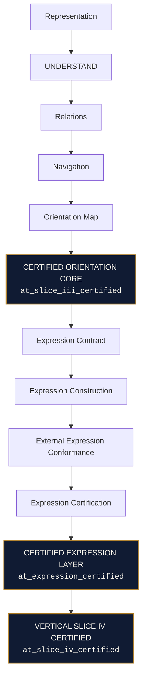

# ORION System Plate

## Certified Core and Expression Architecture

Status: Canonical certified assembly
Baseline: Vertical Slice IV after WP30
Certified STOP: `at_slice_iv_certified`

| Certified boundary | Responsibility | Work packages |
|---|---|---:|
| Certified Orientation Core | Deterministic structural Orientation through the immutable Orientation Map | WP1–WP25 |
| Certified Expression Layer | Deterministic Contract, Construction, External Conformance, and Expression Certification | WP26–WP29 |
| Vertical Slice IV Certified | Certification of the complete Core-to-Expression boundary | WP30 |

The plate is an assembly view. It introduces no component, authority, behavior,
or execution path. Runtime, Gateway, LYRA, SIRIUS, applications, presentation,
and semantic interpretation remain outside the certified chain shown here.
