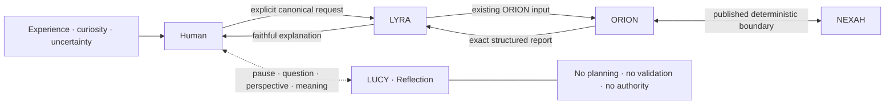

# First Conceptual Diagram — Reflection Beside ORION

- Status: konzeptionelle Skizze; nicht normativ
- Typ: Mermaid-Quelle im Markdown
- Architecture-Plate-Status: keiner

## Lesart

Die durchgezogenen Pfeile zeigen den bereits eingefrorenen deterministischen
Interaktionsweg. LUCY wird nicht in diesen Weg eingesetzt. Die gestrichelte
Beziehung liegt ausschließlich beim Human und bleibt optional.

Es gibt absichtlich keinen Pfeil von LUCY zu ORION, NEXAH, einem Reasoning
Backend oder einem Report. Aus Reflection kann eine neue Frage entstehen; sie
wird jedoch erst durch eine neue explizite Handlung des Human über LYRA zu einer
ORION-Anfrage.

Das Diagramm ist keine Architecture Plate und erweitert die eingefrorene
Plate-Sammlung nicht. Es behauptet keine Runtime, API, Repository-Grenze oder
Implementierungsrichtung.
