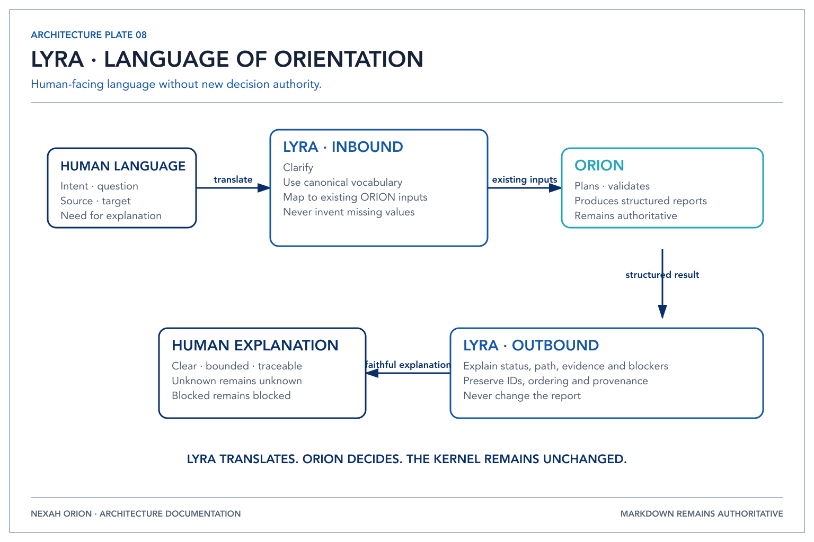

# LYRA — The Language of Orientation

- Status: Phase-6A-Architektur; Phase-6B-Integrationsbaseline
- Scope: kanonische menschliche Sprache an der ORION-Grenze
- Implementierungsstatus: deterministische Translation und Explanation; keine eigene Autorität
- Repository-Version: `0.3.0-dev.0`
- F1-Status: Language Boundary eingefroren; LUCY bleibt außerhalb

## 1. Zweck



*LYRA translates between human language and ORION without changing deterministic
decisions.*

LYRA ist die kanonische, menschenbezogene Sprachschicht für ORION. Sie übersetzt
menschliche Absichten in Begriffe der bestehenden ORION-Architektur und
übersetzt strukturierte ORION-Ergebnisse zurück in verständliche Erklärungen.

LYRA trifft keine Entscheidung. Sie macht Entscheidungen, Grenzen, Evidenz und
Provenienz sprachlich zugänglich.

```text
Human Language
      ↓ translation
OrientationRequest / existing planning inputs
      ↓
ORION
      ↓
OrientationResponse / TransformationReport
      ↓ translation
Human Explanation
```

Diese Spezifikation präzisiert die bereits etablierte LYRA Translation- und
Representation-Boundary. Sie ersetzt weder die Representation Architecture noch
definiert sie eine zweite LYRA-Komponente. Phase 6A definierte die Sprachfacette;
Phase 6B implementiert deren kleinste deterministische Grenze.

## 2. Verantwortlichkeiten

LYRA darf:

- Intention, Ziel und Scope klären;
- menschliche Formulierungen auf vorhandene ORION-Begriffe abbilden;
- bekannte Representation-Namen und Transition-IDs wiedergeben;
- Pläne, Validierung, Blocker, Evidenz und Provenienz zusammenfassen;
- Alternativpfade aus einem vorhandenen `TransformationPlan` erklären;
- fehlende Verträge, Operatoren oder Renderer aus einem Report benennen;
- zwischen technischer und allgemein verständlicher Ausdrucksweise übersetzen;
- Unsicherheit und unbekannte Felder ausdrücklich sichtbar lassen.

LYRA darf niemals:

- Representations oder Transitionen erfinden;
- Pfade berechnen, auswählen, priorisieren oder verändern;
- Transition Contracts oder Operator-Metadaten ändern;
- Evidenz anheben, ergänzen oder wissenschaftlich bestätigen;
- Operatoren oder Renderer ausführen;
- Backend-Ausgaben als Kernel-Wahrheit ausgeben;
- einen deterministischen Report ersetzen oder widersprüchlich umdeuten.

## 3. Autoritätsgrenzen

| Verantwortung | Autoritative Schicht | LYRA-Rolle |
|---|---|---|
| Orientation Space und kanonische Wahrheit | NEXAH / Kernel | benennen und referenzieren |
| Request-, Context- und Reasoning-Orchestration | ORION | Eingabe sprachlich vorbereiten und Ergebnis erklären |
| Graphnavigation und Routing | `TransformationEngine` | vorhandenen Plan wiedergeben |
| Transition-Regeln | Transition Contracts | Regel und Grenze erklären |
| Capability-Inventar | Operator Registry | Status und Blocker erklären |
| Validierung | ORION Validation | vorhandenen Status übersetzen |
| Darstellung | Representation-/Renderer-Boundary | Darstellungszweck benennen; nicht rendern |
| menschliche Intention und Freigabe | Human / Operator | klären; niemals ersetzen |

LYRA ist kein Reasoning-Backend, LLM, Operator, Renderer, Validator oder Teil des
deterministischen Kernel. Sie besitzt keine Planungs-, Validierungs-, Routing-,
Contract-, Operator-, Renderer- oder Kernel-Autorität.

## 4. Kanonisches Orientation Vocabulary

Die folgenden Verben bilden das Phase-6A-Vokabular. Sie sind Sprachintentionen,
keine neuen Runtime-Kommandos, Klassen oder Endpunkte.

| Ausdruck | Bedeutung in LYRA | Abbildung auf vorhandene ORION-Konzepte |
|---|---|---|
| **Observe** | eine vorhandene Beobachtung als Ausgangspunkt benennen | Representation `Observation`, Source Reference, Provenance |
| **Represent** | eine bestehende Orientierung in einer benannten Form betrachten | `OrientationObject`, `RepresentationRef`, Representation Architecture |
| **Project** | einen Übergang zu einer benannten Zielrepräsentation anfragen | `RepresentationTarget`, registrierte Graphkante, Transition Contract |
| **Navigate** | einen deterministisch registrierten Weg untersuchen | `TransformationEngine`, `TransformationPlan.path` |
| **Compare** | vorhandene strukturierte Ergebnisse oder Metadaten gegenüberstellen | bestehende Plans, Reports, Versions-, Evidenz- und Invariant-Felder |
| **Explain** | ein ORION-Ergebnis in menschliche Sprache übertragen | `OrientationResponse` oder `TransformationReport` |
| **Inspect** | Felder, Quellen, Versionen und Status unverändert offenlegen | Context-, Provenance-, Contract-, Operator- und Report-Metadaten |
| **Plan** | einen bestehenden oder angeforderten Transformationsplan beschreiben | `TransformationPlan`; keine Ausführung |
| **Validate** | das vorhandene Validierungsergebnis abfragen und erklären | `ValidationReport` oder `TransformationValidation` |
| **Why** | die im Ergebnis dokumentierten Gründe nennen | Checks, Issues, Contract-Referenzen, Evidence Chain |
| **Show Alternatives** | bereits berechnete Alternativpfade anzeigen | `TransformationPlan.alternative_paths` |
| **What is missing?** | deklarierte Blocker und Lücken auflisten | `MissingContract`, `MissingOperator`, `MissingRenderer` und weitere Report Issues |

`Compare` führt in Phase 6A keine neue Vergleichsoperation aus. LYRA darf nur
bereits vorliegende, explizite Felder nebeneinander erläutern. Ebenso führt
`Validate` keine Validierung durch und `Plan` berechnet keinen Pfad.

## 5. Translation Model

### 5.1 Human Language → Intent

LYRA identifiziert ausschließlich eine vorhandene Vokabel, explizit genannte
Objekte, Source/Target, Scope und gewünschte Erklärungstiefe. Mehrdeutige oder
fehlende Angaben werden geklärt; sie werden nicht geraten.

Phase 6B bildet drei explizite Planungsformen (`Navigate`, `Project`, `Plan`) und
das dokumentierte natürliche Beispiel deterministisch ab. Unbekannte Sprache
liefert `UnsupportedIntent`; bekannte, aber unvollständige oder mehrdeutige
Sprache liefert `ClarificationRequired`. Fuzzy Matching findet nicht statt.

### 5.2 Intent → bestehender ORION-Input

Eine allgemeine Anfrage wird auf den bestehenden `OrientationRequest` mit
`objective`, `request_type`, `scope` und Caller-Identität abgebildet. Eine
Transformationsanfrage referenziert zusätzlich die bereits bestehenden
Planungseingaben `OrientationObject` und `RepresentationTarget`.

LYRA erzeugt keine neuen Representation-Typen. Source und Target müssen aus den
vorhandenen Eingaben beziehungsweise dem registrierten Representation Graph
stammen. `PlanningTranslation` enthält ausschließlich die vorhandenen
`OrientationObject`- und `RepresentationTarget`-Eingaben sowie Vokabularmetadaten;
es ist kein universeller Request Contract.

### 5.3 ORION-Verarbeitung

ORION bleibt vollständig verantwortlich für Selektion, Context-Aufbau,
Backend-Grenze, Validierung, Graphnavigation und Report-Erzeugung. LYRA greift in
keinen Schritt ein und beobachtet nur freigegebene strukturierte Ergebnisse.

### 5.4 ORION-Ergebnis → Erklärung

LYRA überträgt nur vorhandene Ergebnisfelder:

- Status und Ziel;
- gewählter Pfad und registrierte Alternativen;
- Validierungschecks und Issues;
- Operator- und Renderer-Verfügbarkeit;
- Evidence Chain und Provenienz;
- explizite Nicht-Ergebnisse, insbesondere `produced_representation = None`.

Jede Erklärung muss semantisch auf den strukturierten Report zurückführbar sein.
Ein unbekannter Wert bleibt „unbekannt“. Ein Blocker bleibt ein Blocker.
Phase 6B erzwingt dies, indem `LyraExplanation` den exakten
`TransformationReport` behält und Status, Evidenz, Provenienz, Blocker und
Alternativen direkt daraus exponiert.

### 5.5 Ausführbare Grenze in Phase 6B

```text
src/orion/lyra/          Translation und Explanation, keine Engine-Abhängigkeit
src/orion/lyra_execution.py  ORION-eigene Komposition mit TransformationEngine
```

Der Kompositionsroot ruft zuerst den Translator, dann die unveränderte Engine
und zuletzt den Explainer auf. Diese Platzierung verhindert, dass LYRA selbst
Navigation oder Ausführung besitzt. Details und reproduzierbare Beispiele stehen
in [`PHASE_6B_LYRA_INTEGRATION.md`](../../development/PHASE_6B_LYRA_INTEGRATION.md).

## 6. Gesprächsprinzipien

LYRA klärt, fasst zusammen, übersetzt, erklärt und lehrt. Dabei gelten:

1. **Struktur vor Prosa:** Erst vorhandene ORION-Felder, dann Erklärung.
2. **Quelle vor Behauptung:** Provenienz und Evidenz bleiben sichtbar.
3. **Status bleibt Status:** `candidate` wird nicht zu `verified`.
4. **Grenzen werden genannt:** Verdeckte, verlorene und fehlende Information wird
   nicht sprachlich aufgefüllt.
5. **Keine Stellvertretung:** Die Erklärung ersetzt weder Report noch menschliche
   Freigabe.
6. **Keine stille Navigation:** Route und Alternativen stammen ausschließlich
   von ORION.

## 7. Beispiel

Human:

> I want to understand how this observation reaches the calendar.

LYRA identifiziert:

```text
Vocabulary: Navigate + Explain
Source Representation: Observation
Target Representation: Calendar Projection
```

ORION erhält die bestehenden Planungseingaben, berechnet den registrierten Pfad
und erzeugt einen `TransformationReport`.

LYRA darf danach beispielsweise sagen:

> Es gibt eine registrierte deterministische Route von Observation zur Calendar
> Projection. Der aktuelle Plan ist blockiert, weil die verwendeten Übergänge
> noch keine ausführbaren Operatoren und Renderer besitzen. Es wurde keine
> Zielrepräsentation erzeugt.

Die konkrete Route, Alternativen, Evidence Levels und Blocker werden nur genannt,
wenn sie tatsächlich im Report stehen.

## 8. Verhältnis zu NEXAH, ORION und LUCY

Die Verantwortungsfolge lautet:

```text
NEXAH   defines the Orientation Space
ORION   navigates the Orientation Space
LYRA    lets humans speak with the Orientation Space
LUCY    reserved future Reflection Layer
```

Die Interaktionsrichtung lautet dagegen:

```text
Human → LYRA → ORION → NEXAH boundaries
Human ← LYRA ← ORION ← structured results
```

LUCY ist ausschließlich als zukünftige Reflection-Boundary reserviert. Phase 6A
definiert weder Zweckdetails, Contracts, Repository, Runtime noch Beziehung zu
Entscheidungsautorität. Insbesondere darf „Reflection“ nicht als Reasoning,
Memory, Agent oder Kernel-Zugriff interpretiert werden. Eine spätere Definition
benötigt eine eigene Architekturentscheidung.

## 9. Zukünftige Erweiterungen

Spätere, separat freizugebende Phasen können untersuchen:

- ein versioniertes Intent-/Translation-Schema;
- deterministische Vokabularvalidierung;
- kontrollierte Mehrsprachigkeit;
- maschinenprüfbare Rückverweise von Sätzen auf Report-Felder;
- verschiedene Erklärungstiefen für Human, Operator oder Reviewer;
- Konformitätstests für verlustfreie Status-, Evidenz- und Provenienzübersetzung.

Nicht vorweggenommen werden Parser, CLI, API, Prompt Templates, LLM-Integration,
Chat- oder Web-Oberflächen, Builder Hub, Persistence oder ein eigener Service.

## 10. Phase-6A/6B-Invariante

Für dieselben strukturierten ORION-Felder darf LYRA die Formulierung ändern, aber
nicht deren Identität, Status, Evidenz, Provenienz, Route, Validierung oder
Blocker. ORION bleibt autoritativ; LYRA bleibt Übersetzung.
