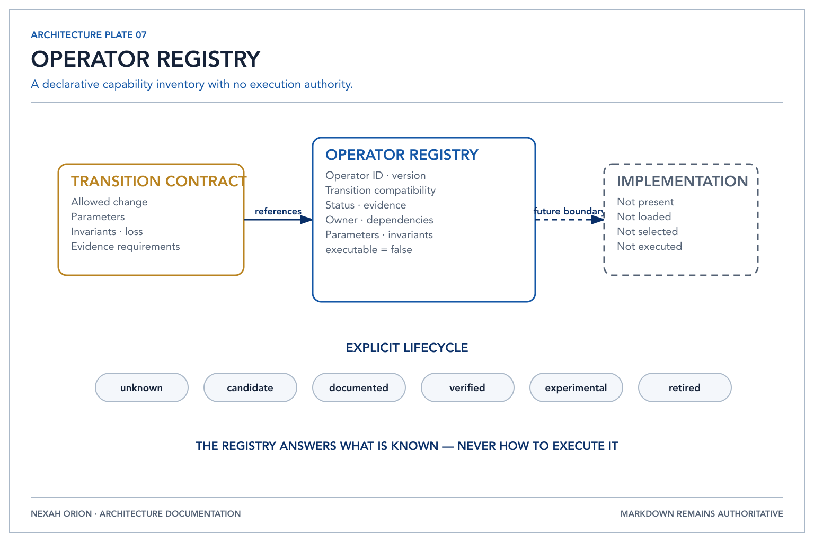

# Operator Architecture

Status: Phase 5A, declarative baseline
Registry schema: `orion.operator-registry/0.1-draft`
Repository version: `0.3.0-dev.0`
F1 status: Registry responsibility frozen; implementations intentionally unfrozen

## Purpose



*The Operator Registry inventories known capabilities without selecting, loading
or executing them.*

The Operator Registry is ORION's authoritative inventory of known future
transformation capabilities. It answers which operator declarations exist,
which Transition Contracts they claim, their compatibility, evidence, lifecycle
status and ownership. It does not contain or discover implementations.

```text
Representation Graph
        ↓ identifies an edge
Transition Contract
        ↓ declares allowed transformation and loss
Operator Registry
        ↓ describes known capability metadata
Transformation Plan
        ↓ reports executable=false
MissingOperator
```

Phase 5A stops at the report. No Target Representation is produced.

## Separation of responsibilities

| Layer | Sole question | Explicit non-responsibility |
|---|---|---|
| Representation Graph | Which transitions are registered? | operator discovery or execution |
| Transition Contract | What may this edge preserve, expose, hide or lose? | implementation ownership and execution |
| Operator Registry | Which operator declarations are known? | selection, ranking, loading or execution |
| Renderer | How is a representation projected for a consumer? | transformation mathematics and inference |
| Transformation Engine | Which registered route and blockers apply? | mathematics, rendering and capability execution |

Contracts remain independent because an allowed transformation must be
inspectable even when no operator exists. Renderers remain independent because
projection is not transformation: an operator may later produce a representation,
while a renderer only presents one.

## Immutable specification

Each `OperatorSpecification` records:

- stable operator ID, name and version;
- explicit lifecycle status and evidence level;
- implemented Transition IDs;
- supported contract and representation versions;
- architectural owner;
- provider and renderer dependencies;
- required and optional parameters;
- declared invariants and lossiness;
- the explicit executable flag and notes.

All values are metadata. Specifications and the registry are immutable. There
are no callables, dynamic imports, provider objects, renderer objects or plugin
references in the catalog.

Contract compatibility is represented as `Txx@contract-version`. Representation
compatibility is empty until an approved version exists; absence is not treated
as implied compatibility.

## Lifecycle

| Status | Meaning |
|---|---|
| `unknown` | no candidate operator is documented |
| `candidate` | Phase 3C records a candidate operation, without verification |
| `documented` | a future specification has been documented |
| `verified` | future evidence and validation have established the declaration |
| `experimental` | future bounded experimentation; not production authority |
| `retired` | declaration remains auditable but is no longer active |

Status is assigned explicitly and is never inferred from evidence or code. Only
`verified` may ever become executable. Phase 5A applies the stricter invariant
that every entry has `executable = false`, including a constructed `verified`
record.

## Initial catalog and evidence continuity

One placeholder exists for every registered edge. Phase 3C status and evidence
are copied without promotion:

| Status | Transitions |
|---|---|
| `unknown` | T01, T02, T04, T05, T08, T11, T14 |
| `candidate` | T03, T06, T07, T09, T10, T12, T13, T15 |

Each entry implements exactly one transition and supports that transition's
current `0.1-draft` contract. Every implementation owner remains explicitly
unassigned. Provider and renderer dependencies are empty. This does not assert
that an algorithm, provider or renderer exists.

## Ownership

ORION owns the catalog schema, deterministic lookup and consistency with the
registered contracts. It does not acquire authority over mathematics,
scientific claims, Kernel truth, renderers, providers or Builder Hub behavior.
An individual or team owner must not be invented; assignment requires the
governance workflow.

## Future execution boundary

A later phase may define a separate implementation port and validation gate.
That work must preserve all of these boundaries:

1. an implementation is not stored in this registry;
2. the registry does not select or load it;
3. verified status and compatible versions are necessary, not sufficient;
4. contract preconditions, postconditions, invariants and declared loss must be
   validated outside the catalog;
5. execution must remain provider- and renderer-independent;
6. no future capability may mutate the Kernel through this layer.

Any change to those authority boundaries requires an ADR. Adding mathematics,
execution or discovery to Phase 5A is an architecture violation.
