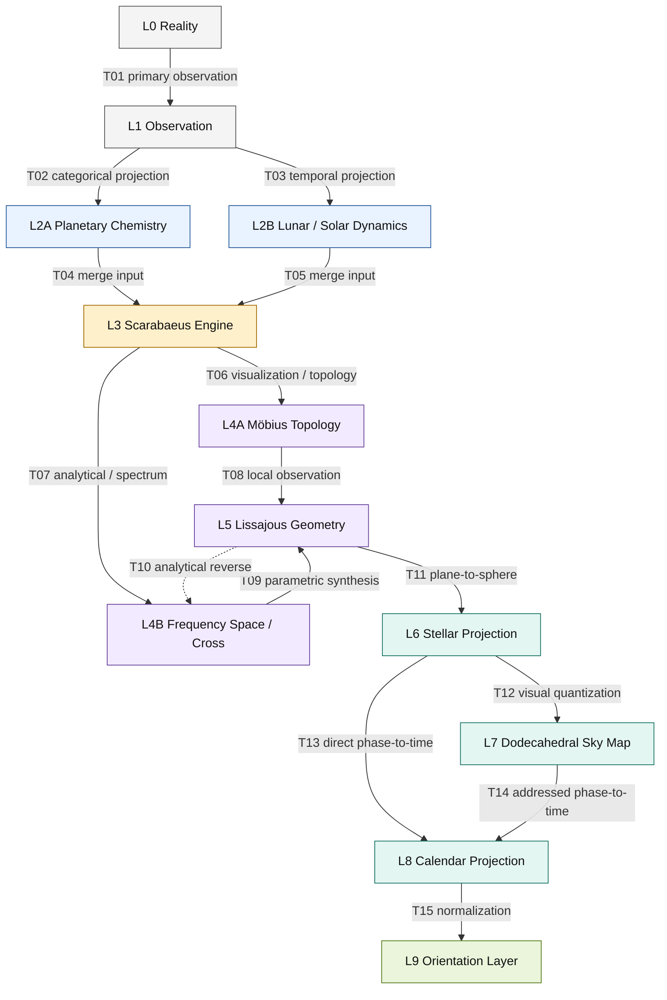

# Representation Graph

## 1. Zweck

Dieser Graph ersetzt die Annahme einer einzigen linearen Pipeline durch eine
Karte aus primären Übergängen, analytischen Projektionen, Visualisierungszweigen,
Merge Points und Normalisierung.

Alle Knoten sind Representations desselben Orientation Object `O@V`. Eine Kante
beschreibt einen Koordinatenwechsel, keine Entstehung neuer Quellidentität.

## 2. Vollständiger Graph



## 3. Graphlegende

| Darstellung | Bedeutung |
|---|---|
| durchgezogene Kante | primär vorgesehene Transformationsrichtung |
| gestrichelte Kante | analytische Rückprojektion; nicht automatisch invers |
| gemeinsamer Zielknoten | Merge Point; Provenienz aller Eingänge erforderlich |
| parallele Kanten | alternative Sicht oder Route desselben Quellobjekts |
| Orientation Layer | Normalisierung, keine neue fachliche Quelle |

## 4. Edge Registry

| ID | Source | Target | Klasse | Rolle | Evidenz |
|---|---|---|---|---|---|
| [`T01`](contracts/T01.md) | Reality | Observation | Primary | bindet Beobachtung und Provenienz | `E1` |
| [`T02`](contracts/T02.md) | Observation | Planetary Chemistry | Primary | kategoriale Korrespondenz | `E0` |
| [`T03`](contracts/T03.md) | Observation | Lunar/Solar Dynamics | Primary | zeitlich-periodische Sicht | `E0–E1` |
| [`T04`](contracts/T04.md) | Planetary Chemistry | Scarabaeus Engine | Merge input | Parameterisierung des Engine State | `E0` |
| [`T05`](contracts/T05.md) | Lunar/Solar Dynamics | Scarabaeus Engine | Merge input | periodischer Treiber oder Takt | `E0` |
| [`T06`](contracts/T06.md) | Scarabaeus Engine | Möbius Topology | Visualization | topologische Randidentifikation | `E0–E1` |
| [`T07`](contracts/T07.md) | Scarabaeus Engine | Frequency Space | Analytical | Moden-/Spektralprojektion | `E1` |
| [`T08`](contracts/T08.md) | Möbius Topology | Lissajous Geometry | Visualization | lokale Beobachtung einer Bahn | `E0` |
| [`T09`](contracts/T09.md) | Frequency Space | Lissajous Geometry | Synthesis | Frequenzpaar als Kurve | `E1` |
| [`T10`](contracts/T10.md) | Lissajous Geometry | Frequency Space | Analytical | Fit beziehungsweise Spektralanalyse | `E1` |
| [`T11`](contracts/T11.md) | Lissajous Geometry | Stellar Projection | Primary | Ebene zu Kugelrichtung | `E0` |
| [`T12`](contracts/T12.md) | Stellar Projection | Dodecahedral Sky Map | Visualization | sphärische Zellquantisierung | `E0–E1` |
| [`T13`](contracts/T13.md) | Stellar Projection | Calendar Projection | Primary | Winkelphase zu Zeitphase | `E0–E1` |
| [`T14`](contracts/T14.md) | Dodecahedral Sky Map | Calendar Projection | Visualization | Zelladresse zu Zeitsegment | `E0` |
| [`T15`](contracts/T15.md) | Calendar Projection | Orientation Layer | Normalization | Kalenderphase normalisieren | `E1` |

## 5. Branches und Merge Points

### 5.1 Source Branch

Observation verzweigt in zwei nicht austauschbare Sichten:

- Planetary Chemistry macht Kategorien und Korrespondenzen sichtbar.
- Lunar/Solar Dynamics macht Phase, Perioden und Überlagerung sichtbar.

Der Scarabaeus Engine ist der erste Merge Point. Er darf beide Eingänge nur
zusammenführen, wenn jeder Engine-Parameter auf seine Quelle zurückgeführt werden
kann.

### 5.2 Analysis Branch

Der Scarabaeus Engine verzweigt in:

- Möbius Topology für Kontinuität und Randidentifikation;
- Frequency Space für Moden, Perioden und Phasen.

Lissajous ist der zweite Merge Point. Die Möbius-Kante liefert einen möglichen
Pfad beziehungsweise lokalen Chart; Frequency Space liefert die parametrischen
Komponenten. Ob beide tatsächlich dasselbe Kurvenobjekt bestimmen, ist offen.

### 5.3 Spatial/Temporal Branch

Stellar Projection bietet zwei Wege zur Calendar Projection:

- `T13` erhält eine kontinuierliche Winkelphase und ist der kürzere Pfad.
- `T12 + T14` erzeugt zunächst eine dodekaedrische Adresse und ist diskreter,
  navigierbarer und stärker verlustbehaftet.

Beide Calendar-Ergebnisse dürfen nur als äquivalent gelten, wenn Epoche,
Laufrichtung, Periodenlänge und Cell-to-Time-Mapping übereinstimmen.

## 6. Primary Path

Der minimale primäre Pfad lautet:

```text
Reality
  -> Observation
  -> {Planetary Chemistry + Lunar/Solar Dynamics}
  -> Scarabaeus Engine
  -> Frequency Space
  -> Lissajous Geometry
  -> Stellar Projection
  -> Calendar Projection
  -> Orientation Layer
```

Möbius Topology und Dodecahedral Sky Map bleiben wichtige parallele
Visualisierungsprojektionen. Sie dürfen nicht stillschweigend zu Pflichtstufen
werden, solange ihre Übergangsoperatoren nicht dokumentiert sind.

## 7. Graph-Invarianten

Für jede Route müssen erhalten bleiben:

- `orientation_object_id` und Source-Version;
- Representation- und Transition-Provenienz;
- deklarierte Landmark-IDs;
- bekannte Phasen- und Epochendefinitionen;
- Transformationsparameter;
- Lossiness-Status jeder durchlaufenen Kante.

Eine Route ist nicht allein deshalb gültig, weil Zielbilder ähnlich aussehen.
Graphgültigkeit verlangt eine nachvollziehbare Kette von Kantenreferenzen.

## 8. Nicht vorhandene Kanten

Folgende Kurzschlüsse sind derzeit nicht autorisiert:

- Planetary Chemistry → Calendar ohne Engine- und Phasenmapping;
- Tide System → Stellar Projection ohne definierte Winkelabbildung;
- Möbius Topology → Frequency Space als angeblich natürliche Inverse;
- Dodecahedral Sky Map → Orientation Layer ohne Calendar-/Normalization-Regel;
- beliebige Representation → Reality als wissenschaftlicher Beweis.

Neue Kanten benötigen eine Transition Card, Evidenz, Parameterdefinition und
Lossiness-Angabe. Visuelle Ähnlichkeit genügt nicht.
