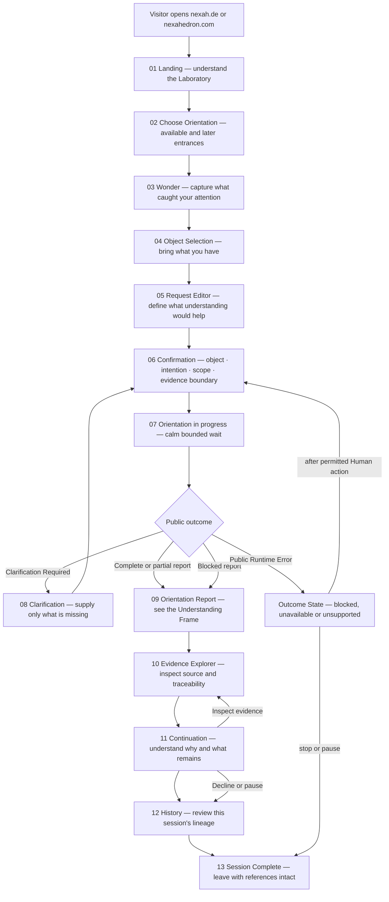
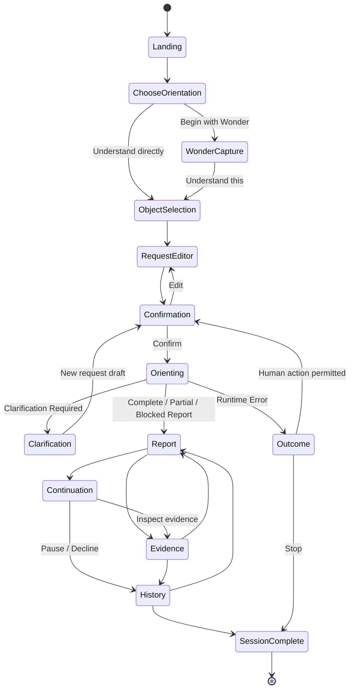
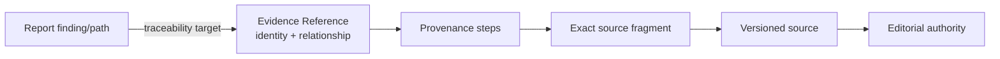

# NEXAHEDRON Alpha — Human Experience Blueprint

- Status: Official Alpha UX blueprint
- Product: NEXAHEDRON — The NEXAH Laboratory
- Engine dependency: immutable ORION Version 1
- Supported executable operator: Understand only
- Authority: experience specification; no ORION architecture or behavior authority
- Implementation: pending

## 1. Experience promise

A first-time visitor should leave the Alpha able to say:

> I brought something that caught my attention. I chose what I wanted to
> understand, confirmed the boundaries, received a traceable orientation, saw
> what supports it and decided whether to inspect the evidence or stop.

NEXAHEDRON must feel like an Orientation Laboratory, never a chat interface.
The experience is organized around objects, scope, evidence, reports and Human
choices—not messages, answers or an assistant persona.

### 1.1 The Alpha boundary

ORION Version 1 executes only `understand`. The opening **Wonder** moment is
therefore NEXAHEDRON-owned pre-session capture:

- it records what caught the Human's attention;
- it does not call ORION;
- it does not claim to be the ORION Wonder operator;
- it may become an Understand request only after the Human explicitly chooses
  **Understand this** and confirms the resulting intention and Scope.

The genuine ORION Wonder operator remains Later. This distinction must be
visible in interaction behavior without burdening the visitor with architecture
terminology.

## 2. Complete visitor journey



### 2.1 The five remembered moments

| Moment | Screens | Human understanding |
|---|---|---|
| Arrival | Landing | “This is a place for orientation across existing knowledge.” |
| Choice | Choose Orientation, Wonder | “I can begin from curiosity without inventing a perfect question.” |
| Commitment | Object, Request Editor, Confirmation | “This is the object, intention and boundary I am choosing.” |
| Insight | Report, Evidence | “I can see the structure and inspect what supports it.” |
| Continuation | Continuation, History, Complete | “The report is a reference point; I decide whether to continue.” |

## 3. Screen-by-screen specification

Every screen has one primary action. Contract names may appear in inspectable
details or the Builder, but visitor-facing language remains human.

### Screen 01 — Landing

| Field | Specification |
|---|---|
| Purpose | Explain NEXAH, NEXAHEDRON and the problem of orientation before asking for input. |
| User goal | Decide whether this Laboratory is relevant and safe to enter. |
| Displayed objects | NEXAH as Orientation Layer; NEXAHEDRON as Laboratory; “information already exists—orientation is missing”; short examples of bringable material; visible authority statement. |
| User actions | `Enter the Laboratory`; optionally follow `Learn about NEXAH` to nexah.de. |
| Consumed ORION contracts | None. No session exists. |
| Derived presentation | None. Product explanation is NEXAHEDRON-owned editorial content. |

On `nexah.de`, `Open the Laboratory` hands the visitor to the same NEXAHEDRON
Landing without creating a session. A direct visit to `nexahedron.com` begins
there immediately. Domain handoff state is navigation only and carries no
Orientation Request.

Essential copy direction:

> Bring what you have. NEXAHEDRON helps you understand its structure, evidence,
> boundaries and possible next steps. It does not replace your sources or decide
> what they mean for you.

One short “What happens inside?” statement introduces ORION without exposing
implementation:

> ORION turns your confirmed object, intention and scope into a structured,
> evidence-bound Orientation Report. It does not replace your sources, decide
> their meaning or choose what you should do next.

### Screen 02 — Choose Orientation

| Field | Specification |
|---|---|
| Purpose | Let the visitor choose how to enter without implying all modes execute in Alpha. |
| User goal | Select the entrance closest to the present intention. |
| Displayed objects | Wonder and Understand as Alpha entrances; Compare, Connect, Explore, Build and Reflect visibly marked `Later`, not disabled without explanation. |
| User actions | `Begin with Wonder`; `Understand something`; inspect Later mode description. |
| Consumed ORION contracts | None. |
| Derived presentation | Capability labels derive from the Alpha feature manifest, not Runtime inference. |

Wonder means “capture a curiosity before choosing an executable orientation.”
Understand means “begin the supported ORION Understand journey directly.”

### Screen 03 — Wonder

| Field | Specification |
|---|---|
| Purpose | Receive an incomplete curiosity without forcing it into question form. |
| User goal | Name what caught attention in ordinary language. |
| Displayed objects | One prompt—“What caught your attention?”; examples such as a passage, observation, contradiction, image or idea; optional material preview. |
| User actions | Write or attach a reference; `Understand this`; return to modes. |
| Consumed ORION contracts | None. Wonder capture is pre-session NEXAHEDRON state. |
| Derived presentation | None. The text remains a Human-owned draft annotation. |

Selecting `Understand this` is explicit mode commitment. It never silently maps
Wonder to Understand.

### Screen 04 — Object Selection

| Field | Specification |
|---|---|
| Purpose | Identify exactly what will be oriented. |
| User goal | Choose one primary object and verify that its source is accessible. |
| Displayed objects | Human-friendly object types; source name; revision/version when known; access state; optional preview; retained Wonder note. |
| User actions | Add a document/reference; describe an idea or observation; replace object; confirm primary object. |
| Consumed ORION contracts | Draft fields for `OrientationObjectReference`; no execution yet. Existing `EvidenceReference` metadata may support source preview after Library resolution. |
| Derived presentation | “What you are bringing” card derived from object ID, kind, owner, source reference, revision and access status. |

Alpha accepts exactly one primary Orientation Object because the Understand
Runtime clarifies any other cardinality.

### Screen 05 — Request Editor

| Field | Specification |
|---|---|
| Purpose | Turn the selected object into an explicit Human intention and bounded Scope. |
| User goal | State what understanding would help and what should remain outside it. |
| Displayed objects | Opening question “What would you like to understand?”; focus; success boundary; include/exclude Scope; depth; unresolved boundaries; object summary. |
| User actions | Edit intention; add or remove Scope boundaries; choose depth; preserve the Wonder note as Human annotation. |
| Consumed ORION contracts | Draft `Intention`, `Scope`, optional audience, constraints and Human annotations from `OrientationRequest`. |
| Derived presentation | Plain-language request summary; no predicted result or confidence. |

This is a structured editor, not a message composer. It has no send-on-enter and
no conversation transcript.

### Screen 06 — Confirmation

| Field | Specification |
|---|---|
| Purpose | Establish Human commitment before ORION execution. |
| User goal | Verify object identity, intention, Scope, access and evidence boundary. |
| Displayed objects | Complete request summary; source/version; what is included/excluded; depth; Human authority; effects `none`; evidence availability; any validation issues. |
| User actions | Edit a section; confirm access; `Begin orientation`. |
| Consumed ORION contracts | Candidate `OrientationRequest`; resolved `EvidenceReference[]`; contract validation results derived from existing validators. |
| Derived presentation | Sectioned confirmation view retaining exact request paths and identities. |

The primary action is enabled only when structural validation passes. Readiness
remains an ORION outcome and must not be guessed by the interface.

### Screen 07 — Orientation in progress

| Field | Specification |
|---|---|
| Purpose | Maintain trust during the bounded request without exposing internals. |
| User goal | Know that the confirmed request is being processed and can be left safely. |
| Displayed objects | Object title, confirmed intention, Scope summary, one calm state label: `Orienting`. |
| User actions | Cancel local waiting/navigation if supported; no mutation of the submitted immutable request. |
| Consumed ORION contracts | Submitted `OrientationRequest` identity only until a public outcome returns. |
| Derived presentation | No invented stages, token streams, reasoning trace, provider name or percentage. |

Permitted microcopy:

> Your confirmed object, intention and scope are being oriented. The result will
> remain bounded by the evidence and uncertainty available.

### Screen 08 — Clarification

| Field | Specification |
|---|---|
| Purpose | Explain why orientation cannot begin yet and preserve all valid context. |
| User goal | Supply the smallest necessary Human input. |
| Displayed objects | Readiness state; ordered issues; missing field; reason; expected value; allowed values; required action; preserved object and intention; effects `none`. |
| User actions | Supply/confirm each required value; return to the relevant request section; review preserved context; resubmit. |
| Consumed ORION contracts | `RuntimeError(kind=clarification_required)` and its exact `ClarificationResult`. |
| Derived presentation | Issue cards derived from `issues`; preserved summary derived from `retained_context`; action checklist derived from `required_user_actions`. |

The page title is **One boundary needs your attention**, not “Error.” The first
line answers four questions in order:

1. What is missing?
2. Why is it required?
3. What must the Human supply or confirm?
4. What has already been preserved?

Resubmission constructs a new validated Orientation Request containing
`clarification_of`. The prior request is not overwritten.

### Screen 09 — Orientation Report

| Field | Specification |
|---|---|
| Purpose | Make the resulting Understanding Frame readable, inspectable and bounded. |
| User goal | See the central orientation, its support and what remains open. |
| Displayed objects | Report identity/status; Summary; Key Findings; Conceptual Structure; Scope coverage; Evidence; Open Questions; Assumptions; Uncertainties; Issues; Confidence; Continuation cards; Human decision area. |
| User actions | Open evidence; inspect uncertainty/issue; choose a continuation; review request; end session. |
| Consumed ORION contracts | `OrientationReport`; associated `ContinuationOption[]`; referenced `EvidenceReference[]`. |
| Derived presentation | Only mappings defined in section 6; no additional finding, score, ranking or conclusion. |

Blocked reports remain reports. The page says **Orientation is blocked at the
evidence boundary** and shows completed, blocked and absent sections without
presenting the result as complete.

### Screen 10 — Evidence Explorer

| Field | Specification |
|---|---|
| Purpose | Let the Human inspect why a report statement is supported, limited or contradicted. |
| User goal | Trace a finding to an exact source, version, authority and report location. |
| Displayed objects | Source; version; fragment; authority; editorial status; evidence class; relationship; provenance steps; traceability targets; validation; access state. |
| User actions | Select an Evidence Reference; follow an accessible source; jump to traced report finding; return to report. |
| Consumed ORION contracts | Exact `EvidenceReference` objects and report evidence refs. |
| Derived presentation | Human labels and a provenance/traceability path; every value remains inspectable in raw metadata view. |

The explorer never edits Library records, upgrades editorial status, fills a
provenance gap or hides unavailable/restricted access.

### Screen 11 — Continuation

| Field | Specification |
|---|---|
| Purpose | Explain why a next step exists and preserve Human control. |
| User goal | Decide whether to inspect, pause, decline or prepare another orientation. |
| Displayed objects | Action type; reason; source report; what remains; Request Delta; availability; blockers; required Human actions; target mode/boundary when present. |
| User actions | Select; inspect evidence/report; supply clarification; confirm a proposed new request; pause; decline. |
| Consumed ORION contracts | Exact `ContinuationOption`. |
| Derived presentation | Card content maps only from fields described in section 8. |

Alpha's implemented option is `inspect_evidence`. Its Request Delta is empty, so
selection opens the Evidence Explorer and **does not create a new Orientation
Request**. The interface says this explicitly. A continuation that starts a new
orientation would preview the resulting request and require Human confirmation,
but no such option may be invented by Alpha.

### Screen 12 — History

| Field | Specification |
|---|---|
| Purpose | Make the current session's lineage understandable. |
| User goal | Revisit what was submitted, clarified, reported and inspected. |
| Displayed objects | Session-local ordered events; exact request/report/continuation/evidence refs; status; preserved context. |
| User actions | Open an immutable item; return to current report; end session. |
| Consumed ORION contracts | All public objects received during this session. |
| Derived presentation | Timeline labels and links; no merged or rewritten contract object. |

History is NEXAHEDRON session state. Alpha provides no account history,
cross-session memory or ORION persistence.

### Screen 13 — Session Complete

| Field | Specification |
|---|---|
| Purpose | Provide a deliberate exit rather than silently returning to Landing. |
| User goal | Understand what was completed, what remains open and what references can be retained. |
| Displayed objects | Object; final report status/ref; evidence inspected; continuation selected/declined; unresolved issues; local-session expiration notice. |
| User actions | Return to report; copy/download permitted references; leave the Laboratory. |
| Consumed ORION contracts | Existing session contracts only; no new ORION call. |
| Derived presentation | Session summary from NEXAHEDRON lineage plus exact public refs. |

The completion statement is **You chose where to stop**, not “Task completed.”

### Outcome screens — bounded public failures

| Outcome | Screen title | Required behavior |
|---|---|---|
| Invalid / Validation Failed | `This request cannot begin yet` | show public issues; retain Human-entered draft where permitted; never expose an exception |
| Unsupported | `This orientation is not available in Alpha` | name supported Understand path; do not simulate another operator |
| Blocked Before Processing | `A required boundary is unavailable` | show reason and required resolution; preserve request context as declared |
| Unavailable | `Orientation is temporarily unavailable` | obey exact retry disposition; never auto-switch provider or behavior |
| Internal Failure | `No trustworthy report was produced` | preserve accepted identity when declared; offer only manual review/exit behavior from the contract |

## 4. Complete screen flow and state ownership



| State family | Owner | May contain |
|---|---|---|
| Pre-session | NEXAHEDRON | selected entrance, Wonder note, object draft |
| Request draft | NEXAHEDRON under Human authority | editable mapping toward an Orientation Request |
| Submitted request | ORION public identity, held by NEXAHEDRON | immutable `OrientationRequest` |
| Public outcome | ORION | exact Version 1 contract objects |
| Presentation | NEXAHEDRON/LYRA | faithful derived view with source identity |
| Session history | NEXAHEDRON | ordered refs and local interaction events |

## 5. Visual information architecture

### 5.1 Persistent page frame

```text
┌─ NEXAHEDRON · The NEXAH Laboratory ───────────────── Session status ─┐
│ Journey: Arrival › Object › Intention › Scope › Report › Continue       │
├── Context ───────────────── Orientation ─────────────────────────┤
│ Object identity         Primary page content                          │
│ Intention              Summary / editor / report                    │
│ Scope                  Evidence and uncertainty in context          │
│ Source/version                                                        │
├── History ─────────────────────────── Actions ──────────────────────┤
│ Immutable session refs                         One primary action     │
└──────────────────────────────────────────────────────────────────────────────┘
```

### 5.2 Information zones

| Zone | Contains | Never contains |
|---|---|---|
| Navigation | product identity, journey position, back/exit, accessibility controls | Gateway, Runtime or provider status |
| Orientation | object, intention, Scope, report structure, continuations | chat transcript or generated persona |
| Evidence | source/version, authority, provenance, relationship, traceability, access | Library editing or hidden ranking |
| Context | the confirmed object, prior report refs, preserved Scope and Human annotations | private reasoning context |
| Actions | one primary action, explicit secondary inspect/edit/pause/decline | automatic continuation or hidden default |
| History | immutable public refs and local session events | cross-session profiling or ORION memory |

On narrow screens, order is Navigation → Context summary → Orientation →
Evidence → Actions → History. Evidence and uncertainty must never be hidden
behind an unlabeled generic drawer.

### 5.3 Visual hierarchy

1. Human intention and report status.
2. Orientation summary and conceptual structure.
3. Evidence and uncertainty beside the claims they qualify.
4. Scope and assumptions.
5. Continuation choices.
6. Contract identity/version as inspectable secondary detail.

Color never carries status alone. `Complete`, `Partial`, `Blocked`, `Open`,
`Restricted` and `Unavailable` always appear as text with accessible semantics.

## 6. First Report View

```text
┌─ Orientation Report · Complete ─────────────────── report-id@version ─┐
│ Understanding: [Human-confirmed focus]                                  │
│ Scope: [included] · Outside: [excluded] · Coverage: [status]          │
├── Summary ──────────────────────────────────────────────────────────┤
│ Orientation summary                                                      │
├── Key findings and structure ────────────────────────────────────┤
│ Concepts · included/excluded boundaries · claims with support           │
├── Evidence ──────────────────────────────────────────────────────────┤
│ Source · fragment · authority · relationship          [Inspect]    │
├── Open questions · Assumptions · Uncertainties ────────────────┤
│ Empty states remain visible: “None declared in this report.”             │
├── Continue Orientation ─────────────────────────────────────────┤
│ [Inspect evidence]                                      [End session]    │
└─────────────────────────────────────────────────────────────────────────────┘
```

### 6.1 Contract-to-view mapping

| Report section | Public source |
|---|---|
| Summary | `mode_payload.content.orientation_summary` |
| Key concepts | `mode_payload.content.key_concepts` |
| Conceptual structure | `mode_payload.content.conceptual_structure` |
| Key findings/support | `mode_payload.content.claims_and_support`; each binding retains its evidence ref |
| Evidence panel | `report.evidence` resolved against exact `EvidenceReference` identities |
| Open questions | `mode_payload.content.open_questions` |
| Assumptions | canonical `report.assumptions`; mode payload assumption labels may be shown only as mode content, never merged silently |
| Uncertainties | canonical `report.uncertainties`, plus mode `content.uncertainties` visibly distinguished |
| Issues | `report.issues` |
| Scope coverage | `mode_payload.content.scope_coverage` and `report.orientation.scope` |
| Confidence | `report.confidence`; no synthetic score |
| Continuation cards | `report.continuations` resolved to exact `ContinuationOption` objects |
| Human decision | NEXAHEDRON action area: select, decline, pause or end; not a report field |

Empty sections are not removed. “No assumptions declared” is different from an
assumption section the UI forgot to render.

## 7. Clarification experience

### 7.1 Layout

```text
One boundary needs your attention
Orientation has not started. Everything confirmed below is preserved.

Needs your input
  [field path as Human label]
  Missing: [expected_value]
  Why: [reason]
  Action: [required_action]
  Allowed values: [when declared]

Already preserved
  Orientation Object: [retained ref]
  Intention: [retained ref]
  Other retained context: [exact references]

[Review request]                                      [Confirm and try again]
```

### 7.2 Rules

- Issue order remains the contract order.
- Blocking and optional issues remain visibly distinct.
- Technical `field_path` is translated to a Human label but remains inspectable.
- Reason is explained faithfully; LYRA may clarify language but not invent a
  missing value.
- Preserved values are not re-requested.
- The primary action names the Human action, not “Retry.”
- The new request carries `clarification_of` with exact result identity/version.
- No red modal, stack trace, provider message or generic failure code appears.

## 8. Evidence Explorer

### 8.1 Evidence detail anatomy

| Visible group | Fields |
|---|---|
| Identity | `evidence_id`, `evidence_version`, `evidence_class` |
| Source | `source_id`, `source_version`, `source_ref`, `fragment_ref`, `integrity_ref` |
| Authority | `authority_owner`, `authority_domain`, `editorial_status`, `authority_version`, `declared_at` |
| Relationship | `relationship`—supports, counters, contextualizes or limits as declared |
| Provenance | every ordered `ProvenanceStep`: inputs, output, owner, lossiness, contract ref/version |
| Traceability | every `TraceabilityTarget`: report/version, target path, finding ID |
| Validation | status, performed checks, issues and validation contract refs |
| Access | `access_status`; restricted/unavailable remain visible and non-actionable |

### 8.2 Exploration model



The source may open only when the declared access state permits it. The explorer
does not copy the entire Library record into NEXAHEDRON and never offers edit,
correct, publish or approve actions.

## 9. Continuation experience

### 9.1 Card anatomy

Every Continuation card answers:

| Human question | Contract source |
|---|---|
| Why does this exist? | `reason_refs`, resolved visibly to report/evidence paths |
| What action is proposed? | `action_type` |
| What remains? | every field in `preserved_context` |
| What changes? | ordered `request_delta` operations |
| Is anything missing? | `availability`, `blockers`, `required_user_actions` |
| Does it start another orientation? | presence of `target_mode` and a non-empty/explicitly orientation-producing delta |
| What must I confirm? | each delta's `human_confirmation` plus required Human actions |
| Where did it come from? | exact `source_report_id` + `source_report_version` |

### 9.2 Selection behavior

| Continuation type | Alpha behavior |
|---|---|
| `inspect_evidence` | opens Evidence Explorer; empty delta means no new request |
| `inspect_report` | opens the exact report section; no new request when delta empty |
| `pause` / decline | records local Human choice and offers Session Complete |
| orientation-producing option | show preserved context + delta + complete resulting request preview; require confirmation; validate before submission |
| `clarification_required` | collect only required values; do not run |
| `blocked` | show blocker and resolution; do not run |
| `future` | may be described as unavailable; never simulate or submit |

Alpha displays only options actually returned by ORION. It does not create a
generic “Ask another question” card.

## 10. Alpha feature set

| Feature | Status | Alpha decision |
|---|---|---|
| NEXAH/NEXAHEDRON landing explanation | Alpha | concise arrival and authority message |
| Orientation chooser | Alpha | Wonder capture + Understand; other modes visibly Later |
| Wonder pre-session capture | Alpha | NEXAHEDRON-owned; no ORION execution |
| Direct Understand entrance | Alpha | only executable mode |
| One primary Orientation Object | Alpha | file/reference/idea metadata; exact source identity required for execution |
| Intention and Scope editor | Alpha | structured, Human-confirmed |
| Request confirmation and contract validation | Alpha | exact public request mapping |
| Clarification flow | Alpha | preserve valid context and resubmit with lineage |
| Calm processing state | Alpha | no internals or fake progress |
| Complete/partial/blocked Report View | Alpha | direct contract mapping |
| Evidence Explorer | Alpha | metadata, provenance, traceability and access; read-only |
| Returned Continuation Options | Alpha | current `inspect_evidence`; pause/decline are Human UI choices |
| Session-local history | Alpha | current journey only, ephemeral |
| Session Complete | Alpha | deliberate exit and reference summary |
| Accessible keyboard/mobile behavior | Alpha | required, not a later enhancement |
| Download/copy public references | Later | only after export format and privacy review |
| Durable session persistence | Later | NEXAHEDRON-owned, never ORION memory |
| Accounts and authentication | Later | maps requester authority without changing contracts |
| Multi-session history | Later | application concern |
| Library connector beyond supplied evidence refs | Later | read-only authority-preserving integration |
| Atlas exploration | Later | read-only; no mutation |
| Compare, Connect, Explore, Build, Reflect | Later | no executable V1 Runtime support |
| Genuine Wonder operator | Later | distinct from Alpha capture; requires approved Runtime capability |
| Builder raw-contract inspection | Later | separate operator-facing interface |
| LUCY/reflection behavior | Research | no current actor, page or Runtime path |
| Personal memory model | Research | must not be inferred from session history |
| Chat interface or assistant persona | Out of Scope | incompatible experience model |
| Search-engine result page | Out of Scope | not orientation |
| Library editing/publishing | Out of Scope | Library authority |
| Atlas mutation | Out of Scope | no write authority |
| Provider/model controls | Out of Scope | private Runtime concern and not a public contract |
| Prompt/reasoning trace display | Out of Scope | forbidden private internals |
| Automatic continuation | Out of Scope | Human confirmation is mandatory |

## 11. Microcopy principles

| Avoid | Use |
|---|---|
| Ask anything | Bring what you have |
| Send message | Begin orientation |
| AI is thinking | Orienting your confirmed object and scope |
| Answer | Orientation Report |
| Sources | Evidence, with authority and version |
| Something went wrong | No trustworthy report was produced |
| Retry | Confirm the missing boundary and try again |
| Start over | Continue from the preserved context |
| Suggested prompt | Continuation supported by this report |
| AI confidence 84% | exact public confidence and evidence coverage fields |

LYRA may make public language easier to understand, but the underlying status,
uncertainty, identity, authority and limitation must always remain inspectable.

## 12. Alpha acceptance criteria

The experience is ready for Alpha review only when a first-time visitor can:

1. distinguish NEXAH from NEXAHEDRON;
2. understand that Wonder capture occurs before ORION execution;
3. identify the one supported executable orientation as Understand;
4. bring one object without first inventing a perfect question;
5. confirm intention and Scope before execution;
6. explain why clarification preserves rather than discards progress;
7. distinguish a blocked report from a failure before processing;
8. trace a finding to source, version, authority and provenance;
9. explain that confidence is bounded by evidence and uncertainty;
10. recognize why a continuation exists and what it preserves;
11. decline or end without being returned silently to Landing;
12. complete the journey without seeing Runtime, Gateway, provider, prompt or
    reasoning internals.

## 13. Canonical boundary statement

NEXAHEDRON Alpha owns the moments around ORION: arrival, choice, commitment,
presentation, evidence exploration, continuation choice and departure. ORION
continues to own the validated Understand orientation and its public outcomes.

The Laboratory may clarify how those outcomes are experienced. It may never
change what they mean.
