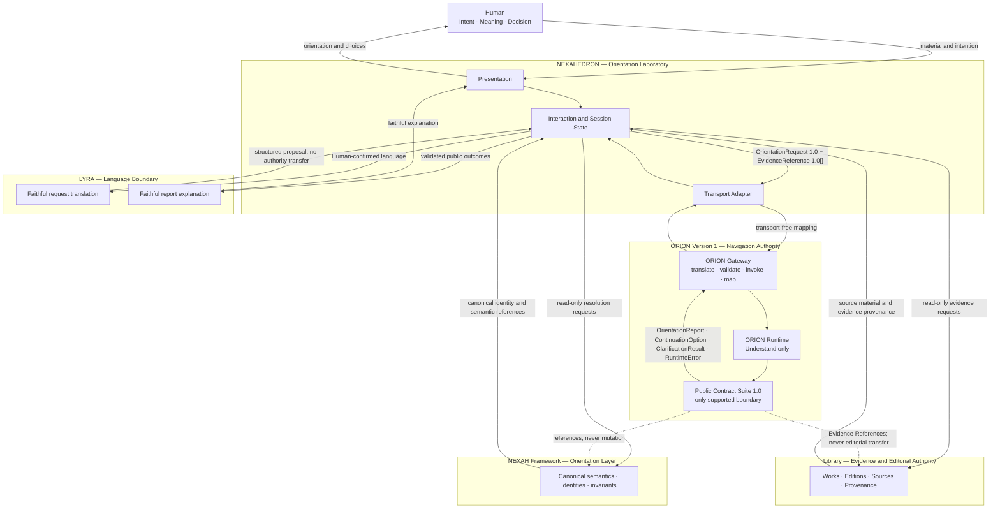
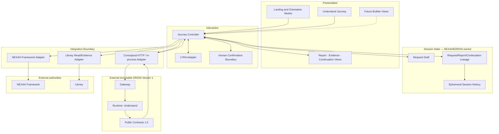

# NEXAH Ecosystem — ORION Version 1 Integration Blueprint

- Status: Official production-integration blueprint
- ORION dependency: Version 1, immutable
- Scope: NEXAH Framework, ORION, NEXAHEDRON, Library and LYRA
- Implementation status: architecture only; transport and application integration pending
- Change rule: every integration adapts to ORION Version 1; this document does not amend ORION

## 1. Purpose

This blueprint defines the first NEXAH application built on ORION. It explains
where ORION begins and ends, which system owns every interaction, how a complete
Orientation Session crosses the ecosystem, and where later integrations belong.

ORION remains an external, replaceable component behind its frozen Version 1.0
public contracts. NEXAHEDRON never imports ORION internals. LYRA never reasons.
The Library never navigates. The Framework never becomes application state. The
Human retains intention, meaning and decision authority.

Normative ORION behavior remains defined only by:

- [`ORION_ORIENTATION_POLICIES.md`](../architecture/operators/ORION_ORIENTATION_POLICIES.md);
- [`ORION_ORIENTATION_OPERATORS.md`](../architecture/operators/ORION_ORIENTATION_OPERATORS.md);
- the six specifications under [`docs/architecture/contracts/`](../architecture/contracts/).

If this blueprint conflicts with those documents, the frozen ORION documents
govern.

## 2. Ecosystem interaction and ownership



### 2.1 Boundary table

| Boundary | Owns | Must never own |
|---|---|---|
| Human | intention, interpretation, reflection, continuation choice, decision | automated authority transfer |
| NEXAHEDRON | presentation, interaction, session state, transport adaptation, Laboratory UX | orientation behavior, canonical semantics, editorial truth |
| LYRA | faithful language translation and explanation | planning, validation, evidence selection, confidence upgrade |
| ORION Gateway | structural request construction, validation, Runtime invocation, outcome validation, presentation mapping | orientation logic, retrieval, persistence, transport |
| ORION Runtime | deterministic Understand workflow and public outcomes | UI, transport, provider selection, Library writes, Framework mutation |
| Public Contracts | stable shared language and invariants | implementation strategy or transport semantics |
| NEXAH Framework | canonical Orientation Layer semantics, identities and invariants | application interaction or report presentation |
| Library | source identity, evidence, provenance and editorial authority | ORION navigation or Human decisions |

The Public Contract Suite is a boundary language, not another running service.
The Framework and Library are referenced through public identities and evidence;
they do not sit inside the ORION Runtime.

## 3. Complete Orientation Session

### 3.1 Session sequence

```mermaid
sequenceDiagram
    actor Human
    participant UI as NEXAHEDRON UI
    participant State as NEXAHEDRON Session State
    participant Lyra as LYRA
    participant Nexah as NEXAH Framework Adapter
    participant Library as Library Adapter
    participant API as NEXAHEDRON Transport Adapter
    participant Gateway as ORION Gateway V1
    participant Runtime as ORION Runtime V1

    Human->>UI: Orientation Object + natural intention
    UI->>State: Draft object, intention and scope
    State->>Lyra: Human language + confirmed mode
    Lyra-->>State: Faithful structured-language proposal
    State-->>Human: Confirm object, intention and scope
    Human->>State: Explicit confirmation

    State->>Nexah: Resolve canonical identity/representation references
    Nexah-->>State: Versioned Framework references or explicit unknown
    State->>Library: Resolve source, edition, provenance and accessible evidence
    Library-->>State: Versioned EvidenceReference objects or explicit access state

    State->>State: Construct OrientationRequest 1.0
    State->>API: OrientationRequest + EvidenceReference[]
    API->>Gateway: Exact public field mapping
    Gateway->>Gateway: Contract and evidence validation
    Gateway->>Runtime: OrientationRequest + EvidenceReference[]
    Runtime->>Runtime: Readiness + Understand workflow + evidence binding
    Runtime-->>Gateway: Public contract outcomes only
    Gateway->>Gateway: Outcome and lineage validation
    Gateway-->>API: GatewayResponse from validated public contracts
    API-->>State: Public outcomes + derived presentation

    alt Clarification Required
        State->>Lyra: RuntimeError + ClarificationResult
        Lyra-->>UI: Faithful clarification language
        UI-->>Human: Required actions; valid fields preserved
        Human->>State: Missing Human values
        State->>State: New OrientationRequest with clarification_of
    else Completed, Partial or Blocked Report
        State->>Lyra: OrientationReport + resolved EvidenceReferences
        Lyra-->>UI: Faithful report explanation
        UI-->>Human: Report, evidence and Continuation Options
        Human->>State: Select one ContinuationOption
        State->>State: Apply request_delta to a new request draft
        State-->>Human: Confirm preserved context and change
        Human->>State: Confirm continuation
        State->>State: New OrientationRequest with continuation_of
    else Public Runtime Error
        State->>Lyra: RuntimeError
        Lyra-->>UI: Faithful status and permitted recovery
        UI-->>Human: Retry, required action or stop exactly as declared
    end
```

### 3.2 Objects exchanged

| Step | Producer → Consumer | Object | Authority rule |
|---:|---|---|---|
| 1 | Human → NEXAHEDRON | material, natural intention, mode choice | Human-owned input; not yet an ORION request |
| 2 | NEXAHEDRON ↔ LYRA | language proposal | LYRA translates; Human confirms meaning |
| 3 | Framework → NEXAHEDRON | versioned identity and Representation references | Framework authority remains external |
| 4 | Library → NEXAHEDRON | source metadata and `EvidenceReference[]` | Library retains source/editorial authority |
| 5 | NEXAHEDRON → Gateway | `OrientationRequest` and `EvidenceReference[]` | exact Version 1.0 fields; effects `none` |
| 6 | Gateway → Runtime | typed `OrientationRequest`, typed `EvidenceReference[]` | no private transport object crosses |
| 7 | Runtime → Gateway | `ClarificationResult`, `OrientationReport`, `ContinuationOption`, or `RuntimeError` | mutually exclusive public lifecycle outcomes |
| 8 | Gateway → NEXAHEDRON | validated public contracts plus directly derived presentation models | presentation never replaces source contracts |
| 9 | NEXAHEDRON → LYRA | validated outcome and evidence metadata | LYRA may explain only what is present |
| 10 | NEXAHEDRON → Human | clarification, report, evidence view, continuation choices | authority and uncertainty remain visible |
| 11 | Human → NEXAHEDRON | selected continuation and confirmation | selection activates no effect by itself |
| 12 | NEXAHEDRON → Gateway | new `OrientationRequest` with `clarification_of` or `continuation_of` | continuation extends lineage; it never restarts silently |

### 3.3 Session identity and state

NEXAHEDRON may assign a Laboratory-local `session_id` for interaction and
history. It is not an ORION public identity and must never replace:

- `request_id` + `request_version`;
- `report_id` + `report_version`;
- `continuation_id`/`option_id` + version;
- `evidence_id` + `evidence_version`;
- source and provenance versions.

For the first production integration, session history is NEXAHEDRON-owned and
may be ephemeral. ORION remains stateless and gains no persistence.

## 4. Conceptual external API

### 4.1 Transport boundary

The HTTP layer is a NEXAHEDRON-owned adapter around the existing in-process
Gateway. It is not part of ORION Version 1 and may not add behavior. The website
consumes only exact Version 1 public contracts and presentation fields derived
directly from them.

Recommended media type:

```text
application/vnd.orion.contracts+json;version=1.0
```

### 4.2 Endpoints

| Method and path | Purpose | Input | Successful body |
|---|---|---|---|
| `POST /orientation/v1/requests` | execute one request | `OrientationRequest` plus zero or more `EvidenceReference` objects | ordered array of public outcomes |
| `POST /orientation/v1/requests/validate` | validate without execution | `OrientationRequest` | validation result derived from existing validator; no orientation |
| `POST /orientation/v1/evidence/validate` | validate evidence before execution | `EvidenceReference[]` | validation results derived from existing validator |

No report-history, mutation, search, Library-write or generic execute endpoint is
defined. Selecting a Continuation Option creates a new Orientation Request and
uses `POST /orientation/v1/requests` again.

### 4.3 Request payload

The transport wrapper separates the exact contracts without altering them:

```json
{
  "request": {
    "schema_version": "orion.orientation-request/1.0",
    "request_id": "request-understand-001",
    "request_version": "1",
    "mode": "understand",
    "requested_by": {
      "requester_id": "nexahedron-session-user",
      "requester_kind": "human",
      "authority_domain": "nexahedron.orientation-laboratory"
    },
    "human_authority": {
      "human_ref": "human-session-001",
      "authority_scope": ["intention", "scope", "continuation"]
    },
    "orientation_objects": [{
      "object_id": "object-paper-001",
      "object_version": "1",
      "object_kind": "Research Paper",
      "source_owner": "library-source-owner",
      "source_ref": "library://works/paper-001",
      "source_revision": "edition-2",
      "identity_scope": "external",
      "representation_refs": [],
      "access_status": "available"
    }],
    "intention": {
      "direction": "I want to understand the central claim and its evidence.",
      "focus": "central claim and supporting evidence",
      "success_boundary": "I can explain the claim and inspect its support."
    },
    "scope": {
      "include": ["central claim", "supporting evidence"],
      "exclude": ["author biography"],
      "unresolved": [],
      "depth": "focused"
    },
    "effects": "none"
  },
  "evidence": [
    {
      "schema_version": "orion.evidence-reference/1.0",
      "evidence_id": "evidence-paper-001",
      "evidence_version": "1",
      "source": {
        "source_id": "paper-001",
        "source_version": "edition-2",
        "identity_domain": "library.works",
        "source_owner": "library-source-owner",
        "source_ref": "library://works/paper-001",
        "fragment_ref": "section:conclusion"
      },
      "authority": {
        "authority_owner": "library-source-owner",
        "authority_domain": "library.works",
        "editorial_status": "published",
        "authority_version": "edition-2"
      },
      "evidence_class": "observed",
      "relationship": "supports",
    "provenance": [{
      "step_id": "source-paper-001",
      "step_kind": "source",
      "input_refs": [],
      "output_ref": "library://works/paper-001#section:conclusion@edition-2",
      "owner": "library-source-owner",
      "lossiness": "none"
    }],
      "validation": {
        "status": "valid",
        "checks": ["source_resolved", "version_resolved"],
        "issues": [],
        "validated_against": ["orion.evidence-reference/1.0"]
      },
      "traceability": [{
        "report_id": "report-request-understand-001-1",
        "report_version": "1",
        "target_path": "mode_payload.content.claims_and_support[0]",
        "finding_id": "finding-central-claim"
      }],
      "access_status": "available"
    }
  ]
}
```

The wrapper keys `request` and `evidence` are transport-owned. Their values are
unmodified public contract objects. Canonical required/optional field rules live
only in the contract specifications.

### 4.4 Response payload

The response is an ordered array of exact public contracts. `schema_version`
is the discriminator; the transport does not invent a second outcome model.

Successful example:

```json
[
  {
    "schema_version": "orion.orientation-report/1.0",
    "identity": {
      "report_id": "report-request-understand-001-1",
      "report_version": "1",
      "request_id": "request-understand-001",
      "request_version": "1",
      "request_schema_version": "orion.orientation-request/1.0",
      "operator_id": "orion.orientation-operator/understand",
      "operator_version": "1.0"
    },
    "lifecycle": {"state": "current"},
    "status": "complete",
    "orientation": "<exact Orientation Report orientation section>",
    "representations": "<exact public representation section>",
    "process": "<exact public process stages>",
    "mode_payload": "<exact Understand payload>",
    "evidence": ["evidence-paper-001@1"],
    "assumptions": [],
    "uncertainties": [],
    "issues": [],
    "confidence": "<exact public confidence section>",
    "validation": "<exact public validation section>",
    "continuations": ["continuation-understand-evidence-001@1"],
    "effects": "none"
  },
  {
    "schema_version": "orion.continuation-option/1.0",
    "option_id": "continuation-understand-evidence-001",
    "option_version": "1",
    "source_report_id": "report-request-understand-001-1",
    "source_report_version": "1",
    "action_type": "inspect_evidence",
    "availability": "available",
    "preserved_context": "<exact preserved-context object>",
    "request_delta": "<exact request-delta operations>",
    "blockers": [],
    "effects": "none"
  }
]
```

Angle-bracket values above abbreviate unchanged nested Version 1 structures;
they are not wire values. A conforming implementation serializes the complete
contract objects defined by the canonical specifications.

### 4.5 Clarification response

```json
[
  {
    "schema_version": "orion.runtime-error/1.0",
    "kind": "clarification_required",
    "result_presence": "clarification_result",
    "result_ref": "clarification-request-understand-001@1"
  },
  {
    "schema_version": "orion.clarification-result/1.0",
    "result_id": "clarification-request-understand-001",
    "result_version": "1",
    "readiness": "clarification_required",
    "issues": ["<ordered complete ClarificationIssue objects>"],
    "required_user_actions": ["<ordered complete Human actions>"]
  }
]
```

The consumer preserves valid request fields, presents ordered issues, collects
only the required Human values, and submits a new request containing
`clarification_of`.

### 4.6 HTTP and public outcome mapping

| Public outcome | Suggested HTTP status | Required client behavior |
|---|---:|---|
| complete or partial Orientation Report | `200` | present report, evidence and available continuations |
| blocked Orientation Report | `200` | present the report as blocked, never as failure-before-processing |
| Clarification Required | `409` | present `ClarificationResult`; preserve valid fields |
| Invalid / Validation Failed | `422` | present exact issues; do not invoke continuation |
| Unsupported | `501` | present unsupported status; do not substitute behavior |
| Blocked Before Processing | `409` | present blocker and declared retry policy |
| Unavailable | `503` | preserve request and follow declared retry disposition |
| Internal Failure | `500` | present bounded failure; expose no diagnostics or internals |

HTTP status is transport guidance only. The `RuntimeError.kind`, report status,
retry policy and continuation policy remain the behavioral authority. A client
must never infer ORION state from HTTP status alone.

## 5. First Builder interface

The Builder is an inspection and verification surface for engineers and
operators. It is not a second Runtime and does not acquire authority by showing
or editing contract data.

```text
┌── ORION Builder ─ Session: local-001 ─ Gateway: Version 1 ───────────┐
│                                                                            │
│  Request Editor                         Validation                         │
│  ┌─ OrientationRequest 1.0 ──────────┐  ┌─ Contract / readiness ──────┐ │
│  │ mode: understand                  │  │ identity             valid │ │
│  │ object · intention · scope          │  │ scope                valid │ │
│  │ authority · constraints · lineage   │  │ readiness            ready │ │
│  └─────────────────────────────────────────┘  └─────────────────────────────┘ │
│                                                                            │
│  Evidence Panel                         Orientation Report Viewer          │
│  ┌─ EvidenceReference[] ────────────┐  ┌─ Report identity + status ─────┐ │
│  │ source · version · fragment        │  │ summary · structure          │ │
│  │ authority · class · relationship   │  │ evidence · uncertainty        │ │
│  │ validation · traceability          │  │ assumptions · confidence        │ │
│  └─────────────────────────────────────────┘  └─────────────────────────────────┘ │
│                                                                            │
│  Continuation Panel                     History                            │
│  ┌─ Available options ───────────────┐  ┌─ Session-local lineage ───────┐ │
│  │ action · preserved context         │  │ request@version          │ │
│  │ request delta · blockers           │  │ report@version           │ │
│  │ [Prepare continuation request]        │  │ continuation@version     │ │
│  └─────────────────────────────────────────┘  └─────────────────────────────┘ │
└───────────────────────────────────────────────────────────────────────────────┘
```

### 5.1 Builder rules

- Request Editor edits a draft external mapping; only a validated
  `OrientationRequest` may execute.
- Validation shows contract validation separately from readiness and public
  Runtime outcomes.
- Evidence Panel shows identity, version, provenance, authority, access and
  traceability; it never edits Library truth.
- Report Viewer renders the complete public report and retains its identity.
- Continuation Panel never executes an option silently. It prepares a new
  request draft and requires Human confirmation.
- History is a session-local lineage view. It is not ORION persistence,
  multi-session memory or a new public contract.
- Private exceptions, prompts, providers, orchestration and reasoning traces are
  never displayed because they are not public ORION behavior.

## 6. NEXAHEDRON production architecture



### 6.1 Layer responsibilities

| Layer | Responsibility | Dependency rule |
|---|---|---|
| Presentation | calm Laboratory UI and accessible rendering | depends on Interaction view state, never ORION internals |
| Interaction | mode-specific flow, LYRA exchange, Human confirmations | constructs no orientation finding |
| Session state | drafts and immutable identity lineage for the current Laboratory session | never becomes ORION memory |
| Transport/Gateway adapter | serialize exact public objects and invoke immutable Gateway | contains no orientation policy |
| ORION | validate and execute Version 1 Understand | external stable dependency |
| Framework adapter | resolve canonical identifiers and Representation references read-only | never copies Framework authority |
| Library adapter | resolve sources and construct/bind evidence with provenance read-only | no editorial mutation |
| Future Builder modules | inspect requests, outcomes and lineage | depend on the same public boundary only |

## 7. Integration inventory

| Integration point | Status | Version 1 placement and constraint |
|---|---|---|
| Public Contract Suite 1.0 | Implemented | sole supported ORION boundary |
| Understand Runtime | Implemented | immutable external ORION component |
| ORION Gateway and presentation mapping | Implemented | in-process; no transport authority |
| Evidence binding and continuation generation | Implemented | Runtime behavior, public-contract validated |
| Phase VI and VII verification | Implemented | reproducibility and evaluation evidence |
| NEXAHEDRON Understand journey | Implemented | Laboratory experience; production transport pending |
| NEXAHEDRON ↔ ORION transport adapter | Planned | wraps Gateway without changing it |
| NEXAH Framework identity/reference adapter | Planned | read-only reference resolution |
| Library source/evidence adapter | Planned | read-only; no Library synchronization writes |
| Authentication and requester identity binding | Planned | NEXAHEDRON/infrastructure concern; maps to existing requester fields |
| Durable NEXAHEDRON session history | Planned | application storage only; not ORION memory |
| Library synchronization | Planned | external integration; must preserve Library authority and versions |
| Atlas exploration | Planned | NEXAHEDRON read/explore surface; no Atlas mutation |
| Representation rendering | Planned | consumer rendering of approved public references; not LYRA behavior |
| Transition Engine execution | Planned | outside the implemented Version 1 Orientation Runtime; earlier declarations do not imply execution |
| Wonder, Compare, Connect, Explore, Build and Reflect operators | Planned | behavioral specifications exist; no Version 1 Runtime implementation |
| Builder inspection modules | Planned | public-contract inspection only |
| Provider adapters and reasoning systems | Historical | earlier experiments are not the production integration boundary |
| Phase 6C Orientation Sessions | Historical | retained conformance evidence, superseded by live/evaluation path |
| T01–T15 draft transition registry | Historical | non-executable earlier architecture slice |
| LUCY Reflection Layer | Research | outside ORION and every current execution path |

“Planned” means an integration location is known. It does not approve behavior,
schedule implementation, extend a contract or commit a future ORION version.

## 8. Production conformance rules

The first integration conforms only when all are true:

1. NEXAHEDRON submits exact Version 1.0 public fields and consumes only valid
   public outcomes or presentation derived directly from them.
2. The transport adapter exposes no provider, prompt, private plan, reasoning
   trace or Runtime exception.
3. LYRA translates and explains without changing intention, evidence,
   uncertainty, confidence, status or continuation availability.
4. Every Evidence Reference preserves source identity, version, provenance,
   authority and traceability to the report.
5. Every continuation originates from exactly one report and becomes a new
   Human-confirmed Orientation Request.
6. Framework and Library access is read-only for this integration.
7. NEXAHEDRON session history never becomes ORION persistence or Human memory.
8. Unsupported modes remain visibly unsupported; no client-side simulation
   presents them as ORION output.
9. ORION packages are consumed as an external stable dependency; no internal
   module is imported across the application boundary.
10. Any need to change ORION is recorded as an integration incompatibility, not
    silently solved inside NEXAHEDRON, LYRA, Framework or Library code.

## 9. First production slice

The first production slice remains intentionally narrow:

```text
Human
  → NEXAHEDRON Understand journey
  → Human-confirmed OrientationRequest 1.0
  → read-only Framework and Library resolution
  → EvidenceReference 1.0 binding
  → immutable ORION Gateway and Understand Runtime
  → OrientationReport 1.0 + ContinuationOption 1.0
  → LYRA faithful explanation
  → Human-selected continuation
  → new Human-confirmed OrientationRequest 1.0
```

No other mode, write path, persistence system or provider integration is needed
to prove the production ecosystem boundary.

The complete Human-facing design for this slice is defined by the
[`NEXAHEDRON Alpha Human Experience Blueprint`](../experience/NEXAHEDRON_ALPHA_UX_BLUEPRINT.md).
